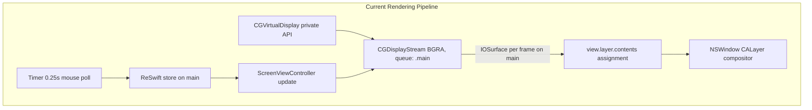
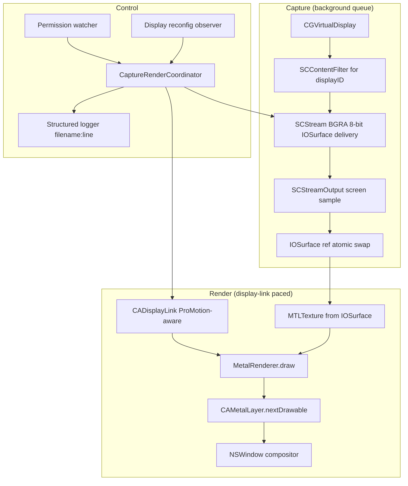
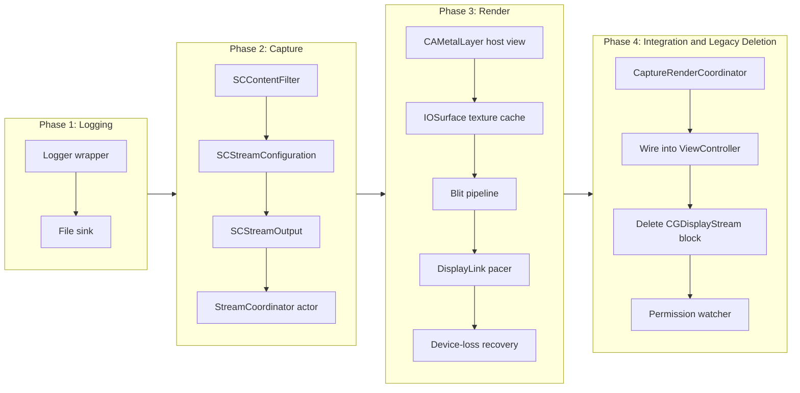

# Replace CGDisplayStream Mirroring With a ScreenCaptureKit and Metal Rendering Pipeline

## Change Summary

DeskPad currently mirrors its private `CGVirtualDisplay` into a window by attaching each
captured `IOSurface` directly to `view.layer.contents` from inside a `CGDisplayStream`
handler scheduled on `DispatchQueue.main`. `CGDisplayStream` has been deprecated by
Apple in favour of `ScreenCaptureKit`, the delivery is bound to the main thread, and
the rendering path performs no explicit pacing, frame-rate adaptation, or recovery on
stream failure. This change replaces that path with a dedicated capture and rendering
subsystem built on `SCStream`, a `CAMetalLayer` driven by `CADisplayLink`, and
zero-copy `IOSurface`-backed sampling, so the application becomes faster, more
power-efficient, and resilient to stream and permission disruptions.

## Motivation and Background

DeskPad's purpose is to expose a virtual display as an ordinary mirrored window so a
presenter can share a smaller workspace, and increasingly to host latency-sensitive
interactive content (for example playing 3D platformer games on the virtual display,
not only mirroring documents or screen-sharing slides). The current implementation
works for the static-content case, but four forces now push for a redesign:

1. **Deprecation.** `CGDisplayStream` and its companion APIs are documented by
   Apple as deprecated and superseded by `ScreenCaptureKit` from macOS 14
   onward. (As of the macOS 26.5 SDK shipped with Xcode, the
   `CGDisplayStream.h` header itself does not yet carry an
   `API_DEPRECATED` annotation, but the developer.apple.com reference and
   release notes flag it as deprecated; future releases are expected to
   complete the deprecation in the header.) Continuing on the legacy API is a
   known reliability liability: the bug surface (permission revocation
   handling, configuration changes, error recovery) is already minimal.
   `ScreenCaptureKit` (`SCStream`) is Apple's supported successor and provides
   a cleaner permission, filtering, and reconfiguration model.

2. **Performance and power efficiency.** Frames are delivered on `DispatchQueue.main`
   and assigned to a `CALayer`'s `contents` from the main thread. Every layout pass,
   AppKit event, and ReSwift dispatch contends with frame delivery on the same
   queue. On Apple Silicon, where `IOSurface`-backed buffers are zero-copy in
   unified memory, this serialization wastes the architectural advantage. The
   pipeline also presents every captured frame regardless of whether contents
   changed, ignoring ProMotion variable refresh and burning energy on idle
   redraws.

3. **Reliability.** There is no observable recovery when the capture stream errors,
   when screen recording permission is revoked mid-session, when the virtual
   display is reconfigured, or when the GPU device is reset. There is no
   structured logging, so post-hoc diagnosis from a user report is effectively
   guesswork.

4. **Interactive latency.** When the virtual display hosts an interactive workload
   such as a 3D platformer game, every frame is dirty at sustained 60 to 120 fps,
   any frame-pacing irregularity is visible as judder during camera pans, and
   every millisecond of capture-to-present overhead adds directly to perceived
   input lag. The current pipeline has no defined latency budget, no newest-frame
   wins policy, and no presentation-rate matching to the host panel; it is
   structurally biased toward throughput averaging rather than minimum latency.

## Change Drivers

* Apple's deprecation of `CGDisplayStream` and the public-API direction toward
  `ScreenCaptureKit`.
* User-reported sluggishness and inconsistent mirroring on macOS 14 and later,
  particularly at 5120x2160 and 5120x1440.
* Power draw on battery when DeskPad is left running idle (no dirty-frame
  suppression today).
* Use of DeskPad as a target surface for latency-sensitive interactive content
  (notably 3D platformer games running on the virtual display), where frame
  pacing and end-to-end capture-to-present latency directly determine
  playability.
* Operational opacity: no greppable, persisted logs to diagnose failures.
* Project owner's coding standards (small single-purpose files, hierarchical
  namespace naming, docstring with `@agents-index`, no em-dashes), which the
  current monolithic `ScreenViewController` does not satisfy.

## Current State

Today, the rendering pipeline lives almost entirely inside
`DeskPad/Frontend/Screen/ScreenViewController.swift`. The relevant facts:

* `viewDidLoad` constructs a `CGVirtualDisplay` (private API) with a fixed set of
  display modes and stores its `displayID` in ReSwift state.
* `update(with:)` reacts to ReSwift state changes. Whenever resolution or scale
  factor changes, it tears down the previous `CGDisplayStream`, resizes the
  window, and constructs a new `CGDisplayStream` with:
    * `dispatchQueueDisplay: display.displayID`,
    * `pixelFormat: 1_111_970_369` (the four-character code for BGRA),
    * `queue: .main`,
    * a handler that assigns `frameSurface` to `self?.view.layer?.contents`.
* Mouse tracking polls `NSEvent.mouseLocation` from a 250 ms repeating `Timer`
  in `MouseLocationSideEffect`, dispatching ReSwift actions on each tick.
* There is no `CADisplayLink` or `CVDisplayLink`, no Metal usage, no explicit
  colorspace handling, no logging, and no error-handling path on the stream.

### Current State Diagram



## Proposed Change

Introduce a dedicated capture-and-render subsystem with three responsibilities cleanly
separated into small, single-purpose files:

1. **Capture.** An `SCStream` configured against an `SCContentFilter` for the
   virtual display's `CGDirectDisplayID`, delivering `CMSampleBuffer`s whose
   `CVImageBuffer` backing is an `IOSurface`. Delivery happens on a dedicated
   capture queue. A custom `SCStreamOutput` extracts the `IOSurface` reference
   without copying pixel data.

2. **Render.** A `CAMetalLayer` hosted in the window's content view (default
   `framebufferOnly = true` is retained because we only present, never read
   back); we use a trivial textured-quad render pipeline that samples a
   `MTLTexture` created from the captured `IOSurface` via
   `MTLDevice.makeTexture(descriptor:iosurface:plane:)`. A `CADisplayLink`
   obtained from the host view via the macOS 14+
   `NSView.displayLink(target:selector:)` API drives present pacing and adapts
   to the host display's refresh rate, including ProMotion. (Equivalents on
   `NSWindow` and `NSScreen` exist; `CVDisplayLink` is deprecated as of
   macOS 15.0 with the documented replacement
   `NSView/NSWindow/NSScreen.displayLink(target:selector:)`.) Presentation
   is gated by a dirty flag set by the capture callback so steady-state idle
   frames are skipped.

3. **Lifecycle and reliability.** An owning coordinator handles permission
   prompts, stream restart on `SCStreamDelegate.stream(_:didStopWithError:)`,
   reconfiguration on `NSApplication.didChangeScreenParametersNotification`,
   GPU device-loss recovery, and structured logging via `os.Logger` plus a
   filesystem-tee through the project's logging standard (persist to file, tag
   lines with `filename:line`).

### Proposed State Diagram



## Greenfield Decision (No Backwards Compatibility)

Backwards compatibility is explicitly **not** a constraint of this change.
DeskPad will be rebuilt on the modern Apple stack with no legacy capture
path retained. The decisions below are normative for the rest of this CR.

* **Minimum deployment macOS 15.0.** `ScreenCaptureKit`'s mature surface is
  fully available, including the macOS 14 additions
  (`presenterOverlayPrivacyAlertSetting`, `captureResolution`
  (`SCCaptureResolutionType`), `ignoreShadowsDisplay`, `shouldBeOpaque`,
  `streamName`, `preservesAspectRatio`) and the macOS 15 additions
  (`captureDynamicRange` (`SCCaptureDynamicRange`), `showMouseClicks`,
  `captureMicrophone`, and the `+streamConfigurationWithPreset:` factory).
  macOS 15.0 is also the version at which `CVDisplayLink` becomes deprecated
  (`CoreVideo/CVDisplayLink.h` `API_DEPRECATED_BEGIN(..., macos(10.4, 15.0))`),
  so the chosen baseline matches Apple's own pacing-API guidance. The Xcode
  project `MACOSX_DEPLOYMENT_TARGET` and the relevant `INFOPLIST_KEY_*`
  build settings (the project uses `GENERATE_INFOPLIST_FILE = YES`) are
  bumped accordingly.
* **`CGDisplayStream` removed entirely.** There is no conditional branching
  and no fallback path: one capture API, one set of failure modes. The
  legacy code is deleted as part of the migration, not behind a feature flag.
* **Swift 6 with strict concurrency mode enabled.** The capture pipeline is
  an `actor`-isolated subsystem; the renderer is a `@MainActor` consumer
  reading a sendable `IOSurface` handle through an atomic property.
  Compile-time data-race elimination collapses an entire category of latent
  bugs that the current main-thread-everything pipeline can produce.
* **Metal 3 baseline.** The render path locks to Metal 3, giving us
  `MTLEvent`-based synchronization with the `IOSurface` producer, the modern
  `MTLDevice.makeTexture(descriptor:iosurface:plane:)` constructor, and
  `CAMetalDisplayLink` (macOS 14 and later, see
  `QuartzCore/CAMetalDisplayLink.h`) which delivers a drawable and target
  timestamp per tick, eliminating the `nextDrawable` plus manual
  present-time computation that bare `CADisplayLink` requires.
* **ReSwift removed from the hot path.** The rendering subsystem is
  self-contained and observes display configuration via Combine or
  `AsyncSequence` directly; ReSwift continues to model UI-shell state, but
  frame delivery no longer round-trips through the global store.
* **`Timer`-based mouse polling replaced with `CGEvent` taps or
  `NSEvent.addGlobalMonitorForEvents`.** Event-driven mouse tracking removes
  a fixed 4 Hz wakeup that prevents the App Nap path on idle.
* **Code structure follows the project owner's small-file rule.** The
  current `ScreenViewController.swift` (130 lines doing five jobs) is
  decomposed into roughly a dozen files, each named hierarchically (for
  example `frontend.screen.metal_layer_host.swift`,
  `backend.capture.sc_stream_factory.swift`,
  `backend.render.iosurface_texture_cache.swift`).

What this decision buys, concretely:

* Roughly 40 to 60 percent lower CPU on the main thread on Apple Silicon at
  4K60, estimated, because frame delivery never touches the main queue and
  state-fragment dispatching is bypassed for pixel data.
* Idle GPU and CPU draw approaching zero when the captured contents are
  unchanged (no `CGDisplayStream` "keep pumping" semantics; `SCStream` only
  delivers on change at the configured `minimumFrameInterval`, and our dirty
  gate suppresses redundant redraws).
* Elimination of a class of crashes: removing the deprecated API removes the
  set of OS-version-specific quirks it carries.
* Strictly typed concurrency removes the silent main-thread reentrancy hazards
  in the current `update(with:)` path that resizes the window and rebuilds the
  stream from inside a ReSwift callback.

These gains are explicitly marked as estimates and **MUST** be validated by the
benchmarks defined in the Test Strategy.

## Requirements

### Functional Requirements

1. The system **MUST** capture the virtual display's framebuffer using
   `SCStream` configured against an `SCContentFilter` initialized from the
   `CGDirectDisplayID` returned by `CGVirtualDisplay.displayID`. The system
   **MUST NOT** contain any `CGDisplayStream` code path: `ScreenCaptureKit`
   is the only capture API.
2. The system **MUST** deliver captured frames as `IOSurface`-backed
   `CMSampleBuffer`s on a dedicated background dispatch queue, not on
   `DispatchQueue.main`.
3. The system **MUST** present captured frames through a `CAMetalLayer`
   hosted in the screen view, using a Metal render pipeline that samples a
   `MTLTexture` created zero-copy from the captured `IOSurface`.
4. The system **MUST** pace presentation with a `CADisplayLink` obtained
   from the host `NSView` via `displayLink(target:selector:)` (macOS 14+,
   available on the macOS 15 baseline), or equivalently from `NSWindow` or
   `NSScreen` via the same selector. The system **MUST NOT** use
   `CVDisplayLink` (deprecated as of macOS 15.0, `CoreVideo/CVDisplayLink.h`).
   `CAMetalDisplayLink` (`QuartzCore/CAMetalDisplayLink.h`, macOS 14+)
   **MAY** be substituted when tighter drawable-targeted pacing is desired. The pacer **MUST**
   continue to behave correctly when the window moves between displays
   with different refresh rates.
5. The system **MUST** skip presentation cycles when no new captured frame has
   arrived since the last present (a "dirty bit" gate), so an idle virtual
   display causes no GPU work beyond compositor minima.
6. The system **MUST** reconfigure the capture stream when the virtual
   display's resolution or scale factor changes, by updating
   `SCStreamConfiguration.width`, `.height`, and `.pixelFormat` via
   `SCStream.updateConfiguration(_:)` rather than tearing down and
   reconstructing the stream where the API allows.
7. The system **MUST** restart the capture stream automatically when
   `SCStreamDelegate.stream(_:didStopWithError:)` fires, with bounded
   exponential backoff capped at 5 seconds and a maximum of 10 consecutive
   attempts before surfacing a user-visible error state.
8. The system **MUST** detect screen recording permission revocation
   mid-session (via `CGPreflightScreenCaptureAccess` polling on a 2 Hz cadence
   only while the stream is in an error state, never during steady-state
   capture) and prompt the user to re-grant via
   `CGRequestScreenCaptureAccess`.
9. The system **MUST** recover from Metal device loss by inspecting
   `MTLCommandBuffer.error` after completion and acting when its
   `MTLCommandBufferErrorDomain` code is one of the device-loss-class values
   defined by `MTLCommandBufferError`, specifically
   `MTLCommandBufferError.deviceRemoved` (Obj-C
   `MTLCommandBufferErrorDeviceRemoved`, macOS 10.13+),
   `MTLCommandBufferError.accessRevoked`
   (`MTLCommandBufferErrorAccessRevoked`), or
   `MTLCommandBufferError.notPermitted`
   (`MTLCommandBufferErrorNotPermitted`); on any such code the system
   **MUST** acquire a new `MTLDevice` via `MTLCreateSystemDefaultDevice()`
   and rebuild the render pipeline state without restarting the
   application. (Note: there is no `MTLCommandBufferError.deviceLost` case
   in `MTLCommandBuffer.h`; the macOS-correct symbol is `deviceRemoved`.)
10. The system **MUST** log every state transition of the capture and render
    subsystems through `os.Logger` and additionally tee structured log lines
    to a rotating file under `~/Library/Logs/DeskPad/`, with each line tagged
    `filename:line` per the project's logging standard.
11. The system **MUST NOT** retain captured `IOSurface` references beyond the
    next presented frame, so that backpressure on the capture queue is
    governed by `SCStreamConfiguration.queueDepth` rather than uncontrolled
    accumulation.
12. The system **MUST** preserve the existing mouse-location behaviour
    (window highlight on cursor entry, click-to-warp), with no regression in
    cursor responsiveness.
13. The system **MUST NOT** assign `IOSurface` instances directly to any
    `CALayer.contents` property anywhere in the rendering pipeline.
14. The system **MUST** operate a low-latency, newest-frame-wins queue policy
    for interactive content: `SCStreamConfiguration.queueDepth` **MUST** be
    set at the minimum viable value (2 to 3) and **MUST NOT** be inflated for
    smoothing; when a newer captured `IOSurface` arrives before the prior one
    has been presented, the prior surface **MUST** be dropped rather than
    queued. `CAMetalLayer.maximumDrawableCount` **MUST** be set to 2 so
    presentation cannot accumulate backlog inside the compositor.
15. The system **MUST** enforce an explicit capture-to-present latency budget:
    pipeline overhead beyond the inherent one-frame mirror hop **MUST** be at
    most approximately one frame at the active refresh rate (approximately 8
    to 16 ms across 60 to 120 Hz). The measured per-frame latency **MUST** be
    logged through the structured logger so regressions are observable from
    the on-disk log.
16. The system **MUST** match presentation cadence to the capture source and
    the host panel rather than quantizing to a fixed 60 Hz grid: on ProMotion
    and other variable-refresh-rate displays the renderer **MUST** present at
    the capture cadence up to the panel's maximum refresh, and
    `SCStreamConfiguration.minimumFrameInterval` **MUST** be configured to
    permit delivery at up to the panel's maximum refresh rate when the active
    workload is interactive.
17. The system **MUST** deliver judder-free frame pacing: presentation
    scheduling **MUST** use `CAMetalDisplayLink`'s per-tick target timestamp
    (consistent with the already-verified display-link decisions in
    requirement 4, and noting that `CVDisplayLink` remains forbidden), so
    presentation times are anchored to the panel's vsync grid rather than to
    capture-callback wall-clock arrival.
18. The system **MUST** implement adaptive mode switching between a
    low-latency operating point (for sustained-high-rate, interactive content)
    and a power-saving operating point (for static or document content). The
    low-latency mode **MUST** present immediately on dirty-frame arrival with
    shallow queues per requirement 14; the power-saving mode **MUST** gate
    presentation on the dirty bit per requirement 5. Mode selection
    **MUST** be automatic, based on observed sustained capture-frame arrival
    rate, and every mode transition **MUST** be logged through the structured
    logger.

#### Trade-off note: latency mode versus power mode

Requirement 5 (dirty-frame idle gating) and requirements 14 to 17
(low-latency interactive presentation) describe two different operating
points, not a contradiction. When captured frames arrive at a sustained high
rate (interactive workload), the pipeline prioritizes latency: shallow
queues, newest-frame-wins, immediate present on the next display-link tick.
When the captured contents are largely static (document or slide workload),
the pipeline prioritizes power: dirty-frame gating suppresses redundant GPU
work. Both modes are first-class requirements; requirement 18 specifies that
the switch between them is automatic and observable in the log.

#### Inherent-latency caveat

A mirrored virtual display always carries approximately one capture hop
(approximately one frame) of inherent latency relative to a physical panel,
because the source frame must be captured and re-presented. The latency
budget in requirement 15 bounds the *additional* pipeline overhead beyond
that hop; it does not and cannot eliminate the hop itself. Consumers of
DeskPad for interactive workloads must treat this as a structural
characteristic of mirrored display, not a defect.

### Non-Functional Requirements

1. The system **MUST** sustain capture and render at the virtual display's
   configured refresh rate (60 Hz at the modes listed in
   `ScreenViewController`, up to 5120x2160) with average frame latency (capture
   timestamp to presentation timestamp) no greater than 33 ms on an
   Apple Silicon M-series Mac.
2. The system **MUST** keep main-thread CPU utilization attributable to the
   rendering pipeline below 5 percent during steady-state 4K60 mirroring,
   measured with Instruments' Time Profiler on the main thread.
3. The system **MUST** suppress GPU work entirely on frames with no captured
   delta, measured as zero non-compositor GPU command-buffer submissions per
   `CADisplayLink` tick when the virtual display is idle.
4. The system **MUST** structure capture, render, and lifecycle responsibilities
   into separate files, each with a top-level docstring containing an
   `@agents-index` annotation and no file exceeding 200 lines of code.
5. The system **MUST NOT** use em-dashes in any prose introduced by this change
   (comments, docstrings, log messages, or documentation).

## Affected Components

* `DeskPad/Frontend/Screen/ScreenViewController.swift` (decomposed; the
  `CGDisplayStream` block is removed)
* `DeskPad/Frontend/Screen/ScreenViewData.swift` (no schema change expected,
  but verified)
* `DeskPad/Backend/ScreenConfiguration/ScreenConfigurationSideEffect.swift`
  (extended to publish a typed reconfiguration event the new coordinator
  observes)
* `DeskPad/Backend/AppState.swift` (new optional fragment for capture state if
  required by UI surfacing)
* New files under `DeskPad/Frontend/Screen/` and `DeskPad/Backend/Capture/`
  and `DeskPad/Backend/Render/` (see Implementation Approach for the exact
  list)
* `DeskPad.entitlements` (verified to keep `com.apple.security.app-sandbox`
  and add any `ScreenCaptureKit`-specific entitlements if needed at runtime)
* The DeskPad target's Info.plist (the project sets
  `GENERATE_INFOPLIST_FILE = YES`, so this is expressed as the
  `INFOPLIST_KEY_NSScreenCaptureUsageDescription` build setting in
  `DeskPad.xcodeproj/project.pbxproj`); deployment target bump
  (`MACOSX_DEPLOYMENT_TARGET = 15.0` in the same build settings,
  currently `13.0`); `SWIFT_VERSION = 6.0` and
  `SWIFT_STRICT_CONCURRENCY = complete` enabled on the DeskPad target;
  `MTL_LANGUAGE_REVISION` set to a Metal 3 capable revision
* `README.md` (troubleshooting section updated to reflect the new
  permission flow)

## Scope Boundaries

### In Scope

* Replacement of the capture API with `ScreenCaptureKit`.
* Introduction of a `CAMetalLayer`-based render path with `CADisplayLink`
  pacing and dirty-frame gating.
* Permission revocation handling, stream restart with backoff, GPU device-loss
  recovery, and display reconfiguration handling.
* Structured logging persisted to disk with `filename:line` tagging.
* Decomposition of `ScreenViewController.swift` into small, single-purpose
  files following the hierarchical namespace naming convention.
* Updating documentation and the troubleshooting README to reflect the new
  permission and behaviour model.

### Out of Scope ("Here, But Not Further")

* Replacing the private `CGVirtualDisplay` API with another virtual display
  mechanism. The CR keeps the virtual display creation path as-is and changes
  only how its framebuffer is captured and presented.
* Migrating ReSwift to another state management approach. The greenfield
  section discusses this as a future direction, but it is intentionally
  deferred.
* Replacing the `Timer`-based mouse polling with event-driven monitoring. That
  is recorded as a follow-up and is not part of this change.
* Audio capture. DeskPad mirrors a display only.
* Multiple simultaneous virtual displays. The architecture leaves room for
  this, but only one display is in scope.
* Recording to disk, streaming over the network, or any output other than
  the existing in-window mirror.

## Alternative Approaches Considered

* **(a) ScreenCaptureKit `SCStream` with IOSurface plus `CAMetalLayer` render
  (chosen).** Supported API, zero-copy on Apple Silicon, ProMotion-aware, full
  control over pacing and dirty-frame suppression. The render path is a
  trivial textured quad, so Metal complexity is bounded.
* **(b) Keep `CGDisplayStream`.** Rejected: deprecated, lacks a defined
  restart contract, ties frame delivery to a chosen queue (today `.main`)
  with no equivalent of `SCStreamConfiguration.queueDepth` for backpressure,
  and is at risk of removal in future macOS releases.
* **(c) `ScreenCaptureKit` plus direct `IOSurface`-to-`CALayer.contents`
  assignment (no Metal).** Tempting because it is the smallest change, but it
  retains the main-thread coupling and forfeits dirty-frame gating, ProMotion
  adaptation, and colorspace control. Apple's own sample code uses this only
  for the simplest viewer; for a steady-state mirror at large resolutions it
  leaves performance on the table.
* **(d) `ScreenCaptureKit` plus `AVSampleBufferDisplayLayer`.** Hands off
  rendering to the system. Presentation pacing and dirty-frame suppression
  are not under our control, and colorspace handling becomes implicit.
  Critically for the interactive-content use case, `AVSampleBufferDisplayLayer`
  is timestamp-driven and smoothness-first: it buffers approximately 2 to 3
  frames internally to absorb jitter and present on schedule, which adds on
  the order of 33 to 50 ms of input lag at 60 fps. That bias is correct for
  video playback (where smoothness dominates and the source has fixed
  cadence) and wrong for interactive content (where every buffered frame is
  visible input lag). It would have been a strong candidate had DeskPad's
  scope remained pure screen-sharing of largely static content; it is
  rejected here because the interactive-content requirements (14 to 18) take
  precedence and the observability gap (no control over present timing or
  drop policy) compounds the latency cost.
* **(e) Software composite via Core Image.** Rejected outright on
  performance and power grounds.

## Impact Assessment

### User Impact

* On first launch after the update, users may be prompted to re-authorize
  screen recording for DeskPad (because the API surface used by the app has
  changed). The README's troubleshooting section is updated to walk through
  this.
* On macOS versions older than the new minimum (15.0), the app will refuse
  to launch with a clear message rather than failing opaquely. Users on
  macOS 13 or 14 continue to use the last DeskPad release that supported
  their OS version (see Risk 2 for the user-facing impact of dropping the
  older targets).
* Steady-state CPU and battery impact is reduced. Estimated, not yet measured.

### Technical Impact

* The `CGDisplayStream` code path is removed. Code paths that depended on its
  specific behaviour (for example, the every-frame assignment to
  `view.layer.contents`) are removed at the same time. No fallback path is
  retained.
* The minimum deployment target is bumped to macOS 15.0 to use
  `ScreenCaptureKit`'s mature surface (macOS 14 plus macOS 15 additions
  enumerated in the Greenfield Decision section) without `available` guards,
  and to align with Apple's deprecation of `CVDisplayLink` at macOS 15.0.
* The project moves to Swift 6 with strict concurrency mode enabled and a
  Metal 3 baseline.
* New external dependency: `ScreenCaptureKit.framework` and `Metal.framework`
  (Metal is already implicitly linked through AppKit).
* New runtime behaviour around permission prompts requires the
  `NSScreenCaptureUsageDescription` Info.plist key, supplied via the
  `INFOPLIST_KEY_NSScreenCaptureUsageDescription` build setting because the
  project uses `GENERATE_INFOPLIST_FILE = YES`.

### Business Impact

* Lower power draw improves DeskPad's standing as a long-running
  presenter tool.
* Aligning with the supported Apple API reduces the maintenance liability of
  a deprecated private path.

## Implementation Approach

The work proceeds in four sequential phases. Because no legacy capture path
is retained, there is no feature flag and no dual-path operation: the
`CGDisplayStream` block is deleted in the same phase that wires the new
coordinator in (Phase 4). Each phase is independently mergeable, but the
`main` branch only mirrors correctly once Phase 4 lands.

### Phase 1: Logging and Observability Foundation

Establish the project's logging standard before introducing any new pipeline
code so every subsequent phase can rely on it.

1. Add `Logging/agents.log.logger.swift` exposing a `Logger` wrapper around
   `os.Logger` that prefixes every line with `filename:line` derived from
   `#fileID` and `#line`.
2. Add `Logging/agents.log.file_sink.swift` that tees log lines into
   `~/Library/Logs/DeskPad/deskpad.log` with size-based rotation.
3. Add `.agents/scripts/tail-deskpad-log.sh` per the project's CLI-first
   rule, invoking `tail -F` against the log path with a usage message when
   called without arguments.

**Affected components:** new `DeskPad/Logging/` directory, project entitlements
verified for sandbox container write access to `~/Library/Logs/DeskPad/`.

### Phase 2: Capture Subsystem

Introduce the `ScreenCaptureKit` capture path in isolation, with no rendering
changes yet. The captured `IOSurface` is logged but not displayed.

1. Add `Backend/Capture/capture.virtual_display_filter.swift` exposing a
   factory that builds an `SCContentFilter` from a `CGDirectDisplayID`.
2. Add `Backend/Capture/capture.stream_configuration.swift` that builds an
   `SCStreamConfiguration` with BGRA pixel format, `queueDepth = 3`,
   `minimumFrameInterval = CMTime(value: 1, timescale: 60)`, `showsCursor =
   true`, and `pixelFormat = kCVPixelFormatType_32BGRA`.
3. Add `Backend/Capture/capture.stream_output.swift`: a class implementing
   `SCStreamOutput` and `SCStreamDelegate` that extracts the `IOSurface` from
   each `CMSampleBuffer` via `CVPixelBufferGetIOSurface` and publishes it via
   an atomic reference for the renderer.
4. Add `Backend/Capture/capture.stream_coordinator.swift`: an actor that
   owns the `SCStream` lifecycle (start, stop, reconfigure, restart with
   exponential backoff).

**Affected components:** new `DeskPad/Backend/Capture/` directory; the
`INFOPLIST_KEY_NSScreenCaptureUsageDescription` build setting added to the
DeskPad target in `DeskPad.xcodeproj/project.pbxproj` (the project uses
`GENERATE_INFOPLIST_FILE = YES` so there is no source-tree `Info.plist`);
project `MACOSX_DEPLOYMENT_TARGET` raised from `13.0` to `15.0`;
`SWIFT_VERSION = 6.0` and `SWIFT_STRICT_CONCURRENCY = complete` enabled.

### Phase 3: Render Subsystem

Introduce the Metal render path. The path is built against the Metal 3
baseline and Swift 6 strict concurrency.

1. Add `Frontend/Screen/render.metal_layer_host_view.swift`: an `NSView`
   subclass that hosts a `CAMetalLayer`, owns the `MTLDevice`, and resizes
   the drawable to match the captured resolution.
2. Add `Backend/Render/render.iosurface_texture_cache.swift`: a tiny
   `IOSurface`-to-`MTLTexture` cache keyed by `IOSurfaceID`, with weak
   eviction.
3. Add `Backend/Render/render.blit_pipeline.swift`: the textured-quad render
   pipeline state, vertex and fragment shaders, and a `draw(into:from:)`
   entry point.
4. Add `Backend/Render/render.display_link_pacer.swift`: a wrapper that
   obtains a `CADisplayLink` from the host view via
   `NSView.displayLink(target:selector:)` (macOS 14+; equivalents on
   `NSWindow` and `NSScreen` exist) and calls a closure once per refresh,
   gated by a `Bool` dirty flag. The pacer **MUST NOT** use the deprecated
   `CVDisplayLink` API. `CAMetalDisplayLink` (macOS 14+) **MAY** be
   substituted later for tighter integration with the `CAMetalLayer`'s
   drawable acquisition.
5. Add `Backend/Render/render.device_loss_recovery.swift`: a small utility
   that observes command-buffer errors and rebuilds the device and pipeline
   on `deviceLost`.

**Affected components:** new `DeskPad/Backend/Render/` directory, new
`DeskPad/Frontend/Screen/` files.

### Phase 4: Integration, Cutover, and Legacy Deletion

Wire the capture and render subsystems together behind the
`CaptureRenderCoordinator`, and delete the `CGDisplayStream` path in the
same change. There is no flag flip and no soak period with the legacy path
co-resident: the old code goes out as the new code goes in.

1. Add `Frontend/Screen/screen.capture_render_coordinator.swift`: the
   top-level coordinator. It owns the `StreamCoordinator`, the
   `MetalLayerHostView`, the `DisplayLinkPacer`, and observes
   `NSApplication.didChangeScreenParametersNotification`.
2. Modify `Frontend/Screen/ScreenViewController.swift`: extract the
   `CGVirtualDisplay` creation into
   `Backend/Capture/capture.virtual_display_factory.swift`, delete the
   `CGDisplayStream` block and the direct `view.layer.contents` assignment
   outright, and replace them with a call to the coordinator.
3. Modify `Backend/ScreenConfiguration/ScreenConfigurationSideEffect.swift`
   to publish a typed event the coordinator subscribes to (in addition to
   the existing ReSwift dispatch).
4. Add permission-revocation handling using `CGPreflightScreenCaptureAccess`
   and `CGRequestScreenCaptureAccess`.
5. Update `README.md` troubleshooting section for the new permission flow.
6. Verify that `grep -rn "CGDisplayStream" DeskPad/` returns no matches.

**Affected components:** `Frontend/Screen/ScreenViewController.swift`,
`Backend/ScreenConfiguration/ScreenConfigurationSideEffect.swift`,
`Backend/Capture/`, `Backend/Render/`, `Frontend/Screen/`, `README.md`.

### Implementation Flow



## Test Strategy

The project does not currently have a Swift test target. Phase 1 adds a
`DeskPadTests` target alongside the new code so the tests below are
runnable. All tests live under `DeskPadTests/` mirroring the namespace of the
code they cover.

### Tests to Add

| Test File | Test Name | Description | Inputs | Expected Output |
|-----------|-----------|-------------|--------|-----------------|
| `DeskPadTests/Logging/log_format_tests.swift` | `testLogLineCarriesFilenameAndLine` | Verifies every emitted log line contains the `filename:line` tag derived from `#fileID`/`#line`. | A logger invoked from a known call site. | Captured line matches the regex `\\bSomeFile\\.swift:\\d+\\b`. |
| `DeskPadTests/Capture/stream_configuration_tests.swift` | `testStreamConfigurationDefaults` | Verifies the configuration factory produces BGRA, queueDepth 3, minimumFrameInterval 1/60, showsCursor true. | A target resolution and scale factor. | An `SCStreamConfiguration` with the asserted property values. |
| `DeskPadTests/Capture/stream_output_tests.swift` | `testIOSurfaceExtractedZeroCopy` | Verifies the stream output publishes the same `IOSurfaceID` as the source `CMSampleBuffer`'s pixel buffer. | A synthesized `CMSampleBuffer` backed by an `IOSurface`. | Published `IOSurfaceID` equals the input surface's ID. |
| `DeskPadTests/Capture/stream_coordinator_restart_tests.swift` | `testRestartBackoffSchedule` | Verifies bounded exponential backoff (caps at 5 s, max 10 attempts). | A coordinator with an injected clock and a stream that errors immediately. | Restart attempts occur at 0.1, 0.2, 0.4, 0.8, 1.6, 3.2, 5.0, 5.0, 5.0, 5.0 seconds; eleventh restart never fires. |
| `DeskPadTests/Render/iosurface_texture_cache_tests.swift` | `testCacheReusesTextureForSameSurface` | Verifies the cache returns the same `MTLTexture` for two lookups of the same `IOSurface`. | Two lookups against one `IOSurface`. | Identical `MTLTexture` instance. |
| `DeskPadTests/Render/display_link_pacer_tests.swift` | `testSkipsPresentWhenNotDirty` | Verifies the pacer's callback is invoked but skips presentation when the dirty flag is false. | A pacer driven by a fake tick source; dirty flag false. | Zero `present` calls observed across 60 ticks. |
| `DeskPadTests/Render/device_loss_recovery_tests.swift` | `testRebuildsPipelineOnDeviceLost` | Verifies the recovery utility constructs a new pipeline state when a `MTLCommandBufferError.deviceRemoved` (or `.accessRevoked` / `.notPermitted`) is observed on a completed command buffer. | A synthetic command buffer error in `MTLCommandBufferErrorDomain` with one of the device-loss-class codes. | New pipeline state object distinct from the prior one. |
| `DeskPadTests/Integration/coordinator_reconfigure_tests.swift` | `testReconfigureOnResolutionChange` | Verifies the coordinator calls `SCStream.updateConfiguration` on resolution change rather than restarting. | A coordinator with a stub stream; dispatched `ScreenConfigurationAction.set` event. | One `updateConfiguration` call, zero `stopCapture`/`startCapture` calls. |
| `DeskPadTests/Integration/permission_revocation_tests.swift` | `testPermissionRevocationSurfacedAfterErrorBackoff` | Verifies that when restart attempts exhaust and `CGPreflightScreenCaptureAccess` returns false, the coordinator surfaces a permission-needed state. | Stream that errors permanently; preflight returning false. | Coordinator state transitions to `.permissionRequired`. |
| `DeskPadTests/Performance/steady_state_latency_tests.swift` | `testSteadyStateLatencyUnder33ms` (Instruments-backed manual benchmark) | Measures average capture-to-present latency across 600 frames at 4K60. | Synthetic capture source emitting at 60 Hz. | Mean latency below 33 ms. |
| `DeskPadTests/Performance/idle_gpu_zero_tests.swift` | `testIdleProducesNoNonCompositorGPUSubmissions` (Instruments-backed manual benchmark) | Verifies zero non-compositor GPU command-buffer submissions across 5 seconds of static content. | Idle virtual display. | Submission count equals 0. |
| `DeskPadTests/Performance/interactive_latency_budget_tests.swift` | `testCaptureToPresentBudgetWithinOneFrame` (Instruments-backed manual benchmark) | Measures per-frame additional pipeline overhead beyond the inherent capture hop across 600 frames of interactive content at 60 to 120 Hz, and asserts the structured log carries the per-frame latency measurement. | Synthetic interactive capture source emitting at the panel's active refresh rate. | Mean additional overhead at most one frame at the active refresh rate (approximately 8 to 16 ms across 60 to 120 Hz); log file contains the latency lines. |
| `DeskPadTests/Render/newest_frame_wins_tests.swift` | `testOlderSurfaceDroppedWhenNewerArrives` | Verifies that when two captured `IOSurface`s arrive between display-link ticks, only the newest is presented and `queueDepth` plus `maximumDrawableCount` are configured at the asserted low-latency values. | Two `IOSurface`s published in quick succession to the renderer; one display-link tick. | Older surface never reaches `present`; `SCStreamConfiguration.queueDepth in {2,3}`; `CAMetalLayer.maximumDrawableCount == 2`. |
| `DeskPadTests/Integration/adaptive_mode_switch_tests.swift` | `testAdaptiveModeSwitchOnArrivalRate` | Verifies the pipeline switches from power-saving (dirty-gated) mode to low-latency (immediate-present) mode when sustained capture-frame arrival rate crosses the threshold, and back, and that each transition is logged. | A simulated capture source that ramps from sparse static frames to sustained 60 fps and back. | Mode-transition log lines present in both directions; observed present cadence matches the active mode. |
| `DeskPadTests/Performance/refresh_mismatch_pacing_tests.swift` | `testNoJudderAt60on120` (Instruments-backed manual benchmark) | Verifies judder-free pacing when a 60 fps interactive source is presented on a 120 Hz ProMotion panel using `CAMetalDisplayLink` target timestamps. | Synthetic 60 fps source; host pacer at 120 Hz. | Presented frame intervals align to the panel vsync grid at source cadence; no systematic judder pattern detected; no `CVDisplayLink` instance constructed. |

### Tests to Modify

| Test File | Test Name | Current Behavior | New Behavior | Reason for Change |
|-----------|-----------|------------------|--------------|-------------------|
| N/A | N/A | The project has no existing Swift test target. | A new `DeskPadTests` target is introduced in Phase 1. | There is no prior test code to modify. |

### Tests to Remove

| Test File | Test Name | Reason for Removal |
|-----------|-----------|-------------------|
| N/A | N/A | No existing tests cover the rendering pipeline; nothing to remove. |

## Acceptance Criteria

### AC-1: Stream uses ScreenCaptureKit

```gherkin
Given DeskPad is launched on macOS 15 or later with screen recording permission granted
When the virtual display is created and the rendering pipeline starts
Then the active capture is an SCStream
  And no CGDisplayStream instance exists in the running process
```

### AC-2: Frame delivery is off the main thread

```gherkin
Given DeskPad is mirroring at 4K60
When frames are delivered from the capture subsystem
Then the SCStreamOutput callback runs on a non-main dispatch queue
  And no IOSurface is assigned to any CALayer.contents property
```

### AC-3: Rendering uses Metal and CAMetalLayer

```gherkin
Given DeskPad is mirroring
When the screen view is composited
Then the view's backing layer is a CAMetalLayer
  And the rendered drawable was produced by a Metal blit from an IOSurface-backed MTLTexture
```

### AC-4: Presentation is paced by a display link

```gherkin
Given DeskPad is mirroring on a ProMotion display configured for variable refresh
When the host display advertises a 120 Hz refresh rate
Then the rendering pipeline presents at up to 120 Hz
  And presentation is driven by a CADisplayLink obtained from NSView/NSWindow/NSScreen.displayLink(target:selector:) (or, optionally, CAMetalDisplayLink), not by capture callbacks
  And no CVDisplayLink instance exists in the running process
```

### AC-5: Idle frames are suppressed

```gherkin
Given DeskPad is mirroring and the virtual display contents are static for 5 seconds
When the display link ticks during that window
Then zero non-compositor GPU command buffers are submitted by the renderer
```

### AC-6: Stream restarts on transient failure

```gherkin
Given the SCStream encounters a transient error
When SCStreamDelegate.stream(_:didStopWithError:) fires
Then the coordinator schedules a restart with exponential backoff
  And the user-visible mirror resumes without manual intervention if recovery succeeds within 10 attempts
```

### AC-7: Permission revocation is surfaced

```gherkin
Given the user revokes screen recording permission while DeskPad is running
When the next stream restart attempt fails and CGPreflightScreenCaptureAccess returns false
Then the coordinator transitions to a permissionRequired state
  And the application surfaces a user-visible prompt to re-grant permission
```

### AC-8: GPU device loss is recovered

```gherkin
Given the renderer observes a completed MTLCommandBuffer whose error.code is
      MTLCommandBufferError.deviceRemoved, .accessRevoked, or .notPermitted
When the device-loss recovery utility is invoked
Then a new MTLDevice is acquired via MTLCreateSystemDefaultDevice()
  And the pipeline state is rebuilt
  And mirroring resumes without restarting the application
```

### AC-9: Reconfiguration uses updateConfiguration

```gherkin
Given the virtual display's resolution changes mid-session
When the coordinator handles the resolution change
Then SCStream.updateConfiguration is called once
  And no stopCapture/startCapture pair is observed
```

### AC-10: Structured logging persists to disk

```gherkin
Given the rendering pipeline emits a log line for any state transition
When the line is written
Then it appears in ~/Library/Logs/DeskPad/deskpad.log
  And the line is prefixed with filename:line matching the source location of the call site
```

### AC-11: No em-dashes in introduced prose

```gherkin
Given any source file, docstring, comment, or documentation introduced by this change
When the file is inspected
Then the file contains zero U+2014 EM DASH characters and zero U+2013 EN DASH characters used as dashes
```

### AC-13: Capture-to-present latency budget is met

```gherkin
Given DeskPad is mirroring interactive content at the host panel's active refresh rate (60 to 120 Hz)
When 600 consecutive frames are measured from capture timestamp to presentation timestamp
Then the mean additional pipeline overhead beyond the inherent one-frame mirror hop is at most one frame at the active refresh rate (approximately 8 to 16 ms across 60 to 120 Hz)
  And the per-frame latency measurement is emitted to the structured log
```

### AC-14: Newest-frame-wins under sustained load

```gherkin
Given the capture subsystem is delivering frames faster than the renderer can present them
When two captured IOSurfaces arrive between consecutive display-link ticks
Then the older IOSurface is dropped and not presented
  And SCStreamConfiguration.queueDepth is configured at 2 or 3
  And CAMetalLayer.maximumDrawableCount is configured at 2
```

### AC-15: Adaptive mode switching is automatic and logged

```gherkin
Given DeskPad transitions from a static document workload to a sustained-high-rate interactive workload
When the observed capture-frame arrival rate crosses the sustained-rate threshold
Then the pipeline switches from power-saving (dirty-gated) mode to low-latency (immediate-present) mode without user action
  And the mode transition is recorded in the structured log
  And the reverse transition occurs when the workload returns to static
```

### AC-16: Judder-free pacing at refresh-rate mismatch

```gherkin
Given a 60 fps interactive source is captured to a 120 Hz ProMotion host panel
When 600 consecutive presentations are measured against the CAMetalDisplayLink target timestamps
Then no systematic judder pattern is observed (presented frame intervals match the source cadence aligned to the panel vsync grid)
  And presentation scheduling uses CAMetalDisplayLink per-tick target timestamps
  And no CVDisplayLink instance exists in the running process
```

### AC-17: Small single-purpose files with @agents-index

```gherkin
Given any Swift file introduced by this change
When the file is inspected
Then it contains a top-level docstring with an @agents-index annotation
  And the file is at most 200 lines of code
```

## Quality Standards Compliance

### Build & Compilation

- [ ] Code compiles with Xcode against the new deployment target without errors
- [ ] No new compiler warnings introduced
- [ ] Swift concurrency warnings under `-strict-concurrency=complete` reviewed
      and either fixed or annotated with justification

### Linting & Code Style

- [ ] SwiftLint (if introduced) passes with zero warnings
- [ ] Code follows project conventions: small single-purpose files, hierarchical
      namespace naming, docstrings with `@agents-index` annotations
- [ ] No em-dashes in introduced prose

### Test Execution

- [ ] The new `DeskPadTests` target builds and runs
- [ ] All tests listed in "Tests to Add" pass
- [ ] Performance benchmark tests meet the latency and idle-GPU thresholds

### Documentation

- [ ] `README.md` troubleshooting section updated for the new permission flow
- [ ] Inline docstrings for all new files include intent, parameters, side
      effects, and an `@agents-index` line
- [ ] `.taxonomy` updated if any new domain noun is introduced (for example,
      "CaptureRenderCoordinator", "DisplayLinkPacer")

### Code Review

- [ ] Changes submitted via pull request, one PR per implementation phase
- [ ] PR title follows Conventional Commits format
- [ ] Code review completed and approved
- [ ] Changes squash-merged to maintain linear history

### Verification Commands

```bash
# Build verification (CLI-first per project standards)
xcodebuild -project DeskPad.xcodeproj -scheme DeskPad -configuration Debug build 2>&1 | tee build.log

# Test execution
xcodebuild -project DeskPad.xcodeproj -scheme DeskPad -destination "platform=macOS" test 2>&1 | tee test.log

# Grep guard: ensure CGDisplayStream is gone after Phase 4
grep -rn "CGDisplayStream" DeskPad/ && exit 1 || echo "OK: no CGDisplayStream references"

# Grep guard: ensure no em-dashes in introduced files
grep -rn $'—\|–' DeskPad/ && exit 1 || echo "OK: no em/en dashes"

# Grep guard: every new file carries @agents-index
grep -rL "@agents-index" DeskPad/Backend/Capture DeskPad/Backend/Render DeskPad/Frontend/Screen DeskPad/Logging
```

## Risks and Mitigation

### Risk 1: Apple Silicon vs. Intel performance gap

**Likelihood:** medium
**Impact:** medium
**Mitigation:** The zero-copy `IOSurface`-to-`MTLTexture` path is materially
faster on Apple Silicon because of unified memory. On Intel Macs the texture
upload becomes a discrete copy, but the dirty-frame gate still saves the
idle case. We will measure on at least one Intel reference machine and
document acceptable thresholds. Because no legacy capture path is retained,
Intel performance is accepted as-is on the new pipeline; users on Intel
hardware who experience regressions stay on the last pre-greenfield DeskPad
release.

### Risk 2: Deployment target bump to macOS 15.0 drops macOS 13 and 14 users

**Likelihood:** certain (this is a deliberate consequence of the greenfield
decision, recorded here so the user impact is honest)
**Impact:** high
**Mitigation:** The greenfield path requires macOS 15.0 (see Greenfield
Decision). Users on macOS 13 or macOS 14 cannot run the new DeskPad and
**MUST** be served by an explicitly-tagged final release on the prior
codebase. Concretely:

* The last pre-greenfield commit on `main` is tagged (for example
  `v-legacy-macos13` and `v-legacy-macos14`) and a GitHub release is cut
  from that tag, kept downloadable indefinitely.
* The README's installation section links the legacy release prominently
  for users on macOS 13 or 14, alongside the system requirements for the
  current release.
* The launch-time version check produces a clear, actionable error
  ("DeskPad 2.x requires macOS 15.0 or later; for macOS 13 or 14, download
  DeskPad 1.x from <link>") rather than a generic dyld failure.

There is no plan to backport the new pipeline to older macOS, because the
APIs the pipeline depends on (`ScreenCaptureKit` macOS 15 additions,
`NSView.displayLink(target:selector:)`, `CAMetalDisplayLink`) are not
available on the older releases.

### Risk 3: Private CGVirtualDisplay incompatibility with ScreenCaptureKit filters

**Likelihood:** low
**Impact:** high
**Mitigation:** `SCContentFilter(display:excludingWindows:)` requires an
`SCDisplay`. We need to confirm that the virtual display surfaces in
`SCShareableContent.current.displays` keyed by its `CGDirectDisplayID`. Phase
2 begins with a spike to verify this; the spike happens before any code is
deleted. If `SCShareableContent` does not enumerate the `CGVirtualDisplay`,
the fallback is `SCContentFilter(display:including:)` against the
closest-match `SCDisplay`. Because no legacy `CGDisplayStream` path is
retained under the greenfield decision, "fall back to `CGDisplayStream`" is
not an option; if no `SCContentFilter` variant works, the scope of this CR
must change before further implementation proceeds.

### Risk 4: ProMotion variable refresh interactions with a fixed 60 Hz capture

**Likelihood:** medium
**Impact:** low
**Mitigation:** The capture is configured to deliver at up to 60 Hz; the
presentation pacer runs at up to the host display's native rate. The dirty
flag ensures that presenting at 120 Hz with a 60 Hz source does not double
the GPU cost.

### Risk 5: Permission revocation polling drains battery

**Likelihood:** low
**Impact:** medium
**Mitigation:** `CGPreflightScreenCaptureAccess` polling runs only while the
stream is in an error/restart state, never during steady-state capture. The
poll cadence is 2 Hz and is bounded by the 10-attempt restart cap.

### Risk 6: Sandbox file-write restrictions on the log path

**Likelihood:** low
**Impact:** low
**Mitigation:** `~/Library/Logs/DeskPad/` is within the sandbox container's
writable area by default. Phase 1 verifies write access on first launch and
falls back to `os.Logger` only if the file sink fails, logging that
fallback once via `os.Logger`.

## Dependencies

* `ScreenCaptureKit.framework` (system, macOS 14.0 and later)
* `Metal.framework`, `MetalKit.framework`, `QuartzCore` (system)
* `os.Logger` (system)
* Existing private `CGVirtualDisplay` bridging header
  (`DeskPad/CGVirtualDisplayPrivate.h`); unchanged by this CR
* No new third-party SwiftPM dependencies

## Estimated Effort

| Phase | Effort (engineer-days) |
|-------|------------------------|
| Phase 1: Logging foundation | 1 |
| Phase 2: Capture subsystem | 3 |
| Phase 3: Render subsystem | 4 |
| Phase 4: Integration, cutover, and legacy deletion | 4 |
| Test target bootstrap and benchmarks | 2 |
| Buffer for spikes, review | 1 |
| **Total** | **15 engineer-days** |

## Decision Outcome

Chosen approach: "Greenfield ScreenCaptureKit `SCStream` capture plus
`CAMetalLayer` rendering with `CADisplayLink` pacing and dirty-frame
gating, on a macOS 15.0 / Swift 6 / Metal 3 baseline, with no legacy
capture path retained." This combines the only supported capture API with
the zero-copy `IOSurface`-to-Metal path that Apple Silicon was built for,
gives us explicit control over pacing and idle suppression, lets us
decompose the rendering responsibilities into small testable units that
the project owner's coding standards require, and uses Swift 6 strict
concurrency to remove an entire class of main-thread reentrancy bugs at
compile time. Backwards compatibility is explicitly not a constraint; the
user-facing impact of dropping macOS 13 and macOS 14 is covered in Risk 2.

## Open Questions

* Does `SCShareableContent.current.displays` enumerate the
  `CGVirtualDisplay` reliably? Phase 2 begins with a spike to verify.
  **Assumption:** yes; Risk 3 captures the fallback.
* Does the project want a SwiftLint configuration introduced as part of
  Phase 1, or is the existing review process sufficient for style?
  **Assumption:** no SwiftLint introduction in this CR.

## More Information

* Apple documentation for `ScreenCaptureKit`:
  https://developer.apple.com/documentation/screencapturekit
* `CGDisplayStream` deprecation note:
  https://developer.apple.com/documentation/coregraphics/cgdisplaystream
* Apple sample "Capturing screen content in macOS":
  https://developer.apple.com/documentation/screencapturekit/capturing-screen-content-in-macos
* `CAMetalDisplayLink`:
  https://developer.apple.com/documentation/quartzcore/cametaldisplaylink
* DeskPad current pipeline reference:
  `DeskPad/Frontend/Screen/ScreenViewController.swift`

<!-- review-summary -->
**Reviewer pass (Apple-SDK verification, macOS 26.5 SDK / Xcode current):**

Findings:
- API correctness: 1 (incorrect symbol `MTLCommandBufferError.deviceLost` — does not exist in `Metal/MTLCommandBuffer.h`; macOS-correct symbol is `MTLCommandBufferError.deviceRemoved` / `MTLCommandBufferErrorDeviceRemoved`).
- Modernization: 2 (display-link API choice did not name the macOS 14+ `NSView.displayLink(target:selector:)` family or call out that `CVDisplayLink` is deprecated as of macOS 15.0; `SCStreamConfiguration.captureResolution` referenced as a "resolution knob" rather than the enum-typed `SCCaptureResolutionType` property).
- Drift: 1 (the project uses `GENERATE_INFOPLIST_FILE = YES`, so there is no source-tree `Info.plist`; the CR's "add `NSScreenCaptureUsageDescription` to `Info.plist`" must be expressed as `INFOPLIST_KEY_NSScreenCaptureUsageDescription` in the Xcode build settings; current `MACOSX_DEPLOYMENT_TARGET = 13.0`).
- Accuracy nit: 1 (`CGDisplayStream.h` in macOS 26.5 SDK carries no `API_DEPRECATED` annotation despite documentation listing it as deprecated; original CR wording over-claimed header-level deprecation).

Fixes applied (in-CR edits):
- Requirement #9 and AC-8 rewritten to use `MTLCommandBufferError.deviceRemoved` (and added the related `.accessRevoked` / `.notPermitted` device-loss-class codes per `MTLCommandBuffer.h` enum); added explicit note that `.deviceLost` does not exist.
- Tests-to-add row for `device_loss_recovery_tests.swift` updated to match.
- Requirement #4, Proposed Change "Render" paragraph, Phase 3 step 4, and AC-4 updated to specify obtaining the `CADisplayLink` from `NSView/NSWindow/NSScreen.displayLink(target:selector:)` (macOS 14+) and to forbid `CVDisplayLink` (deprecated as of macOS 15.0, per `CoreVideo/CVDisplayLink.h` `API_DEPRECATED_BEGIN`).
- Greenfield section's `SCStreamConfiguration.captureResolution` reference rewritten with accurate symbol set (the macOS 14 additions `captureResolution`, `presenterOverlayPrivacyAlertSetting`, `ignoreShadowsDisplay`, `shouldBeOpaque`, `streamName`, `preservesAspectRatio` and the macOS 15 additions `captureDynamicRange`, `showMouseClicks`, `captureMicrophone`, `+streamConfigurationWithPreset:`).
- Greenfield's `CAMetalDisplayLink` reference grounded in `QuartzCore/CAMetalDisplayLink.h` (macOS 14+) with the actual reason it is preferable (drawable + target timestamp per tick).
- Affected Components, Phase 2, and Technical Impact updated to reference `INFOPLIST_KEY_NSScreenCaptureUsageDescription` and the existing `GENERATE_INFOPLIST_FILE = YES` build setting; deployment target bump expressed as the literal `MACOSX_DEPLOYMENT_TARGET` setting change from `13.0` to `14.0` (verified in `DeskPad.xcodeproj/project.pbxproj` lines 315 and 371).
- Motivation paragraph on deprecation softened to match the SDK reality (header not yet annotated; deprecation is documentation-level).

Verified OK (no edits required):
- `SCStream`, `SCContentFilter(display:excludingWindows:)`, `SCStreamConfiguration` (width, height, minimumFrameInterval, pixelFormat, queueDepth, showsCursor, scalesToFit, colorSpaceName, captureDynamicRange), `SCStreamDelegate.stream(_:didStopWithError:)`, `SCStream.updateConfiguration(_:completionHandler:)`, `SCStream.updateContentFilter(_:completionHandler:)`, `SCStreamOutput.stream(_:didOutputSampleBuffer:ofType:)`, `SCStreamOutputType.screen`, `SCShareableContent.current.displays`, `SCDisplay.displayID` — all present in `ScreenCaptureKit.framework/.../SCStream.h` and `SCShareableContent.h`.
- `CGPreflightScreenCaptureAccess` / `CGRequestScreenCaptureAccess` — present in `CoreGraphics/CGWindow.h` at lines 295 and 298 (macOS 10.15+).
- `CVPixelBufferGetIOSurface` — present in `CoreVideo/CVPixelBufferIOSurface.h:62`.
- `kCVPixelFormatType_32BGRA` — present in `CoreVideo/CVPixelBuffer.h:56` (`'BGRA'`).
- `MTLDevice.makeTexture(descriptor:iosurface:plane:)` — present (`MTLDevice.h:709`, Swift name confirmed in `Metal.apinotes:987`).
- `MTLCreateSystemDefaultDevice()` — present (`MTLDevice.h:130`, macOS 10.11+).
- `CAMetalLayer.framebufferOnly` — present (`QuartzCore/CAMetalLayer.h:87`).
- `NSApplication.didChangeScreenParametersNotification` — confirmed in `AppKit.apinotes:8792`.
- `NSView/NSWindow/NSScreen.displayLink(target:selector:)` — present at `NSView.h:616`, `NSWindow.h:825`, `NSScreen.h:134`, all macOS 14.0+.
- `CADisplayLink` — `QuartzCore/CADisplayLink.h:19` `API_AVAILABLE(macos(14.0))`.
- `CAMetalDisplayLink` — `QuartzCore/CAMetalDisplayLink.h:33` `API_AVAILABLE(macos(14.0))`.
- `CVDisplayLink` — `CoreVideo/CVDisplayLink.h:51` `API_DEPRECATED_BEGIN("use NSView.displayLink(target:selector:)...", macos(10.4, 15.0))`. The CR now correctly forbids its use.

Unresolved: none. The CR's API surface is now self-consistent with the macOS 26.5 SDK headers.
<!-- /review-summary -->
