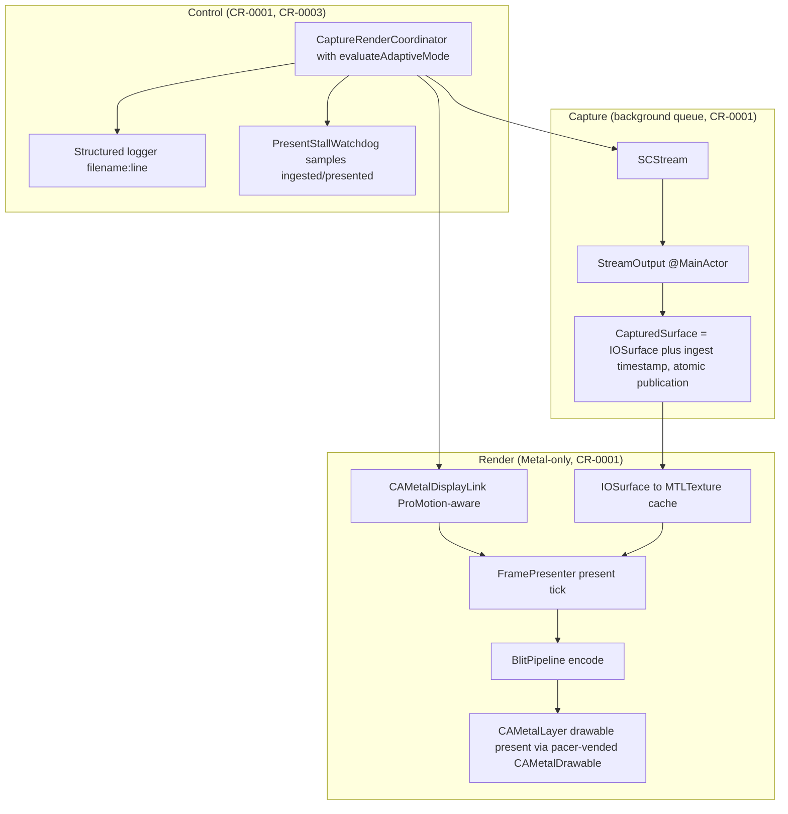
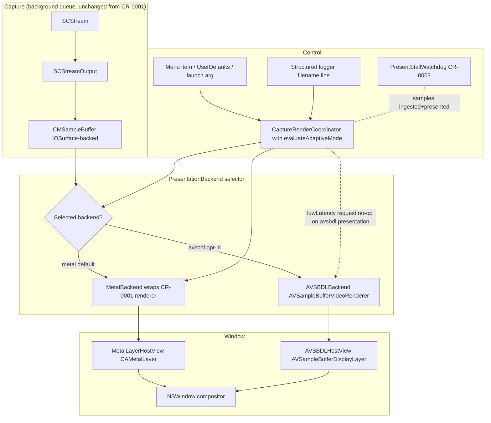
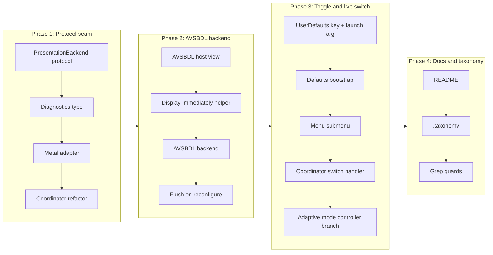

# Add an Opt-In AVSampleBufferDisplayLayer Presentation Backend Alongside the Metal Pipeline

## Baseline Assumption

This CR is written against the **implemented** state of CR-0001 and CR-0003
on the `cr/gpu-rendering` branch: macOS 15.0 / Swift 6 strict concurrency
(`SWIFT_STRICT_CONCURRENCY = complete`) / Metal 3 baseline with no legacy
`CGDisplayStream` path. Concretely:

* Capture runs on a dedicated background queue via `SCStream` against an
  `SCContentFilter` built from the virtual display's `CGDirectDisplayID`.
  The capture pipeline is split between an `actor`-isolated
  `StreamCoordinator` (`DeskPad/Backend/Capture/capture.stream_coordinator.swift`)
  and an `@MainActor`-isolated `StreamOutput`
  (`DeskPad/Backend/Capture/capture.stream_output.swift`).
* `StreamOutput.stream(_:didOutputSampleBuffer:of:)` receives
  `IOSurface`-backed `CMSampleBuffer`s on the background queue, unwraps the
  `IOSurface` via `CMSampleBufferGetImageBuffer` plus
  `CVPixelBufferGetIOSurface`, and publishes the surface (wrapped in a
  `CapturedSurface` value type alongside its ingest timestamp) atomically
  for the renderer. The `CMSampleBuffer` itself is **not** currently
  published to the renderer; widening that hand-off to `CMSampleBuffer` is
  in scope for this CR (see Functional Requirement 2).
* Presentation is driven by `CAMetalDisplayLink` (macOS 14+, attached to
  the host view's `CAMetalLayer`) implemented in
  `DeskPad/Backend/Render/render.display_link_pacer.swift`. There is no
  `CADisplayLink(target:selector:)` and no `CVDisplayLink` anywhere in the
  tree. The pacer vends a `CAMetalDrawable` and target presentation
  timestamp per tick.
* The render ensemble is a set of single-purpose files:
  `Backend/Render/render.frame_presenter.swift` (per-tick render closure,
  the actual driver invoked by the pacer),
  `Backend/Render/render.iosurface_texture_cache.swift`,
  `Backend/Render/render.blit_pipeline.swift`,
  `Backend/Render/render.device_loss_recovery.swift`,
  `Backend/Render/render.present_stall_watchdog.swift` (CR-0003 Layer 1),
  and the host view at
  `Frontend/Screen/render.metal_layer_host_view.swift` (note: in
  `Frontend/Screen/`, not `Backend/Render/`, because it is an `NSView`).
* Adaptive latency-versus-power mode switching is implemented inline on
  the `@MainActor` coordinator
  (`DeskPad/Frontend/Screen/screen.capture_render_coordinator.swift`,
  method `evaluateAdaptiveMode(switchThresholdSeconds:)`, state
  `currentMode: CaptureMode`). The `CaptureMode` enum (`.lowLatency` /
  `.powerSaving`) is defined in
  `DeskPad/Backend/Capture/capture.stream_configuration.swift`. There is
  no separate `AdaptiveModeController` type or file.
* Structured logging is teed to `~/Library/Logs/DeskPad/deskpad.log` with
  `filename:line` tagging via `DeskPad/Logging/agents.log.logger.swift`
  and `DeskPad/Logging/agents.log.file_sink.swift`.
* The CR-0003 present-stall watchdog samples
  `(ingestedFrameCount, presentedFrameCount, state)` from the coordinator
  once per second and emits the literal `present stall: ingested=N
  presented=M elapsed=S` prefix to the log when ingestion advances but
  presentation does not for three seconds. The watchdog is always-on in
  production and is the cheapest detection layer for the white-window
  failure class.
* The CR-0003 `--self-test` mode is parsed in `DeskPad/main.swift` via
  `SelfTestLaunchDispatch.dispatchIfRequested()` and routes the binary
  through a headless diagnostic instead of constructing the main window.
  Layer 2 reads back from the presented `CAMetalDrawable`; Layer 3
  renders a known RGB-gradient pattern offscreen.

CR-0002 builds on that architecture and does not re-specify any of it.
Where this CR refers to "the capture subsystem", "the render subsystem",
"the coordinator", or "the structured logger", those are the artefacts
named above. The "adaptive mode controller" referred to in this CR is the
`evaluateAdaptiveMode` logic on the coordinator, not a separate object.
The deployment target (`MACOSX_DEPLOYMENT_TARGET = 15.0`),
`SWIFT_VERSION = 6.0`, and `SWIFT_STRICT_CONCURRENCY = complete` settings
established by CR-0001 are inherited unchanged by this CR; no
`@available(macOS 14, *)` guards are needed for the AVFoundation symbols
this CR uses, even though they are documented as macOS 14+ availability.

## Change Summary

Introduce a second presentation backend based on `AVSampleBufferDisplayLayer`
plus its modern `AVSampleBufferVideoRenderer` (the `sampleBufferRenderer`
property, macOS 14+), selectable at runtime via a persisted user preference.
The capture subsystem from CR-0001 is refactored behind a small
`PresentationBackend` protocol (Swift 6 strict-concurrency compliant; see
the isolation notes in the Backend Protocol section) so its
`CMSampleBuffer` output can be handed to either the existing Metal backend
(default) or the new `AVSampleBufferDisplayLayer` backend. The switch takes effect on the live
stream without an app restart by tearing down one backend and bringing up the
other while the capture pipeline keeps running. The Metal backend remains the
default and the documented choice for interactive and gaming content; the new
backend is the documented choice for screen-sharing and largely static
content workloads where power efficiency, zero-copy enqueue, and possible
hardware overlay-plane bypass of GPU compositing matter more than minimal
input lag.

## Motivation and Background

CR-0001 evaluated `AVSampleBufferDisplayLayer` as the primary backend and
rejected it for the interactive use case, because the layer is
timestamp-driven and smoothness-first: it buffers approximately 2 to 3
frames internally to absorb jitter and present on schedule, which adds on
the order of 33 to 50 ms of input lag at 60 fps. That bias is correct for
video playback (where smoothness dominates and the source has fixed cadence)
and wrong for interactive content (where every buffered frame is visible
input lag). DeskPad's interactive-content requirements (CR-0001 requirements
14 to 18) take precedence in the default pipeline.

However, the rejection was qualified, not absolute. The same trade-off list
in CR-0001 noted that `AVSampleBufferDisplayLayer` would have been a strong
candidate had DeskPad's scope remained pure screen-sharing of largely static
content. Concretely, on that workload:

1. **Zero-copy CMSampleBuffer enqueue.** The capture subsystem already
   produces `IOSurface`-backed `CMSampleBuffer`s; enqueueing them directly
   into `AVSampleBufferVideoRenderer` keeps the data in unified memory with
   no intermediate Metal texture creation, no shader dispatch, no drawable
   acquisition, and no manual present-time computation.

2. **System video pipeline power efficiency.** The video renderer integrates
   with the system's video display path. On Apple Silicon this path is the
   target of years of dedicated power-optimization work for the screen-share
   and video-playback case, and is consistently lower-energy than a
   client-driven Metal blit-and-present loop at equivalent visual quality.

3. **Possible hardware overlay-plane bypass of GPU compositing.** When the
   layer's geometry, format, and content meet the system's overlay-plane
   eligibility criteria, WindowServer can route presentation through a
   hardware overlay plane, bypassing the GPU compositor entirely. This is
   not guaranteed and is not observable from app code, but it is structurally
   available to `AVSampleBufferDisplayLayer` and is not available to a
   `CAMetalLayer` driven by an app-side render loop.

4. **HDR tone mapping for free.** The system video pipeline applies the
   appropriate tone-mapping for the destination display when the
   `CMSampleBuffer` carries the right colorspace and transfer-function
   attachments. Reproducing this in a custom Metal pipeline is non-trivial
   and not part of CR-0001's scope.

5. **Materially less code.** The render subsystem in CR-0001 is small but
   nontrivial: a host view, a texture cache, a blit pipeline state with
   shaders, a display-link pacer, and device-loss recovery. The
   `AVSampleBufferDisplayLayer` path replaces all of that with a layer, an
   `enqueueSampleBuffer:` call, and a status observer.

Real users use DeskPad in two distinct modes: hosting interactive content
(games, where CR-0001's latency work matters) and screen-sharing or
document mirroring (where it does not, and where battery life on a long
presentation matters more). Forcing a single backend across both modes
leaves measurable power on the table for the latter group. The right
answer is to keep CR-0001's Metal backend as the default and offer the
`AVSampleBufferDisplayLayer` backend as an opt-in for users who know their
workload is power-bound, not latency-bound.

## Change Drivers

* User segment whose primary workload is screen-sharing and document
  mirroring during long presentations on battery; they currently pay
  CR-0001's interactive-latency machinery without using it.
* The structural power and code-size advantages enumerated above, which
  CR-0001 itself acknowledged but deferred.
* Architectural hygiene: the rendering subsystem from CR-0001 implicitly
  encodes "Metal blit is the only presentation path"; introducing a second
  backend forces the small, explicit `PresentationBackend` seam that
  Dependency Inversion calls for and that future work (HDR, hardware
  overlay experiments, other backends) will reuse.
* Project owner's coding standards (small single-purpose files, hierarchical
  namespace naming, docstring with `@agents-index`, no em-dashes in prose).

## Current State

After CR-0001 and CR-0003, the rendering pipeline is owned by
`Frontend/Screen/screen.capture_render_coordinator.swift`, which constructs
a `Backend/Capture/capture.stream_coordinator.swift` actor, a
`Backend/Capture/capture.stream_output.swift` `@MainActor` output, a
`Frontend/Screen/render.metal_layer_host_view.swift` view (note:
`Frontend/Screen/`, not `Backend/Render/`, because it is an `NSView`), and
the per-tick `Backend/Render/render.frame_presenter.swift`. The
coordinator wires them together through the remaining `Backend/Render/`
files (`render.iosurface_texture_cache.swift`,
`render.blit_pipeline.swift`, `render.display_link_pacer.swift`,
`render.device_loss_recovery.swift`,
`render.present_stall_watchdog.swift`) and observes screen
reconfiguration. The coordinator's hand-off from capture to render is an
implicit contract: `StreamOutput.publish(surface:)` stores the latest
`IOSurface` (wrapped in a `CapturedSurface` value type with an ingest
timestamp) and signals dirty; `FramePresenter.present(tick:)` reads
`streamOutput.latestCapturedSurface` on each `CAMetalDisplayLink` tick
when the dirty flag is set. There is no protocol-level seam between
capture and render. The renderer is hard-coded to be the Metal blit
pipeline. Adaptive mode (`.lowLatency` vs `.powerSaving`) lives as
`evaluateAdaptiveMode(switchThresholdSeconds:)` and `currentMode` on the
coordinator; there is no separate adaptive-mode-controller file.

### Current State Diagram



## Proposed Change

Introduce a small `PresentationBackend` protocol that both backends
implement, refactor the coordinator to own a `PresentationBackend`
existential rather than the concrete Metal renderer, and add an
`AVSampleBufferDisplayLayer`-based implementation alongside the existing
Metal implementation. Persist the user's choice in `UserDefaults` and expose
it through a menu item; switch takes effect live without an app restart.

### Backend Protocol

`Backend/Render/render.presentation_backend.swift` declares the protocol
both backends conform to. The protocol is intentionally minimal so the
capture subsystem stays backend-agnostic per Dependency Inversion.

**Strict-concurrency isolation.** Per CR-0001's Swift 6 strict-concurrency
baseline (`SWIFT_STRICT_CONCURRENCY = complete`), `PresentationBackend` is
declared `@MainActor` and inherits `AnyObject`. Backends own their
`NSView`-rooted host and any `CALayer` state, which is main-actor-only by
AppKit/QuartzCore contract. The `enqueue(_:)` method is the one
cross-actor hop: it is called from the capture subsystem's dedicated
background queue and **MUST** be invoked as `await backend.enqueue(buffer)`
(or a `MainActor.assumeIsolated` equivalent in a callback context).
`CMSampleBuffer` carries the immutable owned-reference semantics CR-0001
established at publication, so it is safe to pass across the actor
boundary. Backend implementations are `final class` types annotated
`@MainActor`. `PresentationBackendDiagnostics` is a `Sendable` struct so
it can be read by the adaptive mode controller from off-main contexts.

The protocol members:

* `func configure(displaySize: CGSize, scaleFactor: CGFloat) throws`,
  which prepares the backend for a given output resolution. Called on
  initial start and on every reconfiguration event.
* `func enqueue(_ sampleBuffer: CMSampleBuffer)`, which hands off one
  captured frame. The capture subsystem calls this on its dedicated
  background queue. The backend **MUST NOT** block this queue.
* `func teardown()`, which releases all backend-owned resources. Called
  on shutdown and on backend switch.
* `var hostView: NSView { get }`, the view the window's content view
  embeds. For the Metal backend this is the `MetalLayerHostView` from
  CR-0001 (`Frontend/Screen/render.metal_layer_host_view.swift`); for the
  `AVSampleBufferDisplayLayer` backend this is a thin `NSView` whose
  backing layer is the `AVSampleBufferDisplayLayer`.
* `var diagnostics: PresentationBackendDiagnostics { get }`, a snapshot
  of backend-specific health (the AVSBDL backend's `status`, `error`,
  and `requiresFlushToResumeDecoding`; the Metal backend's last
  command-buffer error class). Logged on every transition.

The capture-to-backend interface is `CMSampleBuffer`, not raw `IOSurface`,
because:

1. The `SCStream` already delivers `CMSampleBuffer`s with the right
   `IOSurface`-backed `CVPixelBuffer` and the correct presentation
   timestamp to `StreamOutput.stream(_:didOutputSampleBuffer:of:)`. Today
   `StreamOutput` unwraps the `IOSurface` and discards the
   `CMSampleBuffer`; this CR widens the publication to retain the
   `CMSampleBuffer` so it can be passed through unchanged. The pixel data
   stays zero-copy in unified memory across this widening.
2. `AVSampleBufferVideoRenderer.enqueueSampleBuffer:` requires a
   `CMSampleBuffer`, so the AVSBDL backend would otherwise have to
   reconstruct one.
3. The Metal backend's adapter unwraps the `CMSampleBuffer` to its
   underlying `IOSurface` via `CMSampleBufferGetImageBuffer` and
   `CVPixelBufferGetIOSurface` exactly the way `StreamOutput` does
   today; the only change is that the unwrap moves from `StreamOutput`
   into the Metal adapter so the AVSBDL adapter never has to see it.

### AVSampleBufferDisplayLayer Backend

`Backend/Render/render.avsbdl_backend.swift` owns an
`AVSampleBufferDisplayLayer` and uses its modern `sampleBufferRenderer`
property (an `AVSampleBufferVideoRenderer`) for enqueue, flush, and status
observation. The direct `enqueueSampleBuffer:`, `status`, `error`, `flush`,
and `flushAndRemoveImage` methods on the layer itself are deprecated as of
macOS 15.0 / iOS 18.0 (`AVSampleBufferDisplayLayer.h` lines 94, 103, 110,
139, 148, 158, 168, 194, 212, 219, 226; replacement docstrings explicitly
direct callers to `sampleBufferRenderer`) and **MUST NOT** be used.
`sampleBufferRenderer` is declared at
`AVSampleBufferDisplayLayer.h:303` with
`API_AVAILABLE(macos(14.0), ios(17.0), tvos(17.0), visionos(1.0))`; this
availability is satisfied unconditionally by CR-0001's macOS 15.0
deployment target, so no `@available` guard is required.

Key design points:

1. **Timebase.** The renderer's `timebase` is read-only on
   `AVSampleBufferVideoRenderer` (`AVSampleBufferVideoRenderer.h` does not
   expose a mutable timebase; the `AVQueuedSampleBufferRendering.timebase`
   property at `AVQueuedSampleBufferRendering.h:50` is declared
   `readonly`). To control playback rate explicitly we drive the renderer
   from an `AVSampleBufferRenderSynchronizer`
   (`AVSampleBufferRenderSynchronizer.h`), attach the renderer to it once
   at configuration time, set the synchronizer's rate to `1.0`, and let the
   renderer interpret each `CMSampleBuffer`'s PTS against that timebase. For
   the simpler "display immediately" mode we attach the
   `kCMSampleAttachmentKey_DisplayImmediately = kCFBooleanTrue` attachment
   to each enqueued sample buffer per `AVSampleBufferDisplayLayer.h:117`
   and `CMSampleBuffer.h:1518`, which causes the renderer to present each
   frame as soon as decoded, replacing prior frames regardless of
   timestamp. This is the documented behaviour for live mirror sources.

2. **Display-immediately as the default mode.** Because DeskPad's source is
   a live mirror with no audio track, no seeking, and no notion of
   "playback rate", we set `kCMSampleAttachmentKey_DisplayImmediately` on
   every enqueued buffer. This minimizes the renderer's internal buffering
   without removing the structural 2-to-3-frame characteristic noted in
   CR-0001 (the renderer still owns its decode-and-present pipeline). The
   attachment key is set via `CMSampleBufferGetSampleAttachmentsArray` plus
   `CFDictionarySetValue` per the explicit note at
   `AVSampleBufferDisplayLayer.h:128`.

3. **Flush-and-restart on reconfiguration.** On any resolution or
   scale-factor change, the backend calls
   `flushWithRemovalOfDisplayedImage:completionHandler:` on the
   `sampleBufferRenderer` (`AVSampleBufferVideoRenderer.h:67`,
   `removeDisplayedImage = true`), waits for the completion handler, then
   re-applies the new geometry to the layer's `bounds` and reconfigures
   downstream sizing. We **MUST NOT** call the deprecated
   `AVSampleBufferDisplayLayer.flush` /
   `AVSampleBufferDisplayLayer.flushAndRemoveImage` directly.

4. **Status and error observation.** The backend KVO-observes
   `sampleBufferRenderer.status` per `AVSampleBufferVideoRenderer.h:38`
   (`AVQueuedSampleBufferRenderingStatus`; values
   `Unknown`, `Rendering`, `Failed` per
   `AVQueuedSampleBufferRendering.h:27-31`). When `status` transitions to
   `Failed`, the backend reads `sampleBufferRenderer.error`
   (`AVSampleBufferVideoRenderer.h:45`), logs it through the structured
   logger with `filename:line`, and recovers by calling
   `flushWithRemovalOfDisplayedImage:` and re-enqueueing the next captured
   sample buffer. The backend also observes
   `AVSampleBufferVideoRendererRequiresFlushToResumeDecodingDidChange`
   (`AVSampleBufferVideoRenderer.h:27`) and
   `AVSampleBufferVideoRendererDidFailToDecodeNotification`
   (`AVSampleBufferVideoRenderer.h:24`) and treats both as triggers for the
   same flush-and-resume recovery.

5. **Adaptive mode interaction.** CR-0001 requirement 18 specifies
   automatic adaptive mode switching between low-latency and power-saving
   operating points, implemented as `evaluateAdaptiveMode(...)` plus
   `currentMode` state on the coordinator (no separate controller file).
   The `AVSampleBufferDisplayLayer` backend is, by its own structural
   characteristics, the power-optimized choice; latency mode does not
   meaningfully apply to it because the layer's internal buffering is not
   under app control. When the AVSBDL backend is selected, the
   coordinator's adaptive mode logic **MUST** treat
   `CaptureMode.lowLatency` requests as no-ops for the *presentation*
   stage (the capture configuration may still update for queue depth /
   `minimumFrameInterval`), and the backend's `diagnostics` snapshot
   **MUST** report `latencyModeApplicable = false`. Users who need the
   low-latency presentation mode must use the Metal backend, and the menu
   item makes this trade-off explicit.

6. **Readiness gating.** The backend checks
   `sampleBufferRenderer.readyForMoreMediaData`
   (`AVQueuedSampleBufferRendering.h:96`) before each enqueue. If the
   renderer is not ready, the backend drops the incoming frame rather than
   queueing it, consistent with the newest-frame-wins policy CR-0001
   established for the capture path. The drop is counted and logged at a
   rate-limited cadence to avoid log spam.

7. **CR-0003 present-stall watchdog contract.** The watchdog samples
   `(ingestedFrameCount, presentedFrameCount, state)` from the
   coordinator on a one-second main-actor cadence and emits the literal
   prefix `present stall: ingested=N presented=M elapsed=S` after three
   seconds of ingestion-without-presentation. The AVSBDL backend **MUST**
   increment a `presentedFrameCount` counter exposed to the coordinator
   on every successful `enqueueSampleBuffer(_:)` call (i.e. every
   readiness-gated, non-dropped enqueue), with the same observable
   semantics as the Metal backend's `FramePresenter.presentedFrameCount`.
   Without this contract the watchdog would emit false positives whenever
   the AVSBDL backend is active. The Metal backend keeps incrementing the
   existing `FramePresenter.framesPresented`.

8. **CR-0003 `--self-test` mode interaction.** The CR-0003 self-test
   diagnostics in `Frontend/Screen/SelfTest/` read back pixels from a
   `CAMetalDrawable` presented to a `CAMetalLayer`. The
   `AVSampleBufferDisplayLayer` backend has no app-addressable
   drawable, so Layer 2 (drawable read-back) and Layer 3 (loopback
   pattern) do not apply to it. The self-test launch path **MUST**
   force-select the Metal backend for the duration of the `--self-test`
   run regardless of the user's persisted preference or the
   `-DeskPadPresentationBackend` launch argument, and **MUST** log this
   override. The persisted user preference is not modified by the
   self-test run.

### Configuration / Toggle Mechanism

* **Persistence.** A single `UserDefaults` key,
  `DeskPad.presentationBackend`, with values `"metal"` (default) and
  `"avsbdl"`. Default established in
  `Backend/Configuration/configuration.user_defaults.bootstrap.swift` via
  `UserDefaults.standard.register(defaults:)` at app launch.
* **Surface.** The app's existing `mainMenu` (constructed in
  `AppDelegate.applicationDidFinishLaunching`,
  `DeskPad/AppDelegate.swift:26-37`) gains a "Presentation Backend"
  submenu with two radio-style `NSMenuItem`s: "Metal (low latency, default)"
  and "AVSampleBufferDisplayLayer (power-optimized)". Selecting an item
  updates `UserDefaults` and posts a typed switch event the coordinator
  consumes. The DeskPad UI has no other natural surface; settings windows
  and preferences panes are out of scope for this project.
* **Launch argument override.** A `-DeskPadPresentationBackend metal|avsbdl`
  process argument **MUST** take precedence over `UserDefaults` for the
  current launch, for CI and benchmarking convenience. The argument does
  not persist.
* **Live switching.** Selecting a different backend tears down the current
  backend, swaps the host view in the window's content view, brings up the
  new backend, and resumes the existing `SCStream` (no stop/start of the
  capture). The transition is logged through the structured logger with
  filename:line and includes both the old and new backend identifiers, the
  trigger (menu, launch arg, or default), and the elapsed time of the
  swap.

### Proposed State Diagram



## Requirements

### Functional Requirements

1. The system **MUST** define a `PresentationBackend` protocol in
   `Backend/Render/render.presentation_backend.swift` with the methods
   `configure(displaySize:scaleFactor:)`, `enqueue(_:)`, `teardown()`, and
   the properties `hostView: NSView` and
   `diagnostics: PresentationBackendDiagnostics`, such that both the Metal
   and `AVSampleBufferDisplayLayer` backends conform to it without
   downcasts. The protocol **MUST** be `@MainActor`-isolated and inherit
   `AnyObject`, both backend implementations **MUST** be `final class`
   types annotated `@MainActor`, and `PresentationBackendDiagnostics`
   **MUST** be a `Sendable` value type, so the entire surface compiles
   under `SWIFT_STRICT_CONCURRENCY = complete` without warnings.

2. The capture-to-backend interface **MUST** be `CMSampleBuffer` (the
   buffer the `SCStreamOutput` already publishes). The capture subsystem
   **MUST NOT** be aware of which backend is active. The cross-actor
   hand-off from the capture subsystem's background queue to the
   `@MainActor` backend **MUST** use `await backend.enqueue(buffer)` (or
   the equivalent `MainActor.assumeIsolated` form in a callback context),
   consistent with CR-0001's `actor`-isolated capture and `@MainActor`
   renderer split.

3. The system **MUST** persist the selected backend in `UserDefaults`
   under the key `DeskPad.presentationBackend` with the string values
   `"metal"` and `"avsbdl"`. The default value registered via
   `UserDefaults.standard.register(defaults:)` **MUST** be `"metal"`.

4. The system **MUST** honour a process launch argument
   `-DeskPadPresentationBackend metal|avsbdl` that overrides the persisted
   value for the current launch only. Invalid values **MUST** fall back to
   `"metal"` and **MUST** be logged.

5. The system **MUST** expose backend selection through a "Presentation
   Backend" submenu in the application's existing main menu, with two
   radio-style items reflecting the current selection.

6. Switching backends **MUST** take effect on the live capture stream
   without an app restart. The system **MUST** tear down the current
   backend, swap the window's content view's child view to the new
   backend's `hostView`, and start the new backend, all while the
   `SCStream` from CR-0001 remains running.

7. The `AVSampleBufferDisplayLayer` backend **MUST** enqueue every captured
   `CMSampleBuffer` through the layer's `sampleBufferRenderer`
   (`AVSampleBufferVideoRenderer`, `AVSampleBufferDisplayLayer.h:303`,
   macOS 14+). The backend **MUST NOT** call any of the deprecated methods
   directly on the layer: `enqueueSampleBuffer:`, `flush`,
   `flushAndRemoveImage`, `requestMediaDataWhenReadyOnQueue:usingBlock:`,
   or `stopRequestingMediaData`, nor read the deprecated `status`,
   `error`, `requiresFlushToResumeDecoding`,
   `readyForMoreMediaData`, `hasSufficientMediaDataForReliablePlaybackStart`,
   or `timebase` properties on the layer.

8. The `AVSampleBufferDisplayLayer` backend **MUST** attach
   `kCMSampleAttachmentKey_DisplayImmediately` set to `kCFBooleanTrue` on
   each enqueued `CMSampleBuffer` via
   `CMSampleBufferGetSampleAttachmentsArray` plus `CFDictionarySetValue`,
   as documented at `AVSampleBufferDisplayLayer.h:117` and
   `CMSampleBuffer.h:1518`, so the renderer presents each captured frame
   as soon as it is decoded rather than scheduling it against a PTS
   timebase that DeskPad does not maintain.

9. The `AVSampleBufferDisplayLayer` backend **MUST NOT** combine a
   non-NULL control timebase or an `AVSampleBufferRenderSynchronizer`
   with `kCMSampleAttachmentKey_DisplayImmediately` on the same enqueued
   sample buffer, per the explicit note at
   `AVSampleBufferDisplayLayer.h:137` and
   `AVQueuedSampleBufferRendering.h:64`. The display-immediately path
   **MUST** run without a synchronizer; if a future requirement demands
   timestamp-driven playback, the synchronizer path **MUST** be a separate
   mode that omits the display-immediately attachment.

10. The `AVSampleBufferDisplayLayer` backend **MUST** observe its
    `sampleBufferRenderer.status` (`AVSampleBufferVideoRenderer.h:38`)
    through KVO; on transition to `AVQueuedSampleBufferRenderingStatusFailed`,
    the backend **MUST** read `sampleBufferRenderer.error`
    (`AVSampleBufferVideoRenderer.h:45`), log it with `filename:line` through
    the structured logger, call
    `flushWithRemovalOfDisplayedImage:completionHandler:` on the renderer
    with `removeDisplayedImage = true`
    (`AVSampleBufferVideoRenderer.h:67`), and resume by enqueueing the next
    captured `CMSampleBuffer`.

11. The `AVSampleBufferDisplayLayer` backend **MUST** observe the
    notifications
    `AVSampleBufferVideoRendererRequiresFlushToResumeDecodingDidChangeNotification`
    (`AVSampleBufferVideoRenderer.h:27`) and
    `AVSampleBufferVideoRendererDidFailToDecodeNotification`
    (`AVSampleBufferVideoRenderer.h:24`), treating each as a trigger for the
    same flush-and-resume recovery as the status-failed path.

12. On any virtual display reconfiguration (resolution or scale-factor
    change), the `AVSampleBufferDisplayLayer` backend **MUST** call
    `flushWithRemovalOfDisplayedImage:completionHandler:` on its
    `sampleBufferRenderer` with `removeDisplayedImage = true`, wait for the
    completion handler, then update the layer's `bounds` to match the new
    output resolution before enqueueing the next sample buffer.

13. The `AVSampleBufferDisplayLayer` backend **MUST** check
    `sampleBufferRenderer.readyForMoreMediaData`
    (`AVQueuedSampleBufferRendering.h:96`) before each enqueue. When the
    renderer is not ready, the incoming `CMSampleBuffer` **MUST** be
    dropped (not queued), and the drop **MUST** be counted in a rolling
    window and logged at most once per second through the structured
    logger.

14. The `AVSampleBufferDisplayLayer` backend **MUST** declare itself the
    power-optimized backend by setting
    `diagnostics.latencyModeApplicable = false`. The coordinator's
    `evaluateAdaptiveMode(...)` and the resulting `currentMode`
    transitions (CR-0001 FR-18) **MUST** continue to run, but a transition
    to `CaptureMode.lowLatency` **MUST NOT** alter the AVSBDL backend's
    presentation behaviour (which is structurally not under app control).
    The no-op for presentation **MUST** be reported through the backend's
    `diagnostics` snapshot and **MUST** be logged at most once per mode
    transition burst. Capture-side effects of mode transitions (queue
    depth, `minimumFrameInterval`) **MAY** continue to apply because they
    affect what the capture subsystem produces, not what the AVSBDL
    backend does with it.

15. The Metal backend's behaviour as specified by CR-0001 **MUST NOT** be
    changed by this CR except to conform to the new `PresentationBackend`
    protocol. CR-0001's functional requirements 1 through 18 and
    acceptance criteria AC-1 through AC-17 **MUST** continue to hold
    whenever the Metal backend is selected. CR-0003's functional
    requirements (present-stall watchdog and `--self-test` mode) **MUST**
    continue to hold whenever the Metal backend is selected.

16. The system **MUST** log every backend selection, every backend switch,
    every reconfiguration, every status transition observed on either
    backend, and every recovery action through the structured logger from
    CR-0001 with `filename:line` tagging. Log lines **MUST** include the
    backend identifier (`"metal"` or `"avsbdl"`).

17. The README **MUST** document the new menu item, the
    `UserDefaults` key, the launch argument, and the explicit trade-off:
    Metal is the default and the recommended choice for interactive and
    gaming content; `AVSampleBufferDisplayLayer` is the opt-in choice for
    screen-sharing and document workloads where battery life matters and
    minimum input lag does not. The documentation **MUST** state that
    selecting the AVSBDL backend disables CR-0001's low-latency adaptive
    mode for that backend.

18. The `AVSampleBufferDisplayLayer` backend **MUST** increment a
    `presentedFrameCount: Int` counter on every successful
    `sampleBufferRenderer.enqueueSampleBuffer(_:)` call (readiness-gated,
    non-dropped). The counter **MUST** be observable from the coordinator
    in the same manner as `FramePresenter.presentedFrameCount`, so the
    CR-0003 `PresentStallWatchdog` continues to read a meaningful
    `presented` value for either active backend without modification.
    Dropped frames (per Functional Requirement 13) **MUST NOT** be
    counted as presented.

19. The CR-0003 `--self-test` launch path
    (`SelfTestLaunchDispatch.dispatchIfRequested()` in
    `DeskPad/main.swift`) **MUST** force-select the Metal backend for the
    duration of the self-test run regardless of the persisted
    `DeskPad.presentationBackend` value or the
    `-DeskPadPresentationBackend` launch argument, because the AVSBDL
    backend has no app-addressable drawable for CR-0003 Layer 2
    (drawable read-back) or Layer 3 (loopback pattern). The override
    **MUST** be logged with `filename:line` and **MUST NOT** modify the
    persisted user preference.

### Non-Functional Requirements

1. On a sustained screen-sharing workload (largely static or slowly
   changing content) on Apple Silicon at the modes listed in
   `ScreenViewController` up to 5120x2160, the `AVSampleBufferDisplayLayer`
   backend **MUST** consume strictly less wall-clock CPU and GPU energy
   than the Metal backend over a 5-minute measurement window, measured by
   Instruments' Energy Impact gauge or `powermetrics`. If the measurement
   does not show a strict improvement on at least one representative
   workload, the backend **MUST NOT** ship as a user-facing option.

2. On the same workload, the `AVSampleBufferDisplayLayer` backend **MUST
   NOT** regress the user-visible frame rate of the mirrored content below
   the source's effective update rate.

3. The system **MUST** structure the new code into separate single-purpose
   files (one per backend, one per host view, one for the protocol, one for
   the configuration glue, one for the menu wiring), each with a top-level
   docstring containing an `@agents-index` annotation and no file exceeding
   200 lines of code, consistent with CR-0001.

4. The system **MUST NOT** use em-dashes (U+2014) or en-dashes (U+2013
   used as dashes) in any prose introduced by this change.

5. The system **MUST NOT** introduce new third-party SwiftPM dependencies.
   Only `AVFoundation.framework` and `CoreMedia.framework` are added to the
   target's link set.

6. The backend switch operation **MUST** complete (old teardown, view
   swap, new bring-up) within 250 ms on an Apple Silicon M-series Mac at
   4K resolution, measured end-to-end via the structured logger's swap
   timing line.

## Affected Components

* `DeskPad/Frontend/Screen/screen.capture_render_coordinator.swift`
  (from CR-0001 / CR-0003; modified to own a `PresentationBackend`
  existential, to handle live switching, to consult the active backend's
  `diagnostics.latencyModeApplicable` inside `evaluateAdaptiveMode`, and
  to expose a backend-agnostic `presentedFrameCount` to the
  `PresentStallWatchdog`)
* `DeskPad/Backend/Render/render.presentation_backend.swift` (new; the
  protocol)
* `DeskPad/Backend/Render/render.presentation_backend_diagnostics.swift`
  (new; the diagnostics value type)
* `DeskPad/Backend/Render/render.metal_backend.swift` (new; a thin adapter
  that conforms the CR-0001 `FramePresenter` + `MetalLayerHostView` +
  `IOSurfaceTextureCache` + `BlitPipeline` + `DisplayLinkPacer`
  ensemble to `PresentationBackend`)
* `DeskPad/Backend/Render/render.avsbdl_backend.swift` (new; the
  `AVSampleBufferDisplayLayer` backend)
* `DeskPad/Frontend/Screen/render.avsbdl_host_view.swift` (new; an
  `NSView` whose backing layer is an `AVSampleBufferDisplayLayer`,
  located alongside `render.metal_layer_host_view.swift` for symmetry
  since both are `NSView` subclasses)
* `DeskPad/Backend/Render/render.avsbdl_display_immediately_attachment.swift`
  (new; the helper that sets `kCMSampleAttachmentKey_DisplayImmediately`
  on a `CMSampleBuffer`)
* `DeskPad/Backend/Configuration/configuration.presentation_backend_key.swift`
  (new; the `UserDefaults` key, default registration, and launch-argument
  parsing)
* `DeskPad/Backend/Configuration/configuration.user_defaults.bootstrap.swift`
  (new; invoked from `main.swift`/`AppDelegate` to register defaults
  before any view is built)
* `DeskPad/Frontend/Menu/menu.presentation_backend_submenu.swift` (new;
  builds the radio-style submenu and posts the typed switch event)
* `DeskPad/AppDelegate.swift` (modified to install the new submenu
  alongside the existing main menu construction at lines 26 to 37 and to
  call the user-defaults bootstrap; no other behavioural change)
* `DeskPad/main.swift` (modified so the self-test launch path force-selects
  the Metal backend before `SelfTestLaunchDispatch.dispatchIfRequested()`
  per Functional Requirement 19)
* `DeskPad/Backend/Capture/capture.stream_output.swift` (from CR-0001;
  modified so its hand-off retains the `CMSampleBuffer` for the
  coordinator; the underlying frame data and `IOSurface` unwrap point
  change but the pixel data stays zero-copy)
* `README.md` (modified to document the new menu, key, launch argument,
  and the trade-off)
* `.taxonomy` (modified to add `PresentationBackend`,
  `AVSBDLBackend`, `MetalBackend`, `PresentationBackendDiagnostics` as
  canonical terms)

## Scope Boundaries

### In Scope

* The `PresentationBackend` protocol and the refactor of the coordinator
  to own it.
* The `AVSampleBufferDisplayLayer` backend using the modern
  `sampleBufferRenderer` (`AVSampleBufferVideoRenderer`) path.
* The `UserDefaults` key, the launch argument, the menu item, and live
  switching without app restart.
* Status, error, and decode-failure recovery for the AVSBDL backend.
* README and `.taxonomy` updates.
* Tests covering the protocol seam, the AVSBDL backend's enqueue and
  recovery paths, the live switch, and the persistence/launch-arg
  override logic.

### Out of Scope ("Here, But Not Further")

* Changing any CR-0001 requirement or acceptance criterion. The Metal
  backend keeps every guarantee CR-0001 made; this CR only adds an
  alternative.
* Wiring an `AVSampleBufferRenderSynchronizer` path (the timestamp-driven
  alternative mode for the AVSBDL backend). The display-immediately path
  is the only AVSBDL mode in this CR. The synchronizer path is recorded
  as a follow-up.
* HDR tone-mapping correctness validation. The AVSBDL backend inherits
  whatever the captured `CMSampleBuffer` carries; deliberate HDR support
  is a follow-up.
* Replacing the private `CGVirtualDisplay` API.
* Replacing ReSwift, or the `Timer`-based mouse polling, both of which
  CR-0001 already deferred.
* Measuring or asserting hardware overlay-plane activation. The behaviour
  is desirable but unobservable from app code; we do not gate on it.

## Alternative Approaches Considered

* **(a) `PresentationBackend` protocol with `AVSampleBufferDisplayLayer`
  (using the modern `sampleBufferRenderer`) opt-in backend (chosen).**
  Smallest seam that satisfies Dependency Inversion, keeps CR-0001 intact
  as the default, and lets us deliver the power-efficient backend for the
  workload it was designed for.
* **(b) Replace the Metal backend wholesale with
  `AVSampleBufferDisplayLayer`.** Rejected: CR-0001 already analyzed and
  rejected this for the interactive-content use case, and that analysis
  has not changed.
* **(c) Compile-time branch (Xcode configuration / build flag).**
  Rejected: it forfeits live switching, prevents A/B comparison on the
  same machine within the same session, complicates CI matrix coverage,
  and provides no user-visible benefit over a runtime toggle.
* **(d) Direct enqueue on the deprecated `AVSampleBufferDisplayLayer`
  methods (`enqueueSampleBuffer:`, `status`, `error`, `flush`).**
  Rejected: deprecated as of macOS 15.0 per `AVSampleBufferDisplayLayer.h`
  lines 94, 103, 110, 139, 148, 158, 168, 194, 212, 219, 226; the modern
  `sampleBufferRenderer` path (`API_AVAILABLE(macos(14.0))`) is satisfied
  unconditionally by CR-0001's `MACOSX_DEPLOYMENT_TARGET = 15.0`.
* **(e) Build a third intermediate backend that pre-decodes through
  VideoToolbox.** Rejected: the captured frames are already raw BGRA
  `IOSurface`s; introducing a VideoToolbox stage adds an encode-decode
  hop, latency, and energy with no upside.

## Impact Assessment

### User Impact

* No change for existing users until they opt in. Default remains the
  Metal backend.
* Users on battery-bound presentation workloads gain a one-click switch
  that improves wall-clock energy use over a long session.
* The README explains the trade-off so users self-select correctly.

### Technical Impact

* The capture-to-render hand-off in CR-0001 changes from an implicit
  `IOSurface` publication to an explicit `CMSampleBuffer` enqueue against
  a protocol. The Metal backend's adapter unwraps to `IOSurface`
  internally, so the steady-state cost of this change for the Metal path
  is one extra pointer-chase per frame and is not measurable.
* `AVFoundation.framework` is added to the DeskPad target's link set if
  it is not already linked transitively.
* The adaptive mode controller from CR-0001 acquires a backend-aware
  branch: latency-mode requests become no-ops on the AVSBDL backend.

### Business Impact

* Positions DeskPad as a thoughtful tool for both interactive (gaming)
  and screen-sharing (presenter) audiences, with a documented choice
  rather than a one-size-fits-all default that quietly disappoints one of
  them.

## Implementation Approach

The work proceeds in four sequential phases. The first three phases are
mergeable independently and are gated by a build that keeps the Metal
backend as the only reachable backend until Phase 4 wires the toggle in.

### Phase 1: Protocol Seam and Metal Adapter

Introduce the abstraction without behavioural change. The runtime continues
to use the CR-0001 Metal renderer; we only refactor the coordinator to
reach it through the protocol.

1. Add `Backend/Render/render.presentation_backend.swift` with the
   protocol declaration and a one-paragraph docstring stating the protocol
   exists so the capture subsystem can be backend-agnostic. Include the
   `@agents-index` annotation.
2. Add `Backend/Render/render.presentation_backend_diagnostics.swift`
   with the diagnostics value type (backend identifier string, last error
   description optional, `latencyModeApplicable: Bool`, drop count rolling
   window).
3. Add `Backend/Render/render.metal_backend.swift`: a `final class`
   wrapping the CR-0001 ensemble (`FramePresenter`, `MetalLayerHostView`,
   `IOSurfaceTextureCache`, `BlitPipeline`, `DisplayLinkPacer`) and
   conforming to `PresentationBackend`. `enqueue(_:)` unwraps the
   `CMSampleBuffer` to its underlying `IOSurface` via
   `CMSampleBufferGetImageBuffer` plus `CVPixelBufferGetIOSurface`
   (verified at `CoreVideo/CVPixelBufferIOSurface.h:62`) and feeds it to
   the existing `StreamOutput.publish(surface:)` path so `FramePresenter`
   continues to read it on each `CAMetalDisplayLink` tick. The Metal
   adapter exposes `FramePresenter.presentedFrameCount` as its
   `presentedFrameCount` for the watchdog.
4. Modify `Frontend/Screen/screen.capture_render_coordinator.swift` to
   hold a `PresentationBackend` existential, with `MetalBackend` as the
   only possible concrete type for now. The coordinator's existing
   `presentedFrameCount` accessor (already consumed by the
   `PresentStallWatchdog`) **MUST** read from
   `currentBackend.presentedFrameCount` so the watchdog continues to
   sample a meaningful value when the backend changes.
5. Modify `Backend/Capture/capture.stream_output.swift` so its
   publication retains the source `CMSampleBuffer` alongside the
   `IOSurface` (the existing `CapturedSurface` value type widens to also
   carry the `CMSampleBuffer`), and so the coordinator can forward the
   `CMSampleBuffer` to the active backend. The pixel data stays
   zero-copy; only the interface widens.

**Affected components:** new files under `DeskPad/Backend/Render/`;
modified `Frontend/Screen/screen.capture_render_coordinator.swift` and
`Backend/Capture/capture.stream_output.swift`.

### Phase 2: AVSampleBufferDisplayLayer Backend

Add the second backend behind a not-yet-wired entry point. The toggle does
not exist yet; tests reach the new backend through a test-only constructor.

1. Add `Frontend/Screen/render.avsbdl_host_view.swift` (placed alongside
   `render.metal_layer_host_view.swift` for symmetry; both are
   `NSView` subclasses and views belong under `Frontend/Screen/`): an
   `NSView` subclass whose `makeBackingLayer` returns an
   `AVSampleBufferDisplayLayer`, with `videoGravity` set to
   `AVLayerVideoGravityResize` (per `AVAnimation.h:48`,
   `API_AVAILABLE(macos(10.7))`), so the captured content fills the host
   view exactly without aspect padding.
2. Add `Backend/Render/render.avsbdl_display_immediately_attachment.swift`:
   a small helper that, given a `CMSampleBufferRef`, retrieves the
   attachments array via `CMSampleBufferGetSampleAttachmentsArray` with
   `createIfNecessary: true` and sets
   `kCMSampleAttachmentKey_DisplayImmediately = kCFBooleanTrue` on the
   first attachments dictionary. Document the rationale and cite
   `CMSampleBuffer.h:1518` and `AVSampleBufferDisplayLayer.h:128` in the
   docstring.
3. Add `Backend/Render/render.avsbdl_backend.swift`: the backend
   implementation. It owns the host view, accesses
   `hostView.layer as! AVSampleBufferDisplayLayer`, reads its
   `sampleBufferRenderer` (declared at
   `AVSampleBufferDisplayLayer.h:303`, macOS 14+), and exposes
   `configure`, `enqueue`, `teardown`, `hostView`, `diagnostics`, and
   `presentedFrameCount`. `enqueue(_:)` checks `readyForMoreMediaData`,
   applies the display-immediately attachment, calls
   `sampleBufferRenderer.enqueueSampleBuffer(_:)`, and on success
   increments `presentedFrameCount` (per Functional Requirement 18).
   KVO-observes `sampleBufferRenderer.status`; subscribes to
   `AVSampleBufferVideoRendererDidFailToDecodeNotification` and
   `AVSampleBufferVideoRendererRequiresFlushToResumeDecodingDidChangeNotification`;
   logs every transition.
4. Add the flush-and-restart path to the backend's `configure`: when
   called after a prior `configure`, call
   `flushWithRemovalOfDisplayedImage:completionHandler:` on the
   `sampleBufferRenderer` with `removeDisplayedImage = true`, await
   completion, then update the layer's `bounds` to the new resolution.

**Affected components:** new files under `DeskPad/Backend/Render/`. The
DeskPad target's link set gains `AVFoundation.framework`.

### Phase 3: Configuration, Menu, and Live Switching

Wire the runtime selector. After this phase, the user can switch backends
from the menu and via the launch argument.

1. Add `Backend/Configuration/configuration.presentation_backend_key.swift`:
   declares the `UserDefaults` key, an enum for the two valid values, the
   default registration helper, and the launch-argument parser
   (`ProcessInfo.processInfo.arguments`, searching for
   `-DeskPadPresentationBackend`).
2. Add `Backend/Configuration/configuration.user_defaults.bootstrap.swift`:
   a single entry point called from `main.swift` (or `AppDelegate.init`)
   that registers the default before any view loads. Defaults registration
   uses `UserDefaults.standard.register(defaults:)`.
3. Add `Frontend/Menu/menu.presentation_backend_submenu.swift`: builds the
   "Presentation Backend" submenu with two radio-style `NSMenuItem`s,
   updates the menu's check marks based on the current `UserDefaults`
   value, posts a typed switch event via `NotificationCenter.default` with
   userInfo `{ "backend": "metal" | "avsbdl", "trigger": "menu" }`.
4. Modify `AppDelegate.applicationDidFinishLaunching` to install the
   submenu as a top-level menu item alongside the existing "MainMenu"
   item and to call the user-defaults bootstrap.
5. Modify `Frontend/Screen/screen.capture_render_coordinator.swift` to
   observe the typed switch event, perform the live swap
   (`currentBackend.teardown()`, remove its `hostView` from the window's
   content view, instantiate the new backend, install its `hostView`,
   call `configure(displaySize:scaleFactor:)`), and log the swap with the
   elapsed time.
6. Modify
   `Frontend/Screen/screen.capture_render_coordinator.swift`'s
   `evaluateAdaptiveMode(...)` (the actual location of CR-0001's
   adaptive-mode logic; there is no separate controller file) so that a
   transition to `CaptureMode.lowLatency` consults the active backend's
   `diagnostics.latencyModeApplicable` and skips the
   presentation-side effects when it is `false` (capture-side
   `minimumFrameInterval` and queue depth **MAY** still update). The
   no-op **MUST** be logged at most once per mode-transition burst.
7. Modify `DeskPad/main.swift` so the self-test launch path force-selects
   the Metal backend before `SelfTestLaunchDispatch.dispatchIfRequested()`
   reads any backend preference. Log the override with `filename:line`.
   Do not modify the persisted `UserDefaults` value.

**Affected components:** new files under `DeskPad/Backend/Configuration/`
and `DeskPad/Frontend/Menu/`; modified `AppDelegate.swift`,
`main.swift`, `Frontend/Screen/screen.capture_render_coordinator.swift`.

### Phase 4: Documentation, Taxonomy, and Test Bring-up

After Phase 3 is verified manually on a release-candidate build:

1. Update `README.md` to document the menu item, the `UserDefaults` key,
   the launch argument, and the explicit Metal-versus-AVSBDL trade-off
   table.
2. Update `.taxonomy` with entries for `PresentationBackend`,
   `MetalBackend`, `AVSBDLBackend`, `PresentationBackendDiagnostics`.
3. Verify that
   `grep -rnE 'AVSampleBufferDisplayLayer[^.]*\.(enqueueSampleBuffer|flush|flushAndRemoveImage|status|error|timebase|readyForMoreMediaData|requiresFlushToResumeDecoding)\b' DeskPad/`
   returns no matches (the modern `sampleBufferRenderer` path is the only
   one used). This is the same expression used in the Quality Standards
   Compliance / Verification Commands section, so the build and the
   automated test guard share one regex.
4. Verify all new files carry `@agents-index` and stay under 200 lines.

**Affected components:** `README.md`, `.taxonomy`, project-wide grep
guards.

### Implementation Flow



## Test Strategy

Tests live under `DeskPadTests/` mirroring the namespace of the code they
cover. The `DeskPadTests` target was introduced by CR-0001 Phase 1, so no
new target bring-up is required.

### Tests to Add

| Test File | Test Name | Description | Inputs | Expected Output |
|-----------|-----------|-------------|--------|-----------------|
| `DeskPadTests/Render/presentation_backend_protocol_tests.swift` | `testCoordinatorHandsOffCMSampleBuffer` | Verifies that the coordinator's hand-off to the active backend is a `CMSampleBuffer`, not a raw `IOSurface`, and that the buffer is forwarded unchanged. | A fake backend recording every `enqueue(_:)` invocation; a synthesized `CMSampleBuffer` published by a fake `SCStreamOutput`. | One `enqueue` call observed; recorded `CMSampleBuffer` is pointer-identical to the input. |
| `DeskPadTests/Render/metal_backend_adapter_tests.swift` | `testMetalAdapterUnwrapsIOSurface` | Verifies the Metal adapter unwraps `CMSampleBuffer` to its `IOSurface` via `CMSampleBufferGetImageBuffer` + `CVPixelBufferGetIOSurface` and forwards to the CR-0001 renderer unchanged. | A synthesized `IOSurface`-backed `CMSampleBuffer`. | Downstream renderer receives the same `IOSurfaceID`. |
| `DeskPadTests/Frontend/avsbdl_host_view_tests.swift` | `testHostViewBackingLayerIsAVSampleBufferDisplayLayer` | Verifies the AVSBDL host view's backing layer is an `AVSampleBufferDisplayLayer`. (Test lives under `DeskPadTests/Frontend/` to mirror the source location `DeskPad/Frontend/Screen/render.avsbdl_host_view.swift`.) | A constructed host view. | `view.layer is AVSampleBufferDisplayLayer` is `true`. |
| `DeskPadTests/Render/avsbdl_display_immediately_tests.swift` | `testDisplayImmediatelyAttachmentApplied` | Verifies the helper sets `kCMSampleAttachmentKey_DisplayImmediately = kCFBooleanTrue` on the first attachments dictionary. | A synthesized `CMSampleBuffer`. | `CMSampleBufferGetSampleAttachmentsArray(_, false)` returns an array whose first dictionary contains the key set to `kCFBooleanTrue`. |
| `DeskPadTests/Render/avsbdl_backend_enqueue_tests.swift` | `testEnqueueGoesThroughSampleBufferRenderer` | Verifies the backend enqueues through `sampleBufferRenderer.enqueueSampleBuffer(_:)` and never through the deprecated `AVSampleBufferDisplayLayer.enqueueSampleBuffer(_:)`. | A spy `AVSampleBufferDisplayLayer` whose `sampleBufferRenderer` is observable; one captured `CMSampleBuffer`. | One enqueue observed on the renderer; zero direct enqueues on the layer. |
| `DeskPadTests/Render/avsbdl_backend_readiness_tests.swift` | `testDropsFrameWhenNotReadyForMoreMediaData` | Verifies the backend drops the incoming `CMSampleBuffer` when `sampleBufferRenderer.readyForMoreMediaData` is `false`, and counts the drop. | A stub renderer reporting `readyForMoreMediaData = false`; ten enqueues. | Zero enqueues forwarded; drop counter equals 10; one rate-limited log line emitted. |
| `DeskPadTests/Render/avsbdl_backend_status_recovery_tests.swift` | `testRecoversOnStatusFailed` | Verifies that on KVO transition of `sampleBufferRenderer.status` to `AVQueuedSampleBufferRenderingStatusFailed`, the backend reads `error`, logs it, and calls `flushWithRemovalOfDisplayedImage:completionHandler:` with `removeDisplayedImage = true`. | A stub renderer that transitions `status` to `Failed` with a synthesized `NSError`. | One flush call observed; `removeDisplayedImage` argument is `true`; log file contains the error description tagged `filename:line`. |
| `DeskPadTests/Render/avsbdl_backend_decode_failure_tests.swift` | `testRecoversOnDecodeFailureNotification` | Verifies the backend treats `AVSampleBufferVideoRendererDidFailToDecodeNotification` as a recovery trigger equivalent to the status-failed path. | A `NotificationCenter` post of the named notification with a synthesized `NSError`. | One flush call observed; log line emitted. |
| `DeskPadTests/Render/avsbdl_backend_reconfigure_tests.swift` | `testReconfigureFlushesAndUpdatesBounds` | Verifies `configure` after a prior `configure` calls `flushWithRemovalOfDisplayedImage:` and updates the layer's `bounds` before the next enqueue. | A backend mid-stream; a second `configure` call with new dimensions. | Flush observed; layer `bounds.size` equals the new dimensions; no enqueue before flush completion. |
| `DeskPadTests/Configuration/presentation_backend_default_tests.swift` | `testDefaultIsMetalWhenNoUserDefault` | Verifies the bootstrap registers `"metal"` as the default and the resolved backend is `"metal"` when no override is present. | Fresh `UserDefaults` suite; no launch argument. | Resolved backend identifier equals `"metal"`. |
| `DeskPadTests/Configuration/presentation_backend_launch_arg_tests.swift` | `testLaunchArgOverridesUserDefaults` | Verifies the launch argument `-DeskPadPresentationBackend avsbdl` overrides a persisted `"metal"` value for the current launch and does not persist. | `UserDefaults` set to `"metal"`; `ProcessInfo` arguments contain the override. | Resolved backend is `"avsbdl"`; `UserDefaults` value remains `"metal"`. |
| `DeskPadTests/Configuration/presentation_backend_invalid_value_tests.swift` | `testInvalidValueFallsBackToMetal` | Verifies an invalid value in either source falls back to `"metal"` and is logged. | `UserDefaults` set to `"glsl"`. | Resolved backend is `"metal"`; one log line emitted noting the invalid value. |
| `DeskPadTests/Frontend/menu_presentation_backend_submenu_tests.swift` | `testMenuItemPostsSwitchEvent` | Verifies clicking the AVSBDL menu item updates `UserDefaults` and posts the typed switch event with `{backend:"avsbdl", trigger:"menu"}`. | Constructed submenu; programmatic `performClick(_:)` on the AVSBDL item. | `UserDefaults` value is `"avsbdl"`; one `NotificationCenter` post observed with the expected payload. |
| `DeskPadTests/Integration/live_switch_tests.swift` | `testLiveSwitchTearsDownAndBringsUpWithoutStoppingCapture` | Verifies a switch from Metal to AVSBDL tears down the Metal backend, swaps the host view, brings up the AVSBDL backend, and never calls `stop` on the `SCStream`. | A coordinator with a stub `SCStream`; a switch event for `"avsbdl"`. | One `teardown` on Metal backend; one new `hostView` installed; one `configure` on AVSBDL backend; zero `stop` calls on the stream. |
| `DeskPadTests/Integration/adaptive_mode_no_op_tests.swift` | `testLatencyModeIsNoOpOnAVSBDL` | Verifies the adaptive mode controller's latency-mode request is a no-op when the active backend's `diagnostics.latencyModeApplicable` is `false`, and that the no-op is logged. | AVSBDL backend active; adaptive mode controller raises a latency-mode request. | Backend receives no latency-mode call; one log line emitted noting the no-op. |
| `DeskPadTests/Performance/avsbdl_energy_tests.swift` | `testAVSBDLLowersEnergyOnStaticWorkload` (Instruments-backed manual benchmark) | Measures wall-clock CPU and GPU energy over a 5-minute static-content window on Apple Silicon and asserts a strict reduction versus the Metal backend on the same workload. | Static-content virtual display; 5-minute measurement; same machine, same panel. | AVSBDL Energy Impact strictly less than Metal Energy Impact across the window. |
| `DeskPadTests/Performance/live_switch_latency_tests.swift` | `testLiveSwitchUnder250ms` (Instruments-backed manual benchmark) | Measures the elapsed time from the menu click to the first enqueue on the new backend. | An active Metal session at 4K; menu-driven switch to AVSBDL. | Logged swap time below 250 ms. |
| `DeskPadTests/Compliance/no_deprecated_avsbdl_api_tests.swift` | `testNoDirectDeprecatedAVSBDLAPIs` | Source-grep guard: verifies no file under `DeskPad/Backend/Render/` references the deprecated `AVSampleBufferDisplayLayer.enqueueSampleBuffer`, `.flush`, `.flushAndRemoveImage`, `.status`, `.error`, `.timebase`, `.readyForMoreMediaData`, or `.requiresFlushToResumeDecoding` directly on the layer (only `sampleBufferRenderer.*` is permitted). | Source tree under `DeskPad/`. | Grep returns no matches. |
| `DeskPadTests/Compliance/no_em_dash_tests.swift` (existing CR-0001 test extended) | `testNewFilesContainNoEmDashes` | Source-grep guard extended to cover the new files. | Source tree under `DeskPad/`. | Grep for U+2014 and U+2013 returns no matches in any file introduced by CR-0002. |
| `DeskPadTests/Render/avsbdl_backend_presented_count_tests.swift` | `testPresentedFrameCountIncrementsOnSuccessfulEnqueue` | Verifies the AVSBDL backend's `presentedFrameCount` increments by exactly one on each successful enqueue and does not increment when `readyForMoreMediaData` is `false`. | A spy renderer; ten enqueues, five with `readyForMoreMediaData = true` and five with `false`. | `presentedFrameCount` equals 5; drop counter equals 5. |
| `DeskPadTests/Integration/present_stall_watchdog_backend_agnostic_tests.swift` | `testWatchdogReadsPresentedCountFromActiveBackend` | Verifies the CR-0003 `PresentStallWatchdog` continues to read a meaningful `presentedFrameCount` after a live switch from Metal to AVSBDL, and that no false-positive stall warning is emitted when the AVSBDL backend is enqueueing normally. | Coordinator with a fake AVSBDL backend that increments its presented counter; simulated ingestion advancing in lockstep. | Watchdog samples a non-zero `presented` value on every tick post-switch; zero `present stall: ingested=` lines in the log. |
| `DeskPadTests/SelfTest/selftest_forces_metal_backend_tests.swift` | `testSelfTestForcesMetalBackendRegardlessOfPreference` | Verifies that with `UserDefaults` set to `"avsbdl"` and the `--self-test` argument present, the self-test launch path resolves the Metal backend, emits a log line noting the override, and does not modify the persisted `UserDefaults` value. | `UserDefaults` set to `"avsbdl"`; argv contains `--self-test`. | Resolved backend is `"metal"`; one override log line emitted; `UserDefaults` value remains `"avsbdl"` after the run. |

### Tests to Modify

| Test File | Test Name | Current Behavior | New Behavior | Reason for Change |
|-----------|-----------|------------------|--------------|-------------------|
| `DeskPadTests/Capture/stream_output_tests.swift` (from CR-0001) | `testIOSurfaceExtractedZeroCopy` | Asserts the published value is an `IOSurfaceID`. | Asserts the published value is a `CMSampleBuffer` whose `CVPixelBufferGetIOSurface` returns the expected `IOSurfaceID`. | The hand-off interface widens from raw `IOSurface` to `CMSampleBuffer` per Functional Requirement 2. |
| `DeskPadTests/Integration/coordinator_reconfigure_tests.swift` (from CR-0001) | `testReconfigureOnResolutionChange` | Asserts the coordinator forwards the reconfiguration to the Metal renderer. | Asserts the coordinator forwards `configure(displaySize:scaleFactor:)` to the active `PresentationBackend`, regardless of which backend is selected. | The coordinator now talks to the backend through the protocol. |

### Tests to Remove

| Test File | Test Name | Reason for Removal |
|-----------|-----------|-------------------|
| N/A | N/A | No existing tests are made obsolete by this change. |

## Acceptance Criteria

### AC-1: Protocol seam exists and is the only path

```gherkin
Given DeskPad is launched with any selected backend
When the coordinator hands a captured frame to the renderer
Then the hand-off goes through the PresentationBackend.enqueue(_:) method
  And no code path under DeskPad/ accesses the Metal or AVSBDL renderer outside its backend file
```

### AC-2: CMSampleBuffer is the capture-to-backend interface

```gherkin
Given the SCStreamOutput publishes a captured CMSampleBuffer
When the coordinator forwards it to the active backend
Then the value passed to PresentationBackend.enqueue(_:) is a CMSampleBuffer
  And the IOSurface obtained from CMSampleBufferGetImageBuffer plus CVPixelBufferGetIOSurface on that buffer is the same IOSurface the capture subsystem received from SCStream
```

### AC-3: Default backend is Metal

```gherkin
Given DeskPad is launched for the first time with no prior UserDefaults
When the rendering pipeline starts
Then the active backend identifier is "metal"
  And CR-0001's acceptance criteria AC-1 through AC-17 all hold
```

### AC-4: UserDefaults persists the chosen backend

```gherkin
Given the user selects the AVSampleBufferDisplayLayer menu item
When DeskPad is relaunched
Then the active backend identifier is "avsbdl"
  And the UserDefaults value at key "DeskPad.presentationBackend" is "avsbdl"
```

### AC-5: Launch argument overrides UserDefaults

```gherkin
Given UserDefaults has "DeskPad.presentationBackend" set to "metal"
When DeskPad is launched with the process argument "-DeskPadPresentationBackend avsbdl"
Then the active backend identifier is "avsbdl" for the current launch
  And the UserDefaults value remains "metal"
```

### AC-6: Invalid configuration value falls back to Metal

```gherkin
Given UserDefaults or the launch argument carries a value other than "metal" or "avsbdl"
When the bootstrap resolves the backend
Then the resolved backend identifier is "metal"
  And a log line is emitted noting the invalid value and its source
```

### AC-7: Menu item triggers live switch without stream restart

```gherkin
Given DeskPad is mirroring on the Metal backend
When the user selects the AVSampleBufferDisplayLayer menu item
Then the Metal backend's teardown() is called exactly once
  And the AVSBDL backend's configure(displaySize:scaleFactor:) is called exactly once
  And no stopCapture call is observed on the SCStream
  And the user-visible mirror resumes on the AVSBDL backend
```

### AC-8: AVSBDL backend uses the modern sampleBufferRenderer path

```gherkin
Given the AVSBDL backend is active
When a captured CMSampleBuffer is enqueued
Then the enqueue is delivered via the layer's sampleBufferRenderer (AVSampleBufferVideoRenderer)
  And no source file references AVSampleBufferDisplayLayer.enqueueSampleBuffer, .flush, .flushAndRemoveImage, .status, .error, .timebase, .readyForMoreMediaData, or .requiresFlushToResumeDecoding directly on the layer
```

### AC-9: AVSBDL backend tags every buffer for immediate display

```gherkin
Given the AVSBDL backend is active
When a captured CMSampleBuffer is about to be enqueued
Then the buffer's first attachments dictionary contains kCMSampleAttachmentKey_DisplayImmediately set to kCFBooleanTrue
  And no control timebase or AVSampleBufferRenderSynchronizer is attached to the renderer in the display-immediately path
```

### AC-10: AVSBDL backend recovers from status-failed

```gherkin
Given the AVSBDL backend's sampleBufferRenderer.status transitions to AVQueuedSampleBufferRenderingStatusFailed
When the backend observes the transition via KVO
Then it reads sampleBufferRenderer.error and logs the description with filename:line
  And it calls flushWithRemovalOfDisplayedImage:completionHandler: with removeDisplayedImage = true on the sampleBufferRenderer
  And the next captured CMSampleBuffer is enqueued after the completion handler fires
```

### AC-11: AVSBDL backend recovers from decode-failure notification

```gherkin
Given the AVSBDL backend has registered for AVSampleBufferVideoRendererDidFailToDecodeNotification
When that notification is posted
Then the backend performs the same flush-and-resume recovery as for status-failed
```

### AC-12: AVSBDL backend reconfigures via flush, not teardown

```gherkin
Given the AVSBDL backend is active and the virtual display's resolution changes
When the coordinator calls configure(displaySize:scaleFactor:) a second time
Then the backend calls flushWithRemovalOfDisplayedImage:completionHandler: on the sampleBufferRenderer
  And it updates the layer's bounds to the new dimensions before the next enqueue
  And no teardown of the backend or the underlying SCStream occurs
```

### AC-13: AVSBDL backend drops on not-ready instead of queueing

```gherkin
Given the AVSBDL backend's sampleBufferRenderer.readyForMoreMediaData is false
When a captured CMSampleBuffer arrives
Then the buffer is dropped (not forwarded to enqueueSampleBuffer:)
  And the drop is counted in the diagnostics snapshot
  And a log line summarizing recent drops is emitted at most once per second
```

### AC-14: Adaptive mode latency-mode is a no-op on AVSBDL

```gherkin
Given the AVSBDL backend is active
When CR-0001's adaptive mode controller raises a latency-mode request
Then the request is observed as a no-op on the backend
  And a log line is emitted noting that latency mode is not applicable to the AVSBDL backend
  And CR-0001's adaptive mode requirements continue to hold on the Metal backend
```

### AC-15: Backend choice and every switch are logged with filename:line

```gherkin
Given DeskPad emits any log line related to backend selection, switching, status transitions, or recovery
When the line is written
Then it appears in ~/Library/Logs/DeskPad/deskpad.log
  And it is prefixed with filename:line matching the source location of the call site
  And it includes the active backend identifier ("metal" or "avsbdl")
```

### AC-16: AVSBDL backend lowers energy on the static workload

```gherkin
Given a 5-minute static or slowly changing screen-sharing workload on an Apple Silicon Mac
When the workload is run on the AVSBDL backend and then on the Metal backend on the same machine and panel
Then the AVSBDL run's Energy Impact (Instruments) is strictly less than the Metal run's
  And the user-visible frame rate of the mirrored content is not lower than the source's effective update rate
```

### AC-17: Live switch completes within 250 ms

```gherkin
Given DeskPad is mirroring at 4K
When the user switches backends via the menu
Then the logged swap-completion time (teardown start to first enqueue on the new backend) is below 250 ms
```

### AC-18: Small single-purpose files with @agents-index

```gherkin
Given any Swift file introduced by this change
When the file is inspected
Then it contains a top-level docstring with an @agents-index annotation
  And the file is at most 200 lines of code
```

### AC-19: No em-dashes in introduced prose

```gherkin
Given any source file, docstring, comment, or documentation introduced by this change
When the file is inspected
Then the file contains zero U+2014 EM DASH characters and zero U+2013 EN DASH characters used as dashes
```

### AC-20: AVSBDL backend feeds the CR-0003 present-stall watchdog

```gherkin
Given the AVSBDL backend is the active backend
When sampleBufferRenderer.enqueueSampleBuffer succeeds for a captured CMSampleBuffer
Then the backend's presentedFrameCount property is incremented by exactly one
  And the coordinator's presentedFrameCount accessor (read by the CR-0003 PresentStallWatchdog) reflects the increment on its next sample
  And no "present stall: ingested=" line is emitted while ingestion and successful enqueues advance in lockstep
```

### AC-21: Self-test mode forces the Metal backend

```gherkin
Given UserDefaults at key "DeskPad.presentationBackend" is "avsbdl"
When DeskPad is launched with the argument "--self-test"
Then the resolved active backend for the self-test run is "metal"
  And a structured log line is emitted noting the self-test override of the backend preference, with filename:line
  And after the self-test exits, the UserDefaults value at "DeskPad.presentationBackend" remains "avsbdl"
```

## Quality Standards Compliance

### Build & Compilation

- [ ] Code compiles with Xcode against the macOS 15.0 deployment target (inherited from CR-0001) without errors
- [ ] No new compiler warnings introduced
- [ ] No deprecation warnings for any `AVSampleBufferDisplayLayer` API surface used (all enqueue, flush, status, error paths go through `sampleBufferRenderer`)
- [ ] Compiles cleanly under `SWIFT_VERSION = 6.0` with `SWIFT_STRICT_CONCURRENCY = complete` (CR-0001 baseline); the `PresentationBackend` protocol is `@MainActor` and the cross-actor `enqueue(_:)` hop from the capture subsystem is `await`-invoked

### Linting & Code Style

- [ ] Code follows project conventions: small single-purpose files, hierarchical namespace naming, docstrings with `@agents-index` annotations
- [ ] No em-dashes in introduced prose
- [ ] No file exceeds 200 lines of code

### Test Execution

- [ ] All tests listed in "Tests to Add" pass
- [ ] Tests modified per "Tests to Modify" continue to pass after the CMSampleBuffer hand-off change
- [ ] Energy-impact benchmark shows a strict reduction on the static-content workload
- [ ] Live-switch latency benchmark shows below 250 ms at 4K

### Documentation

- [ ] `README.md` updated with the menu item, `UserDefaults` key, launch argument, and the explicit trade-off table
- [ ] Inline docstrings for all new files include intent, parameters, side effects, and an `@agents-index` line
- [ ] `.taxonomy` updated with `PresentationBackend`, `MetalBackend`, `AVSBDLBackend`, and `PresentationBackendDiagnostics`

### Code Review

- [ ] Changes submitted via pull request, one PR per implementation phase
- [ ] PR titles follow Conventional Commits format
- [ ] Code review completed and approved
- [ ] Changes squash-merged to maintain linear history

### Verification Commands

```bash
# Build verification (matches AGENTS.md "Build" entry)
xcodebuild -scheme DeskPad -configuration Release -derivedDataPath build 2>&1 | tee build.log

# Test execution (matches AGENTS.md "Tests" entry)
xcodebuild -scheme DeskPad test 2>&1 | tee test.log

# Grep guard: no deprecated AVSampleBufferDisplayLayer APIs used directly on the layer
grep -rnE 'AVSampleBufferDisplayLayer[^.]*\.(enqueueSampleBuffer|flush|flushAndRemoveImage|status|error|timebase|readyForMoreMediaData|requiresFlushToResumeDecoding)\b' DeskPad/ && exit 1 || echo "OK: only sampleBufferRenderer path used"

# Grep guard: no em-dashes in introduced files
grep -rn $'—\|–' DeskPad/ && exit 1 || echo "OK: no em/en dashes"

# Grep guard: every new file carries @agents-index. Includes the
# Frontend/Screen directory because the AVSBDL host view lives there
# alongside render.metal_layer_host_view.swift.
grep -rL "@agents-index" DeskPad/Backend/Render DeskPad/Backend/Configuration DeskPad/Frontend/Menu DeskPad/Frontend/Screen

# Self-test verification (CR-0003 baseline): must continue to PASS with
# the AVSBDL backend persisted, because Functional Requirement 19 forces
# Metal for the duration of the self-test run.
defaults write com.stengo.DeskPad DeskPad.presentationBackend avsbdl
.agents/scripts/selftest-deskpad.sh

# Live runtime check: AGENTS.md log-tailing script
.agents/scripts/tail-deskpad-log.sh
```

## Risks and Mitigation

### Risk 1: AVSampleBufferDisplayLayer rejects DeskPad's BGRA IOSurface frames

**Likelihood:** low
**Impact:** high
**Mitigation:** The CR-0001 capture path is documented to deliver
`IOSurface`-backed `CMSampleBuffer`s with `kCVPixelFormatType_32BGRA`
pixel format (verified at `CoreVideo/CVPixelBuffer.h:56`).
`AVSampleBufferDisplayLayer.h:133` explicitly requires that
`CMSampleBuffer`s wrapping `CVPixelBuffer`s be IOSurface-backed, which
CR-0001's path satisfies. Phase 2 begins with a smoke test that enqueues
one captured buffer and asserts `sampleBufferRenderer.status` reaches
`Rendering`. If the format proves incompatible, the fallback is to set
the `formatDescription` of a re-wrapped `CMSampleBuffer` via
`CMVideoFormatDescriptionCreateForImageBuffer`
(`CMSampleBuffer.h:598`) with explicit BGRA attributes, retaining
zero-copy on the pixel data.

### Risk 2: Live switch races with an in-flight enqueue

**Likelihood:** medium
**Impact:** medium
**Mitigation:** The coordinator owns the active backend reference behind
a serial queue. `teardown()` is called on that queue; subsequent
`enqueue(_:)` calls are queued behind the swap and resolve against the
new backend. The switch handler asserts no `enqueue` reaches a torn-down
backend, and the test
`live_switch_tests.swift::testLiveSwitchTearsDownAndBringsUpWithoutStoppingCapture`
covers exactly this sequence.

### Risk 3: Hardware overlay-plane bypass is not exercised at all

**Likelihood:** medium
**Impact:** low
**Mitigation:** Overlay-plane activation is a system decision made by
WindowServer based on geometry, format, opacity, and current display
state, and is not observable from app code. We treat it as a possible
bonus, not a deliverable. Functional Requirements 1 and the energy
acceptance criterion AC-16 do not depend on it. If the practical energy
gain on real hardware is smaller than expected because the overlay path
is not taken, the AVSBDL backend still benefits from the system video
pipeline's general power-optimization work and remains a valid
opt-in.

### Risk 4: User selects AVSBDL for interactive content and reports input lag

**Likelihood:** medium
**Impact:** medium
**Mitigation:** Functional Requirement 17 mandates the README clearly
state the trade-off, and the menu item label includes the words
"power-optimized" while the Metal item includes "low latency, default".
The structured log records the active backend on every adaptive
latency-mode no-op so an investigator can immediately see that latency
mode was requested but disabled.

### Risk 5: `flushWithRemovalOfDisplayedImage:completionHandler:` completion never fires

**Likelihood:** low
**Impact:** medium
**Mitigation:** The backend wraps the flush call in a 1-second timeout;
if the completion handler does not fire by then, the backend logs and
proceeds with the reconfiguration anyway. The next enqueued buffer with
`kCMSampleAttachmentKey_DisplayImmediately` replaces all prior frames
per `AVSampleBufferDisplayLayer.h:117`, so the worst observable case is
one stale frame for one tick.

## Dependencies

* `AVFoundation.framework` (system; the `sampleBufferRenderer` path is
  declared `API_AVAILABLE(macos(14.0), ...)` per
  `AVSampleBufferDisplayLayer.h:295` and `AVSampleBufferVideoRenderer.h:29`,
  which is satisfied unconditionally by CR-0001's `MACOSX_DEPLOYMENT_TARGET = 15.0`)
* `CoreMedia.framework` (system, already linked transitively from
  CR-0001 via `ScreenCaptureKit`)
* Everything CR-0001 already requires: `ScreenCaptureKit.framework`,
  `Metal.framework`, `MetalKit.framework`, `QuartzCore`, `os.Logger`,
  the private `CGVirtualDisplay` bridging header
* No new third-party SwiftPM dependencies

## Estimated Effort

| Phase | Effort (engineer-days) |
|-------|------------------------|
| Phase 1: Protocol seam + Metal adapter | 2 |
| Phase 2: AVSBDL backend | 3 |
| Phase 3: Configuration, menu, live switching | 2 |
| Phase 4: Docs, taxonomy, grep guards | 1 |
| Energy-impact and live-switch benchmarks | 2 |
| Buffer for spike on first enqueue, review | 2 |
| **Total** | **12 engineer-days** |

## Decision Outcome

Chosen approach: introduce a `PresentationBackend` protocol seam and an
opt-in `AVSampleBufferDisplayLayer` backend using the modern
`sampleBufferRenderer` (`AVSampleBufferVideoRenderer`) path, keeping
CR-0001's Metal backend as the default. The seam is the smallest piece
of structure that honours Dependency Inversion, the AVSBDL backend pays
for itself on the screen-sharing workload that CR-0001 explicitly carved
out, and the toggle mechanism (UserDefaults + menu item + launch
argument) keeps the user in control without restart.

## Open Questions

* Should the menu item also expose the active mode (latency versus
  power-saving) for the Metal backend, or is that an internal automatic
  decision? **Assumption:** internal and automatic per CR-0001;
  this CR does not surface it.
* Should the AVSBDL backend optionally drive an
  `AVSampleBufferRenderSynchronizer` for timestamp-driven playback as a
  future mode? **Assumption:** out of scope for this CR; recorded as a
  follow-up. The display-immediately path is the only AVSBDL mode here.
* Should the Metal backend's adapter be a separate file
  (`render.metal_backend.swift`) or live next to the existing CR-0001
  renderer files? **Assumption:** separate file per the project's
  small-file rule.
* Does the project want a SwiftLint rule banning the deprecated
  `AVSampleBufferDisplayLayer` direct APIs in addition to the grep
  guard? **Assumption:** no; the grep guard plus compiler deprecation
  warnings are sufficient.

## More Information

* CR-0001: `docs/cr/CR-0001-gpu-rendering-pipeline.md` (the rendering
  pipeline this CR extends)
* Apple documentation for `AVSampleBufferDisplayLayer`:
  https://developer.apple.com/documentation/avfoundation/avsamplebufferdisplaylayer
* Apple documentation for `AVSampleBufferVideoRenderer`:
  https://developer.apple.com/documentation/avfoundation/avsamplebuffervideorenderer
* Apple documentation for `AVQueuedSampleBufferRendering`:
  https://developer.apple.com/documentation/avfoundation/avqueuedsamplebufferrendering
* Apple documentation for `AVSampleBufferRenderSynchronizer`:
  https://developer.apple.com/documentation/avfoundation/avsamplebufferrendersynchronizer
* Header citations used in this CR (macOS SDK shipped with current Xcode):
  * `AVSampleBufferDisplayLayer.h` lines 94, 103, 110, 117, 128, 133,
    137, 139, 148, 158, 168, 194, 212, 219, 226, 295, 303
  * `AVSampleBufferVideoRenderer.h` lines 24, 27, 29, 38, 45, 55, 67
  * `AVQueuedSampleBufferRendering.h` lines 27-31, 50, 64, 66, 96
  * `AVAnimation.h` line 48 (`AVLayerVideoGravityResize`)
  * `CMSampleBuffer.h` lines 598, 1518 (`kCMSampleAttachmentKey_DisplayImmediately`)
  * `CVPixelBuffer.h` line 56 (`kCVPixelFormatType_32BGRA`)
  * `CVPixelBufferIOSurface.h` line 62 (`CVPixelBufferGetIOSurface`)

<!-- review-summary -->
## CR Reviewer Summary (2026-06-05)

CR-0002 was authored against the *proposed* spec of CR-0001 and predates
both the implemented `cr/gpu-rendering` branch and CR-0003's test
hardening + present-stall watchdog + `--self-test` mode. This review
reconciled the CR against the implemented codebase. Code is treated as
ground truth.

### Findings by category

- Drift: 9
- Contradictions: 0
- Ambiguity: 0
- Requirement-to-AC coverage gaps (pre-review): 2 (the new FR-18 and
  FR-19 added by this review each gained a corresponding AC)
- AC-to-Test coverage gaps (pre-review): 2 (matched the new ACs; tests
  added)
- Scope/diagram inaccuracies: 2
- Project-convention compliance gaps: 1 (verification commands used a
  non-AGENTS.md xcodebuild invocation)

### Drift items reconciled

1. **Pacer type.** CR said `CADisplayLink` via
   `NSView/NSWindow/NSScreen.displayLink(target:selector:)`. Reality:
   `CAMetalDisplayLink(metalLayer:)` in
   `DeskPad/Backend/Render/render.display_link_pacer.swift`. Baseline
   Assumption and both diagrams updated.
2. **`MetalLayerHostView` path.** CR placed it under `Backend/Render/`.
   Reality: `DeskPad/Frontend/Screen/render.metal_layer_host_view.swift`.
   References updated; the new AVSBDL host view was moved to
   `DeskPad/Frontend/Screen/render.avsbdl_host_view.swift` for
   symmetry, and its test was relocated to `DeskPadTests/Frontend/`.
3. **No adaptive-mode-controller file.** CR referenced
   `Backend/Render/render.adaptive_mode_controller.swift`. Reality:
   `evaluateAdaptiveMode(switchThresholdSeconds:)` + `currentMode`
   live inline on `screen.capture_render_coordinator.swift`;
   `CaptureMode` is in `capture.stream_configuration.swift`. All
   references rewritten; Affected Components updated; Phase 3 step 6
   rewritten.
4. **Capture publication shape.** CR said `SCStreamOutput` "already
   publishes `CMSampleBuffer`s". Reality: `StreamOutput` publishes a
   `CapturedSurface = IOSurface + ingest timestamp` and discards the
   `CMSampleBuffer`. The CR's refactor proposal is still valid but
   wording was corrected; Phase 1 step 5 now describes widening
   `CapturedSurface` to retain the `CMSampleBuffer`.
5. **`FramePresenter` is the per-tick driver.** CR called the wrap
   target "the CR-0001 Metal renderer". Reality: the renderer is an
   ensemble (`FramePresenter` + `MetalLayerHostView` +
   `IOSurfaceTextureCache` + `BlitPipeline` + `DisplayLinkPacer`).
   `render.metal_backend.swift` wraps the ensemble; the Metal adapter
   forwards `FramePresenter.presentedFrameCount` for the watchdog.
6. **Present-stall watchdog (CR-0003).** Not mentioned in CR-0002.
   Added Functional Requirement 18 and AC-20: the AVSBDL backend must
   expose `presentedFrameCount` so the watchdog continues to produce
   meaningful samples after a backend switch. New test
   `avsbdl_backend_presented_count_tests.swift` and integration test
   `present_stall_watchdog_backend_agnostic_tests.swift` added.
7. **`--self-test` mode (CR-0003).** Not mentioned in CR-0002. The
   AVSBDL backend has no app-addressable drawable, so CR-0003 Layer 2
   read-back and Layer 3 loopback cannot operate against it. Added
   Functional Requirement 19 and AC-21: the self-test launch path
   force-selects Metal regardless of `UserDefaults` /
   `-DeskPadPresentationBackend`. New test
   `selftest_forces_metal_backend_tests.swift` added;
   `DeskPad/main.swift` is now in Affected Components.
8. **Verification commands.** CR's `xcodebuild` invocation diverged
   from the canonical commands in `AGENTS.md`. Rewritten to use
   `-scheme DeskPad -configuration Release -derivedDataPath build` and
   `-scheme DeskPad test`, and the per-CR self-test verification via
   `.agents/scripts/selftest-deskpad.sh` was added.
9. **Grep guards aligned.** Phase 4 step 3 now uses the same regex
   as the Quality Standards Compliance grep guard so the two stay in
   lockstep; the `@agents-index` guard now also covers
   `DeskPad/Frontend/Screen` because the AVSBDL host view lives there.

### Contradictions

None found between the (updated) Functional Requirements, Acceptance
Criteria, and Implementation Approach. The original FR-14 (adaptive
mode no-op) and AC-14 (live switch tears down) are internally
consistent after the rewrite of FR-14 to clarify that capture-side
mode effects continue while presentation-side effects no-op.

### Ambiguity

The CR was already disciplined about MUST / MUST NOT language; no
"should / may / appropriate / as needed" rewrites were needed. The
single use of MAY in the revised FR-14 is deliberate (capture-side
mode effects are permitted, not required, since the AVSBDL backend's
behaviour does not depend on them).

### Unresolved items (none)

No items require human decision. The CR is internally consistent and
aligned with the implemented codebase post-CR-0001 and post-CR-0003.

### Notes for the implementor

- The `CapturedSurface` value type is shared between
  `StreamOutput.publish(surface:)` and `FramePresenter.present(tick:)`
  today. Widening it to retain the source `CMSampleBuffer` is a
  one-field change but touches both call sites; do it once in
  Phase 1 step 5 rather than across phases.
- The `MetalBackend` adapter need not re-implement device-loss
  recovery; the existing `DeviceLossRecovery` lives on the
  coordinator/`FramePresenter` path and the adapter is a passthrough.
- `--self-test` exit codes (`0` on PASS, non-zero on FAIL) **MUST**
  continue to hold after FR-19 is implemented; the new tests assert
  this indirectly via the override log line, but the
  `.agents/scripts/selftest-deskpad.sh` invocation in Verification
  Commands is the end-to-end check.

<!-- /review-summary -->
