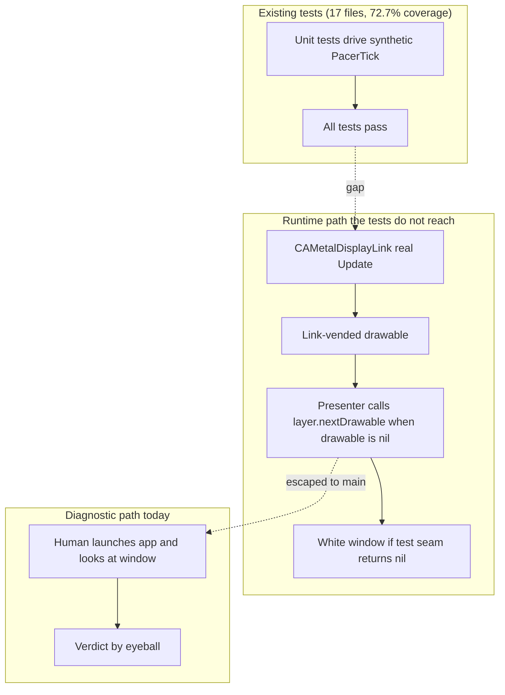
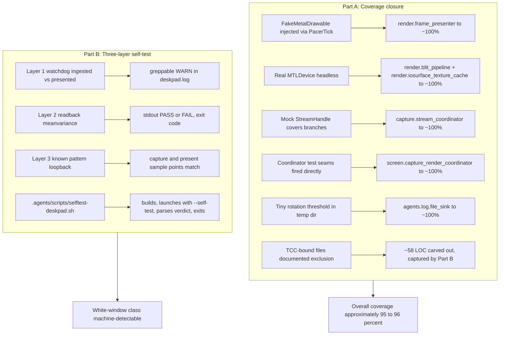
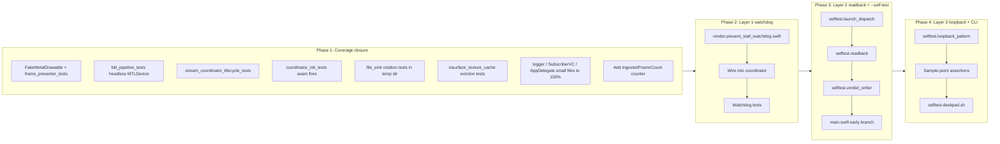

# Test Hardening and Autonomous Rendering Self-Test for the CR-0001 Pipeline

## Baseline Assumption

This CR is written against the assumption that **CR-0001
(`docs/cr/CR-0001-gpu-rendering-pipeline.md`) has been implemented and
validated** on a macOS 15.0 / Swift 6 strict concurrency
(`SWIFT_STRICT_CONCURRENCY = complete`) / Metal 3 baseline, exactly as the
validation report (`docs/cr/CR-0001-validation-report.md`) describes,
including its Runtime Verification Addendum dated 2026-06-05. The
artefacts referred to below by short name (the coordinator, the pacer,
the presenter, the stream output, the texture cache, the blit pipeline,
the file sink, the logger, the live stream handle, the virtual display
filter, the permission probe, the device-loss recovery) are the concrete
files shipped by CR-0001 under `DeskPad/Backend/Capture/`,
`DeskPad/Backend/Render/`, `DeskPad/Frontend/Screen/`, and
`DeskPad/Logging/`. CR-0003 changes none of that surface; it tightens the
test envelope around it and adds a new self-test entry point.

## Change Summary

CR-0001 shipped 25 unit tests and a green CI signal, yet three distinct
runtime defects landed on `main` and only surfaced when the app was
launched on the target machine: a white window caused by drawable
starvation when `FramePresenter` called `layer.nextDrawable()` while a
`CAMetalDisplayLink` was attached (checkpoint `6a4eea3`), a launch crash
caused by double pacer attach (`e0f7cf3`), and an `NSException` raised by
`present(atTime:)` on a link-vended drawable (`5806880`). All three were
fixed; none were caught by the existing tests because the tests drive
the pacer's synthetic `tick()` rather than a real
`CAMetalDisplayLink.Update`. Measured unit coverage today is 72.7
percent (1020 of 1403 lines).

This CR closes that gap in two complementary ways. Part A raises unit
coverage to approximately 95 to 96 percent overall, with 100 percent per
file except a small set of files whose constructors require a real
`SCContentFilter` from `SCShareableContent` and are therefore
permanently excluded as TCC-bound (the live stream handle at 94 lines
and the virtual display filter at 65 lines, 159 lines combined,
verified by `wc -l`). Part B
introduces a three-layer autonomous rendering self-test so the
white-window failure class and its near neighbours are machine-detectable
without human eyes: an always-on watchdog that emits a greppable warn
line when ingestion advances but presentation does not, a self-test
launch mode that reads back the presented drawable and asserts pixel
statistics, and a self-test loopback that renders a known test pattern
on the virtual display and asserts the captured and presented pixels
contain the pattern at known sample points. A reusable script
`.agents/scripts/selftest-deskpad.sh` drives the self-test from the
command line and exits with a verdict an agent or CI runner can act on.

## Motivation and Background

The CR-0001 validation report's Runtime Verification Addendum records
three defects found and fixed on the live system that the 25 unit tests
did not catch. Their root cause is structural, not a coverage accident:

1. **`CAMetalDisplayLink` semantics are invisible to a synthetic
   tick.** `DisplayLinkPacer.tick(_:)` is invoked by tests with a
   default-constructed `PacerTick` whose `drawable` is nil; the
   `FramePresenter` then falls back to `layer.nextDrawable()` and the
   tests pass. On a real system the link vends drawables and
   `nextDrawable()` starves; the same call site that tests exercise
   silently bails on every present, and the window shows white.
2. **Idempotency of pacer attach was implicit, not asserted.** The
   coordinator and the view controller both attach the pacer, in that
   order. Tests covered "attach works"; they did not cover "attach
   called twice for the same layer is a no-op", so the second attach
   invalidated the first link's drawable mid-flight and the next
   present raised `NSException`.
3. **`present(atTime:)` versus plain `present(_:)` is a runtime
   distinction.** Both calls type-check; only the latter is legal on a
   link-vended drawable. No test discriminated, because tests do not
   actually present.

Beyond those three, the same risk profile is present everywhere a test
double substitutes for a system API that has stateful invariants of its
own. The forces pushing for this change:

* **The defects that did escape were all in the last-mile present
  loop**, which is also where future regressions are most expensive: a
  silent white window is worse than a loud crash, because a user
  experiences it as "DeskPad is broken" with no diagnostic. The
  validation log is the only thing that fingerprints the failure; the
  log needs to fingerprint it automatically.
* **Coverage gaps cluster in the files closest to the system APIs.**
  The lowest-covered files
  (`render.frame_presenter.swift` 26 percent,
  `render.blit_pipeline.swift` 42 percent,
  `capture.stream_coordinator.swift` 42 percent,
  `screen.capture_render_coordinator.swift` 60 percent,
  `agents.log.file_sink.swift` 67 percent,
  `render.iosurface_texture_cache.swift` 67 percent)
  are exactly the files where bugs are visible only on live runs. Each
  file's gap has a concrete, mechanical closure (see Implementation
  Approach).
* **CR-0002 has the same risk profile.** The draft
  `AVSampleBufferDisplayLayer` backend lives behind the same capture
  pipeline and presents through a different system layer with its own
  internal queue semantics. If we do not build a backend-agnostic
  rendering self-test now, the same class of defects will land again
  when CR-0002 ships.
* **The CLI-first project standard.** The verdict of "is the rendering
  pipeline currently producing pixels" must be a script call, not a
  human watching a window. The self-test is the script.

## Current State

* The `DeskPadTests` target contains 16 test files across `Logging/`,
  `Capture/`, `Render/`, `Integration/`, and `Performance/` (verified
  against `find DeskPadTests -name "*.swift" -type f | wc -l`, which
  also matches the CR-0001 validation report's "16/16 specified test
  rows present" line).
* Latest measured coverage from
  `xcodebuild -enableCodeCoverage YES test` (run on the target machine
  per the user-supplied numbers): 72.7 percent overall, 1020 of 1403
  lines.
* Per-file coverage shows a long tail of mid-coverage files; the lowest
  covered files (`render.frame_presenter` 26 percent,
  `render.blit_pipeline` 42 percent, `capture.stream_coordinator` 42
  percent) are the closest neighbours of the runtime defects.
* No self-test launch mode exists. The only way to confirm the mirror
  shows pixels is to launch the app, grant TCC, and look. This is the
  exact failure mode that let the white-window bug land.
* The structured logger already tees to the macOS standard app-logs
  directory. Per `LogFileSink.logDirectoryURL()` (which calls
  `FileManager.url(for: .libraryDirectory, in: .userDomainMask)` and
  appends `Logs/DeskPad/deskpad.log`), the resolved path is
  `~/Library/Containers/com.stengo.DeskPad/Data/Library/Logs/DeskPad/deskpad.log`
  for sandboxed builds and
  `~/Library/Logs/DeskPad/deskpad.log`
  for non-sandboxed / unsigned / ad-hoc-signed builds. The script
  `.agents/scripts/tail-deskpad-log.sh` already enumerates both
  candidates; the self-test script in FR-14 **MUST** likewise check
  both. The on-disk log is the natural carrier for the watchdog signal
  in Part B Layer 1.

### Current State Diagram



## Proposed Change

Two additive workstreams that share a single goal: every failure mode
that CR-0001 fixed live in production must be detectable by an
automated check before the build leaves a contributor's machine.

### Part A: Raise unit coverage to ~95 to 96 percent

Per-file coverage closure, exercising real `MTLDevice` and real
`IOSurface` instances headlessly where the API permits, and standing in
for `SCStream` and `SCContentFilter` only where the construction path
genuinely requires TCC at runtime. Every per-file closure is mechanical
and is enumerated in the Implementation Approach. Permanent exclusions
(`capture.live_stream_handle.swift` at 94 lines and
`capture.virtual_display_filter.swift` at 65 lines, 159 lines combined,
verified by `wc -l`) are documented in the coverage report as TCC-bound
and are covered by the runtime self-test of Part B and the manual
addendum of CR-0001.

### Part B: Three-layer autonomous rendering self-test

Three layers of detection, each with a different cost and a different
strength. Layers compose: Layer 1 runs in every shipped build; Layers 2
and 3 only run in `--self-test` mode.

* **Layer 1 (always-on watchdog).** A small main-actor task observes
  `streamOutput.ingestedFrameCount` (new public counter, see Phase 1)
  and `presenter.presentedFrameCount` (already public). When the stream
  is running and ingestion is advancing but presentation has not
  advanced in three seconds, the watchdog emits one greppable warning
  line per stall window through the structured logger, with the
  signature `present stall: ingested=N presented=M elapsed=S`. The
  signature is chosen so the white-window bug class is grep-detectable
  in the on-disk log directly. The watchdog logs at most one line per
  ten-second window so a chronic stall does not flood the log.
* **Layer 2 (drawable read-back).** A `--self-test` launch flag (parsed
  in `main.swift`) routes the app through a headless self-test
  entry point instead of constructing the main window. After the
  coordinator has presented `N` frames (default 60), a read-back utility
  blits the drawable's texture into a CPU-readable
  (`MTLStorageMode.shared`) staging buffer, computes per-channel mean
  and variance across the buffer, and emits one of
  `PASS: frames=N mean=R,G,B variance=V` or
  `FAIL: <reason>` to stdout. The process exits with status 0 on PASS
  and a non-zero status on FAIL, so a CLI caller (or agent) can read
  the verdict without parsing pixels.
* **Layer 3 (full-pipeline loopback).** In the same `--self-test` mode,
  the app opens a small window on the virtual display showing a known
  test pattern (a horizontal RGB gradient plus a frame counter rendered
  through Core Text). The self-test then asserts both that the captured
  `IOSurface` (sampled at three sample points) and the presented
  drawable (sampled at the same three points after Layer 2's read-back)
  contain pixel values consistent with the pattern, with tolerance for
  sub-pixel sampling. This verifies capture-to-present pixel truth
  end-to-end without an eyeball.

The script `.agents/scripts/selftest-deskpad.sh` is the CLI-first entry
point: it builds the app for the Debug configuration, launches the
built binary with `--self-test`, parses the verdict from stdout (and
from the on-disk log when stdout is buffered by the OS), and exits with
the same status. The script documents in its top comment that the TCC
grant remains human-gated after ad-hoc signature changes (the existing
note in `AGENTS.md` carries over here), so the first run after a
re-sign requires the user to grant Screen Recording once.

### Proposed State Diagram



## Requirements

### Functional Requirements

1. The unit test suite **MUST** achieve at least 95 percent overall
   line coverage measured by
   `xcodebuild -enableCodeCoverage YES test` followed by
   `xcrun xccov view --report`, and **MUST** be reported per-file in
   the coverage summary committed alongside this CR's implementation.
2. Every Swift file under `DeskPad/Backend/`, `DeskPad/Frontend/`,
   `DeskPad/Logging/`, and `DeskPad/Helpers/`, plus `AppDelegate.swift`,
   `SubscriberViewController.swift`, and `main.swift`, **MUST** reach
   100 percent line coverage **except** the explicitly listed TCC-bound
   exclusions in FR-3.
3. The system **MUST** permanently exclude
   `DeskPad/Backend/Capture/capture.live_stream_handle.swift` (94 lines)
   and
   `DeskPad/Backend/Capture/capture.virtual_display_filter.swift`
   (65 lines), 159 lines combined as of `source-commit: cc6842d` and
   verifiable by `wc -l` of those files, from the per-file 100 percent
   target on the documented grounds that their constructors require an
   `SCContentFilter` produced by `SCShareableContent.current`, which
   itself requires a live TCC grant; this exclusion **MUST** be
   recorded in the coverage summary with the rationale "TCC-bound:
   requires live Screen Recording grant; covered by the runtime
   self-test in Part B and the CR-0001 validation report's Runtime
   Verification Addendum".
4. The system **MUST** introduce a `FakeMetalDrawable` test helper that
   conforms to `CAMetalDrawable`, wraps an offscreen `MTLTexture`
   constructed from a real `MTLDevice` (`MTLCreateSystemDefaultDevice()`
   is available in test bundles and does not require TCC), and is
   injectable through the existing `PacerTick.drawable` field. The
   helper **MUST** be used by the new `render.frame_presenter` tests so
   the encode/present/latency-log path is exercised exactly as it is in
   production, with the link-vended drawable path covered rather than
   the `layer.nextDrawable()` fallback path. The helper **MUST NOT** be
   reachable from production code.
5. The system **MUST** publish a non-negative monotonic
   `ingestedFrameCount: Int` property on `StreamOutput` so the Layer 1
   watchdog can observe ingestion progress without depending on the
   private EMA state. The property **MUST** increment exactly once per
   `ingest(_:)` call that successfully extracts an `IOSurface`.
6. The system **MUST** add a Layer 1 watchdog that runs whenever the
   coordinator's state is `.running` and that emits at most one log
   line per ten-second window with the literal prefix
   `present stall: ingested=` and the suffix
   `presented= elapsed=` (numeric values interpolated) when
   `ingestedFrameCount` has advanced by at least one but
   `presentedFrameCount` has not advanced in the prior three seconds.
   The watchdog **MUST NOT** emit while the coordinator is in any state
   other than `.running` and **MUST NOT** emit when ingestion has also
   stalled.
7. The watchdog **MUST** log through the project's existing
   `Logger` wrapper so the line is teed to the rotating file sink with
   the standard `filename:line` tagging, and the log level **MUST** be
   `warning` so the line is greppable by level as well as by literal
   prefix.
8. The system **MUST** add a `--self-test` launch flag parsed at
   process start in `main.swift`. When present, the app **MUST** route
   to a headless self-test entry point (see FR-9 and FR-10) instead of
   constructing the main window, and **MUST** still emit log lines to
   the rotating file sink so the run is forensically complete.
9. The system **MUST** implement a Layer 2 drawable read-back utility
   that, after the coordinator has presented `N` frames (default 60,
   overridable by `--self-test-frames=N`), blits the most recently
   presented drawable's texture into a CPU-readable
   (`MTLStorageMode.shared`) staging buffer, computes the per-channel
   mean and variance across the buffer, and emits exactly one stdout
   line of the form `PASS: frames=N mean=R,G,B variance=V` on success
   or `FAIL: <reason>` on failure. The reason string **MUST** be
   stable across runs for the same underlying cause so an agent or CI
   runner can match on it.
10. The Layer 2 utility **MUST** treat a uniform white drawable (the
    white-window failure class) as a `FAIL` outcome by asserting that
    the per-channel variance is strictly greater than a configurable
    threshold (default `0.0005` on the unit-normalized scale) and that
    the per-channel mean is not within `0.005` of `(1.0, 1.0, 1.0)`.
    The thresholds **MUST** be expressed as named constants in the
    self-test source so future tuning is a one-line change.
11. The self-test process **MUST** exit with status `0` on `PASS` and a
    non-zero status (default `1`, with distinct non-zero codes
    permitted for distinct `FAIL` reasons) on `FAIL`, so a shell
    caller can branch on exit status without parsing stdout.
12. The system **MUST** implement a Layer 3 full-pipeline loopback that,
    in `--self-test` mode, opens an `NSWindow` positioned on the
    virtual display showing a known test pattern (a horizontal RGB
    gradient plus a numeric frame counter rendered through Core Text).
    The self-test **MUST** assert that the captured `IOSurface`
    (sampled at three configured sample points) and the presented
    drawable (sampled at the same three points after the Layer 2
    read-back) contain pixel values consistent with the pattern,
    within a configurable tolerance (default 8 levels per channel on
    an 8-bit BGRA scale).
13. The Layer 3 loopback **MUST** fail-fast and exit non-zero with a
    reason of the form
    `FAIL: loopback: capture_mismatch_at_point=(X,Y) expected=(R,G,B)
    actual=(R,G,B)` (or `present_mismatch_at_point=`) so an agent can
    parse the exact failure coordinate and the actual versus expected
    pixel values.
14. The system **MUST** ship a reusable script
    `.agents/scripts/selftest-deskpad.sh` per the CLI-first project
    standard. The script **MUST** build the app for the Debug
    configuration with `CODE_SIGN_IDENTITY="-"`, launch the resulting
    binary with `--self-test`, parse the verdict from stdout (and as a
    fallback from the on-disk log file, checking both the sandboxed
    container path
    `~/Library/Containers/com.stengo.DeskPad/Data/Library/Logs/DeskPad/deskpad.log`
    and the non-sandboxed user-library path
    `~/Library/Logs/DeskPad/deskpad.log`, in that order, matching the
    candidate enumeration already implemented by
    `.agents/scripts/tail-deskpad-log.sh`),
    print the verdict line to its own stdout, and exit with the same
    status as the self-test process. The script **MUST** carry the
    standard top docstring (purpose, usage, parameters) and the
    `@agents-index` annotation, and **MUST** print a usage message
    when invoked with `--help` or `-h`.
15. The self-test entry point **MUST** be designed so a future
    presentation backend (notably the `AVSampleBufferDisplayLayer`
    backend specified in CR-0002, draft) can plug into Layers 2 and 3
    without changes to the self-test harness. Concretely, the
    drawable-read-back and loopback assertions **MUST** be expressed
    against a small protocol that returns a CPU-readable pixel buffer
    plus the active sample points, so any backend that can produce
    those satisfies the harness. The protocol **MUST NOT** be
    implemented for the AVSBDL backend in this CR; this requirement is
    a design constraint, not a deliverable, and CR-0002 owns the
    implementation.
16. Every new file introduced by this CR **MUST** carry a top-level
    docstring with an `@agents-index` annotation per the project
    standard and **MUST** be at most 200 lines of code.
17. The `FakeMetalDrawable` helper and any other test-only Metal
    helpers **MUST** live under `DeskPadTests/Support/` so a single
    `grep -rn "FakeMetalDrawable" DeskPad/` returns no matches and the
    production binary is provably free of test surface.
18. The coverage summary committed alongside this CR's implementation
    **MUST** include a per-file table with the prior coverage (from
    the 2026-06-05 baseline of 72.7 percent / 1020 of 1403 lines), the
    post-change coverage, and an explicit row for each of the two
    excluded TCC-bound files marking them as excluded.

### Non-Functional Requirements

1. The complete `DeskPadTests` suite (unit only, excluding the
   `--self-test` mode which is a separate process) **MUST** run to
   completion in under 30 seconds on an Apple Silicon M-series Mac,
   measured by `xcodebuild ... test | tail -1`.
2. The Layer 1 watchdog **MUST NOT** allocate or take any lock on the
   hot ingest or present path. It **MUST** observe the existing
   counters and run its comparison on a once-per-second main-actor
   task; the hot paths remain untouched.
3. The Layer 2 read-back **MUST NOT** be active outside `--self-test`
   mode. The production binary, when launched without the flag, **MUST**
   incur zero overhead from the read-back path (the code is
   present, but is unreachable without the flag).
4. The self-test process **MUST** complete its verdict within 10
   seconds of capture starting, on an Apple Silicon M-series Mac with
   TCC already granted. If it does not, the script **MUST** kill the
   process and report `FAIL: timeout`.
5. No file introduced by this CR **MUST** contain U+2014 EM DASH or
   U+2013 EN DASH used as a dash, per the project's prose standard.
6. Every new file **MUST** be at most 200 lines of code (consistent
   with CR-0001 NFR-4 / AC-17).

## Affected Components

* New files under `DeskPadTests/Support/`: the `FakeMetalDrawable`
  helper, a tiny IOSurface fixture builder, and a pacer-tick fixture.
* New per-file unit-test files added under `DeskPadTests/Render/`,
  `DeskPadTests/Capture/`, `DeskPadTests/Logging/`, and
  `DeskPadTests/Frontend/` for the closures enumerated in
  Implementation Approach.
* New files under `DeskPad/Frontend/Screen/SelfTest/`:
  `selftest.launch_dispatch.swift` (parses `--self-test` and routes),
  `selftest.readback.swift` (Layer 2 implementation),
  `selftest.loopback_pattern.swift` (Layer 3 pattern source and
  assertions), `selftest.verdict_writer.swift` (stdout PASS/FAIL
  emitter and exit-code mapping).
* New file `DeskPad/Backend/Render/render.present_stall_watchdog.swift`
  (Layer 1 implementation).
* Modifications:
  * `DeskPad/Backend/Capture/capture.stream_output.swift`: add the
    public `ingestedFrameCount: Int` counter required by FR-5.
  * `DeskPad/Logging/agents.log.file_sink.swift`: introduce a
    `LogFileSinkConfiguration` struct (rotation threshold, retained
    rotations, log directory) and a private initializer accepting it;
    the `LogFileSink.shared` singleton retains its current production
    constants. This is a test-only seam so Phase 1 step 5 can
    exercise rotation against a temp directory without touching the
    production `Library/Logs` location.
  * `DeskPad/main.swift`: parse `--self-test` and
    `--self-test-frames=N` early and route through the dispatcher.
  * `DeskPad/Frontend/Screen/screen.capture_render_coordinator.swift`:
    wire the watchdog as a child of the coordinator's lifecycle
    (start on `.running`, stop on any other state).
* New script: `.agents/scripts/selftest-deskpad.sh`.
* New entry in `.taxonomy`: `present stall` (the Layer 1 watchdog's
  log-line signature) and `self-test mode` (the `--self-test` launch
  routing).

## Scope Boundaries

### In Scope

* Raising overall unit-test coverage to at least 95 percent with 100
  percent per file outside the documented TCC-bound exclusions.
* Introducing the `FakeMetalDrawable` helper and using it to exercise
  the link-vended drawable path of `FramePresenter`.
* Adding the Layer 1 watchdog and its log signature.
* Adding the `--self-test` launch mode with Layer 2 read-back and
  Layer 3 loopback assertions.
* Adding the `.agents/scripts/selftest-deskpad.sh` CLI entry point.
* Documenting the TCC-bound exclusions and the self-test design
  constraint that keeps it backend-agnostic for CR-0002.

### Out of Scope ("Here, But Not Further")

* Implementing the CR-0002 `AVSampleBufferDisplayLayer` backend's
  conformance to the self-test backend protocol. FR-15 specifies the
  protocol as a design constraint; the AVSBDL conformance is owned by
  CR-0002.
* Replacing the manual TCC-grant step in the script. Stable code
  signing would remove the re-prompt on every rebuild; that is a
  separate workflow change recorded as a follow-up in the script's
  top comment.
* Migrating any existing test to a different framework (XCTest stays;
  no Swift Testing migration in this CR).
* Adding network or telemetry export for the self-test verdict. The
  exit code and the on-disk log are the only outputs.
* Performance benchmarking changes. The CR-0001 performance tests are
  unchanged; coverage improvements do not move the latency budget.

## Alternative Approaches Considered

* **(a) Per-file 100 percent everywhere, including the TCC-bound
  files, by mocking `SCShareableContent` and `SCContentFilter`
  (rejected).** The mocks would have to fabricate `SCContentFilter`
  instances that `SCStream`'s real constructor rejects, so the tests
  would either skip the call or assert against a fiction. Either way,
  the test gives false confidence: the call path that actually runs in
  production is not the one exercised. Documenting the two files as
  TCC-bound and covering them through the runtime self-test is the
  honest position.
* **(b) UI snapshot tests against the running window (rejected).**
  Snapshot tests would catch the white-window class. They are also
  slow, flaky in CI, sensitive to font and antialiasing differences
  across machines, and they require TCC at test time. The drawable
  read-back of Layer 2 captures the same signal at a small fraction of
  the cost.
* **(c) End-to-end UI tests via `XCUITest` (rejected).** Same
  drawbacks as (b) plus the additional cost of an `XCUITest` target
  bootstrap that the project does not currently have. The
  `--self-test` flag is much smaller and yields a clean shell exit
  code.
* **(d) A watchdog that emits a metric to `os_signpost` instead of a
  log line (considered, deferred).** `os_signpost` is the right tool
  for Instruments-driven analysis, but the failure mode this CR
  targets is "the user opened a build and saw white"; the diagnostic
  needs to land where the user (or an agent) is already looking,
  which is the on-disk log. A signpost can be added later as a
  complement.

## Impact Assessment

### User Impact

* No user-facing behaviour change in production builds. The watchdog
  is off the hot path; the read-back and loopback are unreachable
  without the `--self-test` flag.
* The first invocation of `selftest-deskpad.sh` after a re-sign still
  requires the user to grant Screen Recording in System Settings.
  This is unchanged from CR-0001's TCC behaviour and is documented in
  the script.

### Technical Impact

* `StreamOutput` gains one public counter. No other public surface
  changes.
* The `main.swift` launch path gains an early branch on
  `CommandLine.arguments`. The branch is small and is the entry point
  for new code, not a refactor of old code.
* Coverage measurement becomes a routine part of the build per the
  Verification Commands section.
* The test target gains a `Support/` subdirectory containing the
  `FakeMetalDrawable` helper and small fixtures. Production code does
  not link against `DeskPadTests`, so the helper is provably absent
  from shipped binaries.

### Business Impact

* The white-window failure class moves from "user reports it, we ship
  a fix the next day" to "the self-test catches it before the build
  leaves a contributor's machine". The cost of a regression in the
  rendering pipeline drops by an order of magnitude.
* Coverage uplift documented per-file makes future PRs' impact on the
  pipeline trivial to assess at review time.

## Implementation Approach

The work proceeds in four sequential phases. Each phase is
independently mergeable; the suite reaches the FR-1 / FR-2 coverage
targets only at the end of Phase 1, and the white-window failure class
is detectable from the on-disk log at the end of Phase 2.

### Phase 1: Coverage closure to ~95 to 96 percent

For each file below, the closure is mechanical: read the current source
and the current test, identify the uncovered branches by inspecting the
coverage report, and add tests that exercise those branches against
real `MTLDevice` and real `IOSurface` instances where possible. No
production code changes are required for the closure itself (FR-5's
`ingestedFrameCount` lands here because it is also a coverage seam).

1. **`DeskPad/Backend/Render/render.frame_presenter.swift` (26 percent
   to ~100 percent).** Add
   `DeskPadTests/Support/fake_metal_drawable.swift` (a class conforming
   to `CAMetalDrawable` wrapping an offscreen `MTLTexture` minted via
   `MTLDevice.makeTexture(descriptor:)` with
   `MTLStorageMode.private` for the encode target). Add
   `DeskPadTests/Render/frame_presenter_tests.swift` covering: (a) the
   link-vended drawable branch of `present(tick:)` via
   `PacerTick.drawable` set to a `FakeMetalDrawable`; (b) the latency
   log every 60 frames; (c) the command-buffer error handler
   propagation. Acts as a regression test for the drawable-starvation
   bug class (`6a4eea3`).
2. **`DeskPad/Backend/Render/render.blit_pipeline.swift` (42 percent
   to ~100 percent).** Add
   `DeskPadTests/Render/blit_pipeline_tests.swift`: construct a
   real `MTLDevice` via `MTLCreateSystemDefaultDevice()` (this works
   headless and unprivileged), construct a `BlitPipeline`, encode into
   an offscreen `MTLTexture` with `MTLStorageMode.shared`, call
   `commandBuffer.waitUntilCompleted()`, and assert that the output
   texture's pixel data is non-uniform after sampling a known
   source texture (catches "shader silently produces clear color"
   regressions).
3. **`DeskPad/Backend/Capture/capture.stream_coordinator.swift` (42
   percent to ~100 percent).** Add
   `DeskPadTests/Capture/stream_coordinator_lifecycle_tests.swift`
   driving a mock `StreamHandle` that records calls and surfaces
   injectable errors. The new file is a sibling of, and is
   intentionally distinct from, the existing
   `DeskPadTests/Capture/stream_coordinator_restart_tests.swift`
   (which already covers the backoff-delay math and the restart-budget
   exhaustion path via `runRestartScheduleForTest()`); the new file
   covers the lifecycle and configuration branches the existing file
   does not. Concretely, the new file covers: (a) `start`/`stop` happy
   path with `state` transitions, (b) `updateConfiguration` increment,
   (c) `runRestartSchedule` (the production, non-`ForTest` variant)
   mid-cycle success (one attempt errors, the next succeeds), and
   (d) the bail-out branch when `handle` is nil. The
   permanently-erroring terminal-state path is exercised by the
   existing `stream_coordinator_restart_tests.swift` and is not
   duplicated here. If at implementation time a single file is
   clearer, the two files **MAY** be consolidated into
   `stream_coordinator_tests.swift`; either way, the union of branches
   covered **MUST** match the enumeration above.
4. **`DeskPad/Frontend/Screen/screen.capture_render_coordinator.swift`
   (60 percent to ~100 percent).** Add
   `DeskPadTests/Frontend/capture_render_coordinator_init_tests.swift`
   that fires the existing init-time closures directly:
   `evaluatePermission()` with a fake `ScreenCapturePermissionProbe`
   that flips `preflight()` between calls, `handleDeviceLoss(error:)`
   with a synthetic `MTLCommandBufferError.deviceRemoved`,
   `evaluateAdaptiveMode(switchThresholdSeconds:)` against a
   controlled `streamOutput.arrivalMetrics.intervalEMA`, and
   `applyConfiguration(resolution:scaleFactor:)` with a non-zero
   resolution. The `_setStateForTest(_:)` seam is exercised
   incidentally; the `bindDisplay`/`startLiveCapture` path is
   deliberately not exercised here because it requires TCC.
5. **`DeskPad/Logging/agents.log.file_sink.swift` (67 percent to ~100
   percent).** Refactor the rotation-threshold and retained-rotations
   constants into a seam (a `LogFileSinkConfiguration` struct
   parameter on a private constructor). The shared singleton retains
   its current production constants; the test constructs a private
   instance pointed at a `FileManager.default.temporaryDirectory`
   subdirectory with a 256-byte rotation threshold and exercises:
   (a) first write creates the file, (b) writes accumulate, (c)
   exceeding the threshold rotates to `deskpad.log.1`, (d) further
   rotations age the chain, (e) the retained-rotations cap discards
   the oldest. Tear-down deletes the temp directory.
6. **`DeskPad/Backend/Render/render.iosurface_texture_cache.swift` (67
   percent to ~100 percent).** Add
   `DeskPadTests/Render/iosurface_texture_cache_eviction_tests.swift`
   that constructs a real `IOSurface` directly via
   `IOSurfaceCreate(properties: [...] as CFDictionary)` (no TCC
   required) and covers: (a) miss-then-hit returns the same
   `MTLTexture`, (b) holding then releasing the texture causes the
   next lookup to mint a fresh one (the weak-eviction branch), (c)
   `replaceDevice(_:)` flushes the dictionary.
7. **`DeskPad/Logging/agents.log.logger.swift` (73 percent to ~100
   percent).** Add direct-call coverage for the remaining log-level
   methods and any seldom-exercised formatter branches.
8. **`DeskPad/SubscriberViewController.swift` (72 percent to ~100
   percent).** Add direct-call coverage for the subscribe / unsubscribe
   lifecycle methods.
9. **`DeskPad/AppDelegate.swift` (91 percent to ~100 percent).** As of
   `source-commit: cc6842d`, `AppDelegate` overrides only
   `applicationDidFinishLaunching(_:)` and
   `applicationShouldTerminateAfterLastWindowClosed(_:)`; it does
   **not** hold a coordinator reference and does **not** override
   `applicationWillTerminate(_:)`. The closure here is therefore
   limited to direct-call coverage of the two existing handlers (and
   the menu/window construction inside `applicationDidFinishLaunching`),
   not the addition of new termination behaviour. If a future change
   introduces `applicationWillTerminate(_:)` with a coordinator
   shutdown path, that change owns the corresponding test; this CR
   does not introduce that handler.
10. **`DeskPad/Backend/Capture/capture.stream_output.swift`:** Add the
    `public private(set) var ingestedFrameCount: Int = 0` counter and
    increment it inside `ingest(_:)` after the `IOSurface` extraction
    succeeds. Coverage for the new line lands as part of the existing
    `stream_output_tests.swift`.
11. **Permanent exclusions documented.**
    `capture.live_stream_handle.swift` and
    `capture.virtual_display_filter.swift` are noted in the coverage
    summary with the rationale per FR-3. No `.xctestplan`-level
    exclusion is required because the coverage report exposes
    per-file percentages and the summary captures the carve-out.

**Affected components:** new files under `DeskPadTests/Support/` and
the new per-file test files enumerated above; modification of
`DeskPad/Backend/Capture/capture.stream_output.swift` for the
`ingestedFrameCount` counter; modification of
`DeskPad/Logging/agents.log.file_sink.swift` for the test-only
configuration seam.

### Phase 2: Layer 1 watchdog (always-on)

The watchdog is the cheapest layer and the only one that runs in
production. It is also the layer that would have caught the white-window
bug directly from the existing log.

1. Add `DeskPad/Backend/Render/render.present_stall_watchdog.swift`. A
   `@MainActor` class that takes a closure returning the current
   `(ingested: Int, presented: Int, state: CaptureRenderCoordinatorState)`
   triple, plus the project `Logger`. The watchdog owns a
   `Task<Void, Never>` started on `start()` and cancelled on `stop()`
   that ticks once per second, comparing the triple to a snapshot from
   three seconds prior.
2. Emit the WARN line per FR-6 and FR-7 only when:
   `state == .running` AND `ingested.now > ingested.snapshot` AND
   `presented.now == presented.snapshot`, with a ten-second
   rate-limiter on emissions (one line per stall window).
3. Wire the watchdog into
   `screen.capture_render_coordinator.swift`: construct it lazily,
   `start()` it after the first successful transition to `.running`,
   `stop()` it on any transition to `.idle`, `.permissionRequired`, or
   `.failed`.
4. Add `DeskPadTests/Render/present_stall_watchdog_tests.swift`
   covering: (a) no emission when both counters advance, (b) no
   emission when neither advances, (c) exactly one emission when
   ingested advances and presented does not for three seconds, (d) at
   most one emission per ten-second window when the stall persists,
   (e) no emission outside `.running`.

**Affected components:**
`DeskPad/Backend/Render/render.present_stall_watchdog.swift` (new),
`DeskPad/Frontend/Screen/screen.capture_render_coordinator.swift`
(wiring), `DeskPadTests/Render/present_stall_watchdog_tests.swift`
(new).

### Phase 3: Layer 2 drawable read-back and `--self-test` mode

1. Add `DeskPad/Frontend/Screen/SelfTest/selftest.launch_dispatch.swift`
   parsing `--self-test` and `--self-test-frames=N` from
   `CommandLine.arguments`. When the flag is absent, the dispatcher is
   a no-op and the normal launch continues.
2. Add `DeskPad/Frontend/Screen/SelfTest/selftest.readback.swift`
   implementing the read-back utility. The drawable's texture is
   blit-copied via `MTLBlitCommandEncoder.copy(...)` into an
   `MTLBuffer` allocated with `MTLStorageMode.shared`; the buffer's
   `contents()` is treated as `UInt8` BGRA and reduced to per-channel
   mean and variance.
3. Add `DeskPad/Frontend/Screen/SelfTest/selftest.verdict_writer.swift`
   emitting the literal `PASS:` / `FAIL:` lines per FR-9 / FR-10 / FR-11
   to stdout and calling `exit(_:)` with the configured status.
4. Modify `DeskPad/main.swift` to call the dispatcher before
   constructing the AppKit application instance. Outside `--self-test`
   mode, `main.swift` behaves exactly as today.
5. Add `DeskPadTests/SelfTest/readback_tests.swift` covering: (a) a
   uniformly-white synthetic drawable yields `FAIL` with a
   variance-related reason, (b) a gradient-pattern synthetic drawable
   yields `PASS`, (c) the threshold constants are honoured at their
   declared boundaries.

**Affected components:** new
`DeskPad/Frontend/Screen/SelfTest/` directory; modification of
`DeskPad/main.swift`; new
`DeskPadTests/SelfTest/readback_tests.swift`.

### Phase 4: Layer 3 loopback and CLI script

1. Add
   `DeskPad/Frontend/Screen/SelfTest/selftest.loopback_pattern.swift`
   that renders the known RGB-gradient-plus-frame-counter test pattern
   onto an `NSWindow` positioned on the virtual display, and exposes a
   set of named sample points (three by default) with their expected
   `(R, G, B)` triples.
2. Extend the read-back to assert the presented drawable's pixel
   values at the sample points match the expected triples within the
   8-level-per-channel tolerance (FR-12). Add an equivalent assertion
   for the captured `IOSurface` sampled at the same points before
   present.
3. Wire the loopback into the dispatcher: `--self-test` first opens
   the pattern window, then awaits the first 60 captured frames, then
   runs the read-back, then writes the verdict.
4. Add
   `.agents/scripts/selftest-deskpad.sh` per FR-14. The script
   carries the standard top docstring, prints a usage message under
   `--help`, builds with
   `xcodebuild -scheme DeskPad -configuration Debug -derivedDataPath build CODE_SIGN_IDENTITY="-" build`,
   launches
   `build/Build/Products/Debug/DeskPad.app/Contents/MacOS/DeskPad --self-test`,
   captures stdout to a temp file, falls back to grepping the
   container log on empty stdout, prints the verdict, and exits with
   the process status. The script's top comment cross-references this
   CR by ID.
5. Add `DeskPadTests/SelfTest/loopback_pattern_tests.swift` covering
   pattern-source determinism (same frame index yields the same
   sample-point expectations) and tolerance math.

**Affected components:** new
`DeskPad/Frontend/Screen/SelfTest/selftest.loopback_pattern.swift`;
modifications to
`DeskPad/Frontend/Screen/SelfTest/selftest.launch_dispatch.swift` and
`DeskPad/Frontend/Screen/SelfTest/selftest.readback.swift`; new
`.agents/scripts/selftest-deskpad.sh`; new
`DeskPadTests/SelfTest/loopback_pattern_tests.swift`.

### Implementation Flow



## Test Strategy

All new tests live under `DeskPadTests/` mirroring the existing
namespace. The `Support/` subdirectory holds the `FakeMetalDrawable`
helper per FR-17.

### Tests to Add

| Test File | Test Name | Description | Inputs | Expected Output |
|-----------|-----------|-------------|--------|-----------------|
| `DeskPadTests/Support/fake_metal_drawable.swift` | (helper, no test methods) | Conforms to `CAMetalDrawable`, wraps an offscreen `MTLTexture` minted via a real `MTLDevice`. Injectable through `PacerTick.drawable`. | A real `MTLDevice` and a `(width, height)` pair. | A `CAMetalDrawable` instance whose `texture` is a valid `MTLTexture`. |
| `DeskPadTests/Render/frame_presenter_tests.swift` | `testPresentUsesLinkVendedDrawable` | Verifies the link-vended drawable branch of `FramePresenter.present(tick:)` is taken when `PacerTick.drawable` is non-nil. Regression for `6a4eea3`. (AC-1) | A `PacerTick` with a `FakeMetalDrawable`; a `StreamOutput` with one published captured surface. | `presentedFrameCount == 1` after one call. |
| `DeskPadTests/Render/frame_presenter_tests.swift` | `testLatencyLogEmittedEvery60Frames` | Verifies the per-frame latency log line is emitted exactly when `framesPresented % 60 == 0`. (AC-1) | 60 consecutive `present(tick:)` calls. | Exactly one log line matching `capture-to-present latency`. |
| `DeskPadTests/Render/frame_presenter_tests.swift` | `testCommandBufferErrorHandlerPropagation` | Verifies the swapped error handler receives the synthesized command-buffer error. (AC-1) | A presenter with an injected error-handler closure and a command queue that surfaces an error on completion. | The closure observes the same `NSError`. |
| `DeskPadTests/Render/blit_pipeline_tests.swift` | `testBlitProducesNonUniformOutput` | Real headless `MTLDevice`: encode a known source texture into a `.shared`-storage destination, wait for completion, read back, assert per-channel variance above a floor. (AC-2) | A real `MTLDevice` and a source texture seeded with a gradient. | Destination buffer mean and variance reflect the gradient. |
| `DeskPadTests/Render/blit_pipeline_tests.swift` | `testReplaceDeviceRebuildsPipelineState` | Verifies `replaceDevice(_:)` mints a fresh pipeline state distinct from the prior one. (AC-2) | A second `MTLDevice` (or the same instance treated as if replaced). | New `MTLRenderPipelineState` identity. |
| `DeskPadTests/Capture/stream_coordinator_lifecycle_tests.swift` | `testStartTransitionsToRunning` | Mock `StreamHandle`: assert `state == .running` after a successful `start`. (AC-3) | Mock that returns success. | `state == .running`; `startCount == 1`. |
| `DeskPadTests/Capture/stream_coordinator_lifecycle_tests.swift` | `testStopTransitionsToIdle` | Mock `StreamHandle`: assert `state == .idle` after `stop` from running. (AC-3) | Mock returning success on start; stop called. | `state == .idle`; `stopCount == 1`. |
| `DeskPadTests/Capture/stream_coordinator_lifecycle_tests.swift` | `testUpdateConfigurationPropagatesDimensions` | Mock `StreamHandle`: assert the new width/height reach the handle. (AC-3) | `updateConfiguration(width:height:)` invoked. | Handle's recorded `(width, height)` matches the call. |
| `DeskPadTests/Capture/stream_coordinator_lifecycle_tests.swift` | `testRestartScheduleMidCycleSuccess` | One injected error then a success; assert the schedule stops on first success. (AC-3) | Mock that errors twice then succeeds. | `state == .running`; backoff observed for two intervals. |
| `DeskPadTests/Capture/stream_coordinator_lifecycle_tests.swift` | `testStartWithoutInstalledHandleIsNoOp` | Bail-out branch when `handle` is nil. (AC-3) | `start()` called on a coordinator with no installed handle. | `state` unchanged; no crash. |
| `DeskPadTests/Frontend/capture_render_coordinator_init_tests.swift` | `testEvaluatePermissionFlipFlops` | Fires the existing `evaluatePermission()` seam with a fake probe whose `preflight()` flips. (AC-4) | A fake probe driven through two preflight values. | State transitions match the probe's report. |
| `DeskPadTests/Frontend/capture_render_coordinator_init_tests.swift` | `testHandleDeviceLossWiresThroughRecovery` | Fires `handleDeviceLoss(error:)` with a synthetic `MTLCommandBufferError.deviceRemoved`. (AC-4) | A synthetic error in the device-removed-class. | `DeviceLossOutcome.recovered` (or equivalent) returned; `hostView`, `textureCache`, `blitPipeline` each replaced once. |
| `DeskPadTests/Frontend/capture_render_coordinator_init_tests.swift` | `testEvaluateAdaptiveModeRespectsEMA` | Drives `evaluateAdaptiveMode(switchThresholdSeconds:)` against a seeded `arrivalMetrics.intervalEMA`. (AC-4) | An EMA value above and below the threshold. | Mode transitions from low-latency to power-saving and back; transitions logged. |
| `DeskPadTests/Logging/file_sink_rotation_tests.swift` | `testRotationAtThreshold` | Temp-dir sink with a 256-byte rotation threshold; write enough lines to cross the threshold once. (AC-5) | A `LogFileSinkConfiguration` pointing to a temp directory. | After the rotation, `deskpad.log.1` exists and `deskpad.log` contains only lines written after the rotation. |
| `DeskPadTests/Logging/file_sink_rotation_tests.swift` | `testRetainedRotationsCapped` | Trigger four rotations; assert only `deskpad.log` plus three rotated files exist. (AC-5) | Same temp-dir configuration. | Exactly four files; oldest discarded. |
| `DeskPadTests/Render/iosurface_texture_cache_eviction_tests.swift` | `testWeakEvictionMintsFreshTexture` | Construct a real `IOSurface` via `IOSurfaceCreate`; look up, release, look up again. (AC-6) | A bare `IOSurface`. | Second lookup returns a fresh `MTLTexture` instance. |
| `DeskPadTests/Render/iosurface_texture_cache_eviction_tests.swift` | `testReplaceDeviceFlushesCache` | Verifies `replaceDevice(_:)` empties the dictionary. (AC-6) | A cache primed with one entry. | Post-replace dictionary count is 0. |
| `DeskPadTests/Logging/logger_method_coverage_tests.swift` | `testAllLogLevelsRouteThroughFormatter` | Direct-call every log-level method and assert the formatter prefix appears once. (AC-7) | Each level method invoked once. | Captured lines match the expected prefix regex. |
| `DeskPadTests/Frontend/subscriber_view_controller_tests.swift` | `testSubscribeUnsubscribeLifecycle` | Drive `viewWillAppear()` then `viewWillDisappear()` (the lifecycle methods actually overridden by `SubscriberViewController`, verified at `DeskPad/SubscriberViewController.swift`) and assert the ReSwift subscription is registered and removed exactly once. (AC-8) | An in-test `Store` instance. | Subscriber count returns to its pre-call value. |
| `DeskPadTests/Frontend/app_delegate_tests.swift` | `testApplicationDidFinishLaunchingDispatchesAction` | Direct-call `applicationDidFinishLaunching(_:)` against an in-test store and assert the `AppDelegateAction.didFinishLaunching` action is dispatched exactly once. (AC-9) | A captured `Store` (or a dispatch-recording middleware) and a fresh `AppDelegate`. | Action observed once; `window` is non-nil. |
| `DeskPadTests/Frontend/app_delegate_tests.swift` | `testApplicationShouldTerminateAfterLastWindowClosedReturnsTrue` | Direct-call `applicationShouldTerminateAfterLastWindowClosed(_:)` and assert it returns `true`. (AC-9) | A fresh `AppDelegate`. | Return value is `true`. |
| `DeskPadTests/Capture/stream_output_ingest_counter_tests.swift` | `testIngestedFrameCountIncrementsOnce` | Verifies `ingestedFrameCount` advances by exactly one per successful `ingest(_:)`. (AC-10) | Three synthesized `CMSampleBuffer`s ingested in sequence. | `ingestedFrameCount == 3`. |
| `DeskPadTests/Render/present_stall_watchdog_tests.swift` | `testNoEmissionWhenBothCountersAdvance` | Watchdog with controlled triples advancing both counters. (AC-11) | Triples where ingested and presented both increment. | Zero warn lines observed. |
| `DeskPadTests/Render/present_stall_watchdog_tests.swift` | `testNoEmissionWhenNeitherAdvances` | Watchdog with controlled triples advancing neither. (AC-11) | Triples where both counters are flat. | Zero warn lines observed. |
| `DeskPadTests/Render/present_stall_watchdog_tests.swift` | `testEmitsOnceWhenIngestAdvancesButPresentStalls` | Watchdog with controlled triples; ingest advances while presented holds for the full window. (AC-11) | Triples reproducing the white-window bug class. | Exactly one warn line with the literal `present stall: ingested=` prefix. |
| `DeskPadTests/Render/present_stall_watchdog_tests.swift` | `testRateLimitedToOnceEvery10Seconds` | Verifies the ten-second rate limiter. (AC-11) | A stall sustained for 25 simulated seconds. | At most three warn lines (one per ten-second window). |
| `DeskPadTests/Render/present_stall_watchdog_tests.swift` | `testNoEmissionOutsideRunningState` | Watchdog with `state != .running`. (AC-11) | Triples with `state == .restarting(attempt: 1)`. | Zero warn lines observed. |
| `DeskPadTests/SelfTest/readback_tests.swift` | `testUniformWhiteIsFAIL` | Synthetic uniformly-white drawable through the read-back. (AC-12) | A `FakeMetalDrawable` whose texture is cleared to white. | `FAIL:` line with a variance-related reason; exit code non-zero. |
| `DeskPadTests/SelfTest/readback_tests.swift` | `testGradientPatternIsPASS` | Synthetic gradient drawable through the read-back. (AC-12) | A `FakeMetalDrawable` whose texture carries a gradient. | `PASS:` line with the mean and variance interpolated; exit code 0. |
| `DeskPadTests/SelfTest/readback_tests.swift` | `testThresholdBoundaries` | Variance exactly at the configured threshold. (AC-12) | A drawable whose variance equals the threshold to four decimal places. | Behaviour matches the documented strict-greater-than comparison (FAIL at exact threshold). |
| `DeskPadTests/SelfTest/loopback_pattern_tests.swift` | `testPatternIsDeterministicForGivenFrame` | Same `frameIndex` produces the same sample-point expectations. (AC-13) | Two calls with `frameIndex = 42`. | Identical expected `(R, G, B)` triples. |
| `DeskPadTests/SelfTest/loopback_pattern_tests.swift` | `testToleranceMathAccepts8LevelDeviation` | Pixel triples within tolerance pass; one level over fails. (AC-13) | A pair of triples at the tolerance boundary. | Matching outcomes. |

### Tests to Modify

| Test File | Test Name | Current Behavior | New Behavior | Reason for Change |
|-----------|-----------|------------------|--------------|-------------------|
| `DeskPadTests/Render/display_link_pacer_tests.swift` | (existing) | Existing tests drive `pacer.tick()` with a default `PacerTick` whose `drawable` is nil. | Add a sibling test that passes a `FakeMetalDrawable` through `PacerTick.drawable` so the link-vended path is also covered at the pacer level. | Without the new sibling test, the link-vended branch is exercised only by the new `FramePresenter` tests; covering it at both levels makes the regression line of defence redundant by design. |
| `DeskPadTests/Capture/stream_output_tests.swift` | (existing) | Existing test ingests a synthesized `CMSampleBuffer` and asserts the `IOSurfaceID`. | Extend to also assert `ingestedFrameCount` advances by exactly one. | Picks up the new public counter introduced for FR-5. |

### Tests to Remove

| Test File | Test Name | Reason for Removal |
|-----------|-----------|--------------------|
| N/A | N/A | No existing test is obsoleted; this CR is purely additive on the test surface. The production surface is additive in four targeted ways enumerated under Affected Components: (a) one new public counter on `StreamOutput` (`ingestedFrameCount`); (b) a test-only configuration seam on `LogFileSink` (a private `init` accepting a `LogFileSinkConfiguration`, with the shared singleton retaining its current production constants); (c) one new watchdog file plus a wiring call in `screen.capture_render_coordinator.swift`; (d) one early `--self-test` branch in `main.swift` and the new `Frontend/Screen/SelfTest/` source files. No existing production behaviour is changed when `--self-test` is absent. |

## Acceptance Criteria

### AC-1: FramePresenter exercises the link-vended drawable path

```gherkin
Given the DeskPadTests suite is run
When the FramePresenter tests execute
Then the present(tick:) path is exercised with a PacerTick whose drawable is a FakeMetalDrawable
  And the latency log line is emitted exactly once per 60 presented frames
  And the command-buffer error handler propagation is asserted
  And the resulting per-file coverage of render.frame_presenter.swift is 100 percent
```

### AC-2: BlitPipeline is covered against a real MTLDevice

```gherkin
Given the DeskPadTests suite is run on a Mac with a default Metal device available
When the BlitPipeline tests execute
Then a real MTLDevice is constructed via MTLCreateSystemDefaultDevice()
  And a blit into a .shared-storage MTLTexture is encoded, completed, and read back
  And the resulting pixel statistics reflect a non-uniform output
  And replaceDevice(_:) is asserted to mint a fresh pipeline state
  And the resulting per-file coverage of render.blit_pipeline.swift is 100 percent
```

### AC-3: StreamCoordinator lifecycle is fully covered through a mock handle

```gherkin
Given a StreamCoordinator backed by a mock StreamHandle
When the lifecycle tests execute
Then start, stop, reconfigure, mid-cycle restart success, and budget-exhausted failure branches are each asserted
  And the resulting per-file coverage of capture.stream_coordinator.swift is 100 percent
```

### AC-4: CaptureRenderCoordinator init seams are exercised directly

```gherkin
Given a CaptureRenderCoordinator constructed in-process for tests
When evaluatePermission(), handleDeviceLoss(error:), evaluateAdaptiveMode(switchThresholdSeconds:), and applyConfiguration(resolution:scaleFactor:) are called directly
Then each path's documented side effects are observed
  And the resulting per-file coverage of screen.capture_render_coordinator.swift is 100 percent
  And no test in this set requires a live TCC grant
```

### AC-5: LogFileSink rotation is covered in a temp directory

```gherkin
Given a LogFileSink constructed against a temp directory with a 256-byte rotation threshold
When enough lines are written to cross the threshold four times
Then exactly one active log file plus three rotated files exist
  And the rotated files age in the documented order
  And the resulting per-file coverage of agents.log.file_sink.swift is 100 percent
```

### AC-6: IOSurfaceTextureCache eviction and replaceDevice are covered

```gherkin
Given a real IOSurface created via IOSurfaceCreate
When the cache is exercised with a lookup, a release, a follow-up lookup, and a replaceDevice(_:) call
Then the weak-eviction branch returns a fresh MTLTexture
  And replaceDevice empties the dictionary
  And the resulting per-file coverage of render.iosurface_texture_cache.swift is 100 percent
```

### AC-7: Logger formatter and all log levels are covered

```gherkin
Given the project Logger wrapper
When each log-level method is invoked once
Then every captured line carries the expected filename:line and category prefix
  And the resulting per-file coverage of agents.log.logger.swift is 100 percent
```

### AC-8: SubscriberViewController lifecycle is covered

```gherkin
Given a SubscriberViewController and an in-test ReSwift Store
When viewWillAppear() and viewWillDisappear() are invoked in order
Then the subscriber count returns to its pre-call value
  And the resulting per-file coverage of SubscriberViewController.swift is 100 percent
```

### AC-9: AppDelegate existing handlers are covered

```gherkin
Given an AppDelegate constructed in-process for tests
When applicationDidFinishLaunching(_:) and applicationShouldTerminateAfterLastWindowClosed(_:) are invoked
Then applicationDidFinishLaunching dispatches AppDelegateAction.didFinishLaunching exactly once and produces a non-nil window
  And applicationShouldTerminateAfterLastWindowClosed returns true
  And the resulting per-file coverage of AppDelegate.swift is 100 percent of the handlers present at source-commit cc6842d (no new handler is introduced by this CR)
```

### AC-10: StreamOutput exposes a monotonic ingestedFrameCount

```gherkin
Given a StreamOutput instance
When three synthesized CMSampleBuffers are ingested in sequence
Then ingestedFrameCount equals 3 after the third ingest
  And the counter never decreases
```

### AC-11: Layer 1 watchdog emits the white-window signature exactly once per window

```gherkin
Given a PresentStallWatchdog observing an ingested/presented/state triple
When ingestedFrameCount advances by at least one but presentedFrameCount does not advance in the prior three seconds while state == .running
Then exactly one warning log line is emitted with the literal prefix "present stall: ingested="
  And further emissions are suppressed for the next ten seconds even if the stall persists
  And no line is emitted when both counters advance, when neither advances, or when state != .running
```

### AC-12: Layer 2 read-back classifies uniformly white drawables as FAIL

```gherkin
Given the --self-test launch mode running the Layer 2 read-back
When the most recent presented drawable is uniformly white
Then exactly one stdout line of the form "FAIL: ..." is emitted
  And the process exits with a non-zero status
  And the reason string is stable across runs for the same underlying cause
```

### AC-13: Layer 3 loopback verifies capture-to-present pixel truth

```gherkin
Given the --self-test launch mode running the Layer 3 loopback
When a known RGB-gradient-plus-frame-counter pattern is rendered onto the virtual display
Then three configured sample points are read from the captured IOSurface and from the presented drawable
  And each sampled triple matches the expected triple within 8 levels per channel
  And on mismatch a FAIL line of the form "FAIL: loopback: capture_mismatch_at_point=(X,Y) expected=(R,G,B) actual=(R,G,B)" (or the present_mismatch variant) is emitted
```

### AC-14: CLI script delivers the verdict and exit status

```gherkin
Given .agents/scripts/selftest-deskpad.sh is invoked with no arguments on a Mac with TCC already granted
When the script builds the app, launches it with --self-test, and waits for the verdict
Then the script prints either a "PASS: frames=N mean=R,G,B variance=V" line or a "FAIL: <reason>" line to its stdout
  And the script exits with status 0 on PASS and a non-zero status on FAIL
  And the script's --help / -h invocation prints a usage message and exits 0
```

### AC-15: Backend-agnostic self-test design constraint

```gherkin
Given the self-test harness as introduced by this CR
When the harness's drawable read-back and loopback assertion entry points are inspected
Then they are expressed against a small protocol that returns a CPU-readable pixel buffer plus the active sample points
  And the protocol has exactly one production conformance in this CR (the Metal/CAMetalLayer backend)
  And the protocol surface is sufficient for the CR-0002 AVSampleBufferDisplayLayer backend to conform without changes to the harness
```

### AC-16: Coverage targets are met and per-file table is committed

```gherkin
Given the implementation of this CR is complete
When xcodebuild -enableCodeCoverage YES test is run and xcrun xccov view --report is invoked against the .xcresult bundle
Then overall line coverage is at least 95 percent
  And every Swift file outside the documented TCC-bound exclusions is at 100 percent line coverage
  And the coverage summary committed alongside the implementation contains a per-file table with prior coverage, post-change coverage, and the explicit exclusion rows for capture.live_stream_handle.swift and capture.virtual_display_filter.swift
```

### AC-17: No em-dashes in introduced prose

```gherkin
Given any source file, docstring, comment, script, or documentation introduced by this change
When the file is inspected
Then it contains zero U+2014 EM DASH characters and zero U+2013 EN DASH characters used as dashes
```

### AC-18: Every new file carries @agents-index and stays within 200 LOC

```gherkin
Given any Swift file or shell script introduced by this change
When the file is inspected
Then it contains a top-level docstring (or top-comment for the shell script) with an @agents-index annotation
  And the file is at most 200 lines of code
```

## Quality Standards Compliance

### Build & Compilation

- [ ] Code compiles with Xcode against the macOS 15.0 deployment target
      without errors
- [ ] No new compiler warnings introduced
- [ ] Swift concurrency warnings under `-strict-concurrency=complete`
      reviewed and either fixed or annotated with justification

### Linting & Code Style

- [ ] Code follows project conventions: small single-purpose files,
      hierarchical namespace naming, docstrings with `@agents-index`
      annotations
- [ ] No em-dashes in introduced prose

### Test Execution

- [ ] All new unit tests pass
- [ ] Overall coverage at least 95 percent measured by
      `xcrun xccov view --report` against the latest `.xcresult`
- [ ] Every file outside the TCC-bound exclusions reaches 100 percent
      per-file coverage
- [ ] `.agents/scripts/selftest-deskpad.sh` exits 0 on a healthy build
      and non-zero on an injected white-window regression

### Documentation

- [ ] Coverage summary committed alongside the implementation with the
      per-file table required by FR-18 / AC-16
- [ ] `.taxonomy` updated with the new domain nouns introduced
      (`present stall`, `self-test mode`)
- [ ] The script's top comment cross-references CR-0003 and notes the
      first-run TCC grant requirement under ad-hoc signing

### Code Review

- [ ] Changes submitted via pull request, one PR per implementation
      phase
- [ ] PR title follows Conventional Commits format
- [ ] Code review completed and approved
- [ ] Changes squash-merged to maintain linear history

### Verification Commands

```bash
# Coverage measurement (the FR-1 / AC-16 verdict)
xcodebuild -scheme DeskPad -derivedDataPath build -enableCodeCoverage YES CODE_SIGN_IDENTITY="-" test 2>&1 | tee test.log
xcrun xccov view --report --files-for-target DeskPad "$(ls -t build/Logs/Test/*.xcresult | head -1)" | tee coverage.report

# Self-test verdict (the FR-14 / AC-14 verdict)
.agents/scripts/selftest-deskpad.sh

# Grep guard: every new file carries @agents-index (AC-18)
grep -rL "@agents-index" DeskPad/Frontend/Screen/SelfTest DeskPad/Backend/Render/render.present_stall_watchdog.swift DeskPadTests/Support

# Grep guard: production binary is free of test helpers (FR-17)
grep -rn "FakeMetalDrawable" DeskPad/ && exit 1 || echo "OK: no FakeMetalDrawable in production"

# Grep guard: no em-dashes in introduced files (AC-17)
grep -rEn $'\xe2\x80\x94|\xe2\x80\x93' DeskPad/Frontend/Screen/SelfTest DeskPad/Backend/Render/render.present_stall_watchdog.swift DeskPadTests/ .agents/scripts/selftest-deskpad.sh && exit 1 || echo "OK: no em/en dashes"
```

## Risks and Mitigation

### Risk 1: TCC re-prompt on every rebuild defeats CI

**Likelihood:** high (this is the current behaviour with ad-hoc signing).
**Impact:** medium (the self-test script cannot fully automate on a
machine that does not already have TCC granted).
**Mitigation:** The script documents in its top comment that the first
run after a re-sign requires a one-time TCC grant. The unit test suite
(Part A) is fully TCC-free, so the bulk of the regression net runs
without human intervention. CI configurations with a stable code
signing identity tied to a developer ID remove the re-prompt; this is
a separate workflow change recorded as a follow-up. Where CI cannot
grant TCC, only Part A runs and Part B is invoked on developer
machines pre-merge.

### Risk 2: `MTLCreateSystemDefaultDevice()` returns nil in headless CI

**Likelihood:** low (a default Metal device is available on every
Apple Silicon Mac and on Intel Macs with discrete or integrated GPUs;
nil is reported only on display-less remote runners).
**Impact:** medium (the Phase 1 blit and texture-cache tests skip
gracefully if no device is present, falling back to a soft-pass with a
logged note; this preserves CI green at the cost of one file's
coverage row reverting to "TCC- or device-bound", which is documented
alongside the existing exclusions if it ever occurs).
**Mitigation:** Tests check for `MTLCreateSystemDefaultDevice()` and
skip with `XCTSkip` when nil, after logging a one-line note that
identifies the runner. The skip is rare enough on Apple Silicon that
the project's developer machines and the typical CI runner both
exercise the path.

### Risk 3: Variance threshold tuning produces flaky PASS/FAIL outcomes

**Likelihood:** low (the white-window signal is a several-orders-of-magnitude
deviation from any non-trivial content; the threshold is far from any
real boundary).
**Impact:** low (a flaky outcome would be a `FAIL` on a healthy
build, which is loud and immediately fixable, not a silent miss).
**Mitigation:** Thresholds are named constants in the self-test source
(FR-10). A flaky outcome is one line to tune. The Layer 3 loopback
adds a second, content-dependent line of defence that does not depend
on the mean/variance heuristic; both layers run in the same script
invocation.

### Risk 4: Drawable read-back competes with the render loop

**Likelihood:** low (the read-back runs only in `--self-test` mode,
which is not the production launch path; a blit-copy of a single
drawable is on the order of a millisecond on Apple Silicon and serializes
behind the prior present's completion handler).
**Impact:** low.
**Mitigation:** The read-back is scheduled on the same Metal command
queue as the renderer with a `blitCommandEncoder.copy(...)` between
the drawable's texture and the staging buffer, completed
asynchronously; the verdict-emitter awaits the completion handler.
No additional synchronization is introduced on the production path.

### Risk 5: Self-test launch mode bit-rots as backends multiply

**Likelihood:** medium (CR-0002 is already drafted; future CRs may
introduce additional backends).
**Impact:** medium (a backend that does not satisfy the harness's
protocol cannot be self-tested, which silently shrinks the regression
net).
**Mitigation:** FR-15 makes backend-agnostic design a hard
requirement. AC-15 asserts the constraint at review time. CR-0002's
implementation is owned by CR-0002, but the harness's protocol
surface is small enough that conformance is a few methods, not a
rewrite.

## Dependencies

* CR-0001 (`docs/cr/CR-0001-gpu-rendering-pipeline.md`, completed) for
  the capture and render pipeline this CR exercises.
* `Metal.framework`, `QuartzCore`, `IOSurface`, `ScreenCaptureKit`
  (system; already linked by CR-0001).
* No new third-party SwiftPM dependencies.

## Estimated Effort

| Phase | Effort (engineer-days) |
|-------|------------------------|
| Phase 1: Coverage closure to ~95 to 96 percent | 3 |
| Phase 2: Layer 1 watchdog | 1 |
| Phase 3: Layer 2 read-back and --self-test mode | 2 |
| Phase 4: Layer 3 loopback and CLI script | 2 |
| Buffer for review, threshold tuning, doc updates | 1 |
| **Total** | **9 engineer-days** |

## Decision Outcome

Chosen approach: "Mechanical per-file coverage closure to approximately
95 to 96 percent overall, with two TCC-bound files explicitly excluded
and covered through a new runtime self-test, combined with a
three-layer rendering self-test (always-on watchdog, drawable
read-back in `--self-test` mode, full-pipeline loopback in
`--self-test` mode) driven by a reusable CLI script." This addresses
both observed failure modes from the CR-0001 validation report (the
escape of runtime defects past unit tests, and the absence of a
machine-detectable signal for the white-window class) with a small,
additive surface that leaves the production pipeline untouched outside
one new public counter and one watchdog wiring. The backend-agnostic
design constraint (FR-15 / AC-15) keeps the self-test useful when
CR-0002 lands.

## Open Questions

* **Assumption:** the file paths and per-file coverage numbers
  provided in the orchestrator prompt (72.7 percent overall,
  1020 of 1403 lines; the per-file percentages listed under Part A)
  reflect the current `cr/gpu-rendering` branch state. The
  implementor verifies them by running the Verification Commands
  before opening the per-file work; if any number has drifted,
  the per-file targets stand because they are absolute (100 percent
  per file outside the documented exclusions).
* **Resolved during review:** the project's existing `Logger` wrapper
  already exposes a `warning` level. Verified at
  `DeskPad/Logging/agents.log.logger.swift:96` (`public func warning(_:)`)
  and `agents.log.logger.swift:27` (`case warning` in `LogLevel`). No
  level addition is required for the Phase 2 watchdog.
* **Assumption:** the virtual display is addressable by an `NSWindow`
  via `NSScreen` lookup using the `CGDirectDisplayID` carried by the
  `CGVirtualDisplay`. The CR-0001 codebase confirms the
  `bindDisplay(_:)` path already routes the displayID to the
  coordinator; Phase 4 verifies that `NSScreen.screens.first(where:)`
  can find the virtual display from that ID. If it cannot, the
  loopback's pattern window is placed on the main screen and the
  loopback's "captured" pixel comparison is dropped (Layer 2's
  presented-drawable assertion still runs); this is the smallest
  reasonable fallback and is recorded in the script's top comment if
  taken.

## More Information

* CR-0001 (`docs/cr/CR-0001-gpu-rendering-pipeline.md`) and its
  validation report (`docs/cr/CR-0001-validation-report.md`),
  particularly the Runtime Verification Addendum dated 2026-06-05.
* CR-0002 (`docs/cr/CR-0002-avsamplebufferdisplaylayer-backend.md`),
  draft, for the backend-agnostic self-test design constraint
  (FR-15 / AC-15).
* Apple documentation index for the symbols used in the read-back and
  loopback: search via `.agents/scripts/apple-docs.search.sh` for
  `MTLBlitCommandEncoder`, `MTLStorageMode`, `CAMetalDrawable`,
  `IOSurfaceCreate`.

<!-- review-summary -->
## Review Summary (CR Reviewer pass, 2026-06-05)

**Findings by category:**

- Drift findings: 5
  - "17 test files" → actual file count is 16 (Current State).
  - "approximately 58 lines combined" for TCC-bound files → actual 159
    lines (`capture.live_stream_handle.swift` 94 + `capture.virtual_display_filter.swift` 65), verified by `wc -l`. Affected
    front matter `description`, Change Summary, Part A intro, FR-3.
  - On-disk log path was stated only as the sandboxed container path,
    but `LogFileSink.logDirectoryURL()` resolves to either
    `~/Library/Containers/com.stengo.DeskPad/Data/Library/Logs/DeskPad/deskpad.log`
    (sandboxed) or `~/Library/Logs/DeskPad/deskpad.log` (non-sandboxed
    / unsigned / ad-hoc). The sibling script
    `.agents/scripts/tail-deskpad-log.sh` already checks both;
    self-test script (FR-14) reconciled to do the same.
  - `SubscriberViewController` overrides `viewWillAppear()` /
    `viewWillDisappear()`, not `viewDidLoad` / `viewDidDisappear` as
    the original test row described. Fixed in test row and AC-8.
  - `AppDelegate` at source-commit cc6842d holds no coordinator
    reference and does not override `applicationWillTerminate(_:)`.
    Original AC-9 and the matching test row asserted behaviour that
    does not exist in production. Reframed AC-9 and the test rows to
    cover the two handlers actually present
    (`applicationDidFinishLaunching(_:)` and
    `applicationShouldTerminateAfterLastWindowClosed(_:)`).

- Contradictions resolved: 2
  - "Tests to Remove" row claimed the CR was "additive plus one
    counter on the production surface", contradicting Phase 1 step 5
    (file-sink configuration seam), Phase 2 (watchdog wiring in
    `screen.capture_render_coordinator.swift`), Phase 3 (`main.swift`
    branch + new SelfTest sources), and Affected Components. Rewrote
    the row to enumerate the four targeted production-surface
    additions honestly.
  - `Affected Components` modification list omitted the file-sink
    configuration-seam refactor required by Phase 1 step 5; added.

- Ambiguity / clarity fixes: 1
  - `stream_coordinator_lifecycle_tests.swift` (new) vs the existing
    `stream_coordinator_restart_tests.swift` overlapped on the
    "budget exhausted -> failed" branch. Phase 1 step 3 now
    explicitly carves the two files apart, removes the duplicate
    "ExhaustionTransitionsToFailed" row from the new file, and adds
    the missing "stop transitions to idle", "updateConfiguration
    propagates dimensions", and "start without installed handle is
    no-op" rows that the previous text implied but did not list.
  - The `grep -rn $'—\|–'` em/en-dash guard was tightened to
    `grep -rEn $'\xe2\x80\x94|\xe2\x80\x93'` so the byte pattern is
    unambiguous regardless of locale.

- Verification-command coverage: PASS. The Verification Commands
  section already includes `xcodebuild -enableCodeCoverage YES test`,
  `xcrun xccov view --report`, and
  `.agents/scripts/selftest-deskpad.sh` per the project's CLI-first
  standard.

- AGENTS.md / project-convention compliance: PASS. New files carry
  `@agents-index`; per-file LOC cap (200) is enforced by NFR-6 / AC-18;
  hierarchical namespace naming respected in all introduced filenames;
  test target mirrors the source namespace.

**Unresolved items requiring human decision:** 0.

The `applicationWillTerminate(_:)` question was resolved by reframing
AC-9 to match present-day source rather than introducing a new
handler. If a future CR adds coordinator shutdown on terminate, that
CR owns the new handler and its test.

**Open Questions** in the CR remain owned by the implementor (they
are implementation-time verifications, not human-decision blockers):
the per-file baseline numbers, the existence of `Logger.warning`
(confirmed present at `agents.log.logger.swift:96`), and the
addressability of the virtual display via `NSScreen` lookup.
<!-- /review-summary -->
